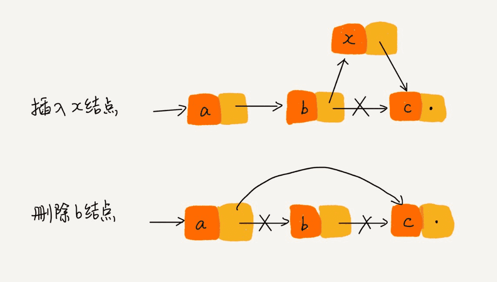
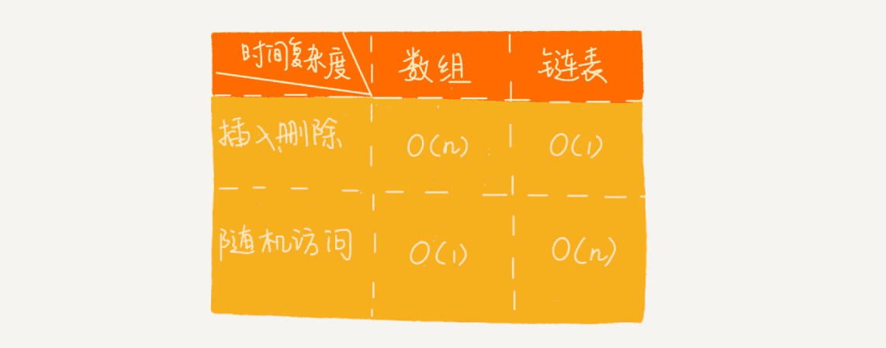

## 6-链表（上）：如何实现LRU缓存淘汰算法?

先来讨论一个经典的链表应用场景，那就是 **LRU缓存淘汰算法**。 

缓存是一种提高数据读取性能的技术，在硬件设计、软件开发中都有着非常广泛的应用，比如常见的 **CPU缓存、数据库缓存、浏览器缓存**等等。 

缓存的大小有限，当缓存被用满时，哪些数据应该被清理出去，哪些数据应该被保留？这就需要**缓存淘汰策略**来决定。常见的策略有三种：先进先出策略 **FIFO**（First In，First Out）、最少使用策略 **LFU**（Least Frequently Used）、最近最少使用策略 **LRU（Least Recently Used）**。  

开篇问题就是：**如何用链表来实现 LRU缓存淘汰策略呢？** 

### **1.五花八门的链表结构**

相比数组，链表是一种稍微复杂一点的数据结构。对于初学者来说，掌握起来也要比数组稍难一些。这两个非常基础、非常常用的数据结构，我们常常将会放到一块儿来比较。所以我们先来看，这两者有什么区别。 

我们先从**底层的存储结构**上来看一看。 

为了直观地对比，我画了一张图。从图中我们看到，数组需要一块连续的内存空间来存储，对内存的要求比较高。如果我们申请一个 100MB 大小的数组，当内存中没有连续的、足够大的存储空间时，即便内存的剩余总可用空间大于 100MB，仍然会申请失败。 

而链表恰恰相反，它并不需要一块连续的内存空间，它通过“指针”将一组**零散的内存块**串联起来使用，所以如果我们申请的是 100MB 大小的链表，根本不会有问题。 

链表结构五花八门，今天我重点给你介绍三种最常见的链表结构，它们分别是：单链表、双向链表和循环链表。我们首先来看最简单、最常用的**单链表**。 

我们刚刚讲到，链表通过指针将一组零散的内存块串联在一起。其中，我们把内存块称为链表的“**结点**”。为了将所有的结点串起来，每个链表的结点除了存储数据之外，还需要记录链上的下一个结点的地址。如图所示，我们把这个记录下个结点地址的指针叫作**后继指针 next**。 

从我画的单链表图中，你应该可以发现，其中有两个结点是比较特殊的，它们分别是第一个结点和最后一个结点。我们习惯性地把第一个结点叫作**头结点**，把最后一个结点叫作**尾结点**。其中，头结点用来记录链表的**基地址**。有了它，我们就可以遍历得到整条链表。而尾结点特殊的地方是：指针不是指向下一个结点，而是指向一个**空地址 NULL**，表示这是链表上最后一个结点。 

与数组一样，链表也支持数据的查找、插入和删除操作。 

我们知道，在进行数组的插入、删除操作时，为了保持内存数据的连续性，需要做大量的数据搬移，所以时间复杂度是 O(n)。而在链表中插入或者删除一个数据，我们并不需要为了保持内存的连续性而搬移结点，因为链表的存储空间本身就不是连续的。所以，在链表中插入和删除一个数据是非常快速的。 

为了方便你理解，我画了一张图，从图中我们可以看出，针对链表的插入和删除操作，我们只需要考虑<u>相邻结点的指针改变</u>，所以对应的时间复杂度是 O(1)。 

但是，有利就有弊。链表要想随机访问第k个元素，就没有数组那么高效了。因为链表中的数据并非连续存储的，所以无法像数组那样，根据首地址和下标，通过寻址公式就能直接计算出对应的内存地址，而是需要根据指针一个结点一个结点地依次遍历，直到找到相应的结点。 

你可以把链表想象成一个队伍，队伍中的每个人都只知道自己后面的人是谁，所以当我们希望知道排在第k位的人是谁的时候，我们就需要从第一个人开始，一个一个地往下数。所以，链表随机访问的性能没有数组好，需要 O(n) 的时间复杂度。 

好了，单链表我们就简单介绍完了，接着来看另外两个复杂的升级版，**循环链表**和**双向链表**。 

**循环链表是一种特殊的单链表**。实际上，循环链表也很简单。它跟单链表唯一的区别就在尾结点。我们知道，单链表的尾结点指针指向空地址，表示这就是最后的结点了。而循环链表的尾结点指针是指向链表的头结点。从我画的循环链表图中，你应该可以看出来，它像一个环一样首尾相连，所以叫作“循环”链表。 

和单链表相比，**循环链表**的优点是从链尾到链头比较方便。<u>当要处理的数据具有环型结构特点时，就特别适合采用循环链表</u>。比如著名的**约瑟夫问题**。尽管用单链表也可以实现，但是用循环链表实现的话，代码就会简洁很多。 

单链表和循环链表是不是都不难？接下来我们再来看一个稍微复杂的，在实际的软件开发中，也更加常用的链表结构：**双向链表**。 

单向链表只有一个方向，结点只有一个后继指针 next 指向后面的结点。而双向链表，顾名思义，它支持两个方向，每个结点不止有一个后继指针 next 指向后面的结点，还有一个**前驱指针 prev** 指向前面的结点。 

从我画的图中可以看出来，双向链表需要额外的两个空间来存储后继结点和前驱结点的地址。所以，如果存储同样多的数据，双向链表要比单链表占用更多的内存空间。虽然两个指针比较浪费存储空间，但可以支持双向遍历，这样也带来了双向链表操作的灵活性。那相比单链表，双向链表适合解决哪种问题呢？ 

从结构上来看，双向链表可以支持 O(1) 时间复杂度的情况下找到前驱结点，正是这样的特点，也使双向链表在某些情况下的插入、删除等操作都要比单链表简单、高效。 

你可能会说，我刚讲到单链表的插入、删除操作的时间复杂度已经是 O(1) 了，双向链表还能再怎么高效呢？别着急，刚刚的分析比较偏理论，很多数据结构和算法书籍中都会这么讲，但是这种说法实际上是不准确的，或者说是有先决条件的。我再来带你分析一下链表的两个操作。 

我们先来看**删除操作**。 

在实际的软件开发中，从链表中删除一个数据无外乎这两种情况： 

- 删除结点中“值等于某个给定值”的结点； 
- 删除给定指针指向的结点。 

对于第一种情况，不管是单链表还是双向链表，为了查找到值等于给定值的结点，都需要从头结点开始一个一个依次遍历对比，直到找到值等于给定值的结点，然后再通过我前面讲的指针操作将其删除。 

尽管单纯的删除操作时间复杂度是 O(1)，但遍历查找的时间是主要的耗时点，对应的时间复杂度为 O(n)。根据时间复杂度分析中的加法法则，删除值等于给定值的结点对应的链表操作的总时间复杂度为 O(n)。 

对于第二种情况，我们已经找到了要删除的结点，但是删除某个结点 q 需要知道其前驱结点，而单链表并不支持直接获取前驱结点，所以，为了找到前驱结点，我们还是要从头结点开始遍历链表，直到 p->next=q，说明 p 是 q 的前驱结点。 

但是对于双向链表来说，这种情况就比较有优势了。因为双向链表中的结点已经保存了前驱结点的指针，不需要像单链表那样遍历。所以，针对第二种情况，单链表删除操作需要 O(n) 的时间复杂度，而双向链表只需要在 O(1) 的时间复杂度内就搞定了！ 

同理，如果我们希望在链表的某个指定结点前面**插入**一个结点，双向链表比单链表有很大的优势。双向链表可以在 O(1) 时间复杂度搞定，而单向链表需要 O(n) 的时间复杂度。你可以参照我刚刚讲过的删除操作自己分析一下。 

除了插入、删除操作有优势之外，对于一个**有序链表**，双向链表的按值查询的效率也要比单链表高一些。因为，我们可以记录上次查找的位置 p，每次查询时，根据要查找的值与 p 的大小关系，决定是往前还是往后查找，所以平均只需要查找一半的数据。 

现在，你有没有觉得双向链表要比单链表更加高效呢？这就是为什么在实际的软件开发中，**双向链表尽管比较费内存，但还是比单链表的应用更加广泛的原因**。如果你熟悉 Java 语言，你肯定用过 **LinkedHashMap** 这个容器。如果你深入研究 LinkedHashMap 的实现原理，就会发现其中就用到了双向链表这种数据结构。 

实际上，这里有一个更加重要的知识点需要你掌握，那就是**用空间换时间**的设计思想。当内存空间充足的时候，如果我们更加追求代码的执行速度，我们就可以选择空间复杂度相对较高、但时间复杂度相对很低的算法或者数据结构。相反，如果内存比较紧缺，比如代码跑在手机或者单片机上，这个时候，就要反过来用时间换空间的设计思路。 

还是开篇缓存的例子。**缓存实际上就是利用了空间换时间的设计思想**。如果我们把数据存储在硬盘上，会比较节省内存，但每次查找数据都要询问一次硬盘，会比较慢。但如果我们通过缓存技术，事先将数据加载在内存中，虽然会比较耗费内存空间，但是每次数据查询的速度就大大提高了。 

所以我总结一下，对于执行较慢的程序，可以通过消耗更多的内存（空间换时间）来进行优化；而消耗过多内存的程序，可以通过消耗更多的时间（时间换空间）来降低内存的消耗。你还能想到其他时间换空间或者空间换时间的例子吗？ 

了解了循环链表和双向链表，如果把这两种链表整合在一起就是一个新的版本：**双向循环链表**。我想不用我多讲，你应该知道双向循环链表长什么样子了吧？你可以自己试着在纸上画一画。 

### **2.链表 VS 数组性能大比拼**

通过前面内容的学习，你应该已经知道，数组和链表是两种截然不同的内存组织方式。正是因为内存存储的区别，它们插入、删除、随机访问操作的时间复杂度正好相反。 

不过，数组和链表的对比，并不能局限于时间复杂度。而且，在实际的软件开发中，不能仅仅利用复杂度分析就决定使用哪个数据结构来存储数据。 

数组简单易用，在实现上使用的是连续的内存空间，可以借助 **CPU的缓存机制**，预读数组中的数据，所以访问效率更高。而链表在内存中并不是连续存储，所以对 CPU缓存不友好，没办法有效预读。 

数组的缺点是大小固定，一经声明就要占用整块连续内存空间。如果声明的数组过大，系统可能没有足够的连续内存空间分配给它，导致“内存不足（out of memory）”。如果声明的数组过小，则可能出现不够用的情况。这时只能再申请一个更大的内存空间，把原数组拷贝进去，非常费时。链表本身没有大小的限制，天然地支持动态扩容，我觉得这也是它与数组最大的区别。 

你可能会说，我们 Java 中的 ArrayList 容器，也可以支持动态扩容啊？我们上一节课讲过，当我们往支持动态扩容的数组中插入一个数据时，如果数组中没有空闲空间了，就会申请一个更大的空间，将数据拷贝过去，而数据拷贝的操作是非常耗时的。 

我举一个稍微极端的例子。如果我们用 ArrayList 存储了了 1GB 大小的数据，这个时候已经没有空闲空间了，当我们再插入数据的时候，ArrayList 会申请一个 1.5GB 大小的存储空间，并且把原来那 1GB 的数据拷贝到新申请的空间上。听起来是不是就很耗时？ 

除此之外，如果你的代码<u>对内存的使用非常苛刻，那数组就更适合</u>你。因为链表中的每个结点都需要消耗额外的存储空间去存储一份指向下一个结点的指针，所以内存消耗会翻倍。而且，<u>对链表进行频繁的插入、删除操作，还会导致频繁的内存申请和释放，容易造成内存碎片</u>，如果是 Java 语言，就有可能会导致频繁的 GC（Garbage Collection，垃圾回收）。 

所以，在我们实际的开发中，针对不同类型的项目，要根据具体情况，权衡究竟是选择数组还是链表。 

### **3.解答开篇**

如何基于链表实现LRU缓存淘汰算法？ 

我的思路是这样的：我们维护一个有序单链表，越靠近链表尾部的结点是越早之前访问的。当有一个新的数据被访问时，我们从链表头开始顺序遍历链表。 

1. 如果此数据之前已经被缓存在链表中了，我们遍历得到这个数据对应的结点，并将其从原来的位置删除，然后再插入到链表的头部。 

2. 如果此数据没有在缓存链表中，又可以分为两种情况： 
	- 如果此时缓存未满，则将此结点直接插入到链表的头部； 
	- 如果此时缓存已满，则链表尾结点删除，将新的数据结点插入链表的头部。 

这样我们就用链表实现了一个 LRU 缓存，是不是很简单？ 

现在我们来看下 m 缓存访问的时间复杂度是多少。因为不管缓存有没有满，我们都需要遍历一遍链表，所以这种基于链表的实现思路，缓存访问的时间复杂度为 O(n)。 

实际上，我们可以继续优化这个实现思路，比如引入**散列表**（Hash table）来记录每个数据的位置，将缓存访问的时间复杂度降到 O(1)。因为要涉及我们还没有讲到的数据结构，所以这个优化方案，我现在就不详细说了，等讲到散列表的时候，我会再拿出来讲。 

除了基于链表的实现思路，实际上还可以用数组来实现 LRU 缓存淘汰策略。如何利用数组实现 LRU 缓存淘汰策略呢？我把这个问题留给你思考。 

### **4.内容小结**

 链表比数组稍微复杂，有几种：**单链表**、**双向链表**、**循环链表**、**双向循环链表**。

和数组相比，链表更适合插入、删除操作频繁的场景，查询的时间复杂度较高。不过，在具体软件开发中，要对数组和链表的各种性能进行对比，综合来选择使用两者中的哪一个。 

### **5.课后思考**

如何判断一个字符串是否是回文字符串的问题，我想你应该听过，我们今天的思题目就是基于这个问题的改造版本。如果字符串是通过单链表来存储的，那该如何来判断是一个回文串呢？你有什么好的解决思路呢？相应的时间空间复杂度又是多少呢？ 

Re Ydyhm:

“数组简单易用，在实现上使用的是连续的内存空间，可以借助 CPU的缓存机制，预读数组中的数据，所以访问效率更高。而链表在内存中并不是连续存储，所以对 CPU 缓存不友好，没办法有效预读。” 这里的CPU缓存机制指的是什么？为什么就数组更好了？

\----

我没有百度也没有Google。之前开发时遇到过，我斗胆说下。
CPU在从内存读取数据的时候，会先把读取到的数据加载到CPU的缓存中。而CPU每次从内存读取数据并不是只读取那个特定要访问的地址，而是读取一个数据块(这个大小我不太确定。。)并保存到CPU缓存中，然后下次访问内存数据的时候就会先从CPU缓存开始查找，如果找到就不需要再从内存中取。这样就实现了比内存访问速度更快的机制，也就是CPU缓存存在的意义:为了弥补内存访问速度过慢与CPU执行速度快之间的差异而引入。

对于数组来说，存储空间是连续的，所以在加载某个下标的时候可以把以后的几个下标元素也加载到CPU缓存这样执行速度会快于存储空间不连续的链表存储。