# 入门篇

## 1-为什么要学习数据结构和算法？


### **1. 想要通关大厂面试，千万别让数据结构和算法拖了后腿**

很多大公司，比如 BAT、Google、Facebook，面试的时候都喜欢考算法、让人现场写代码。越是厉害的公司，越是注重考察数据结构与算法这类基础知识。相比短期能力，他们更看中你的长期潜力。 

我们学任何知识都是为了“**用**”的，是<font color=#FF8C00>**为了解决实际工作问题**</font>的，学习数据结构和算法自然也不例外。 

### **2. 业务开发工程师，你真的愿意做一辈子 CRUD boy 吗？**

对于大部分业务开发来说，我们平时可能更多的是利用已经封装好的现成的接口、类库来堆砌、翻译业务逻辑，很少需要自己实现数据结构和算法。但是，**不需要自己实现，并不代表什么都不需要了解。** 

如果不知道这些类库背后的原理，不懂得时间、空间复杂度分析，你如何能用好、用对它们？存储某个业务数据的时候，你如何知道应该用 **ArrayList**，还是 **Linked List** 呢？调用了某个函数之后，你又该<font color=#FF8C00>**如何评估代码的性能和资源的消耗呢？**</font> 

作为业务开发，我们会用到各种**框架、中间件和底层系统**，比如 Spring、RPC 框架、消息中间件、Redis 等等。**在这些基础框架中，一般都揉和了很多基础数据结构和算法的设计思想。** 

> Redis 中的有序集合为什么要用跳表来实现呢？为什么不用二叉树呢？ 

**掌握数据结构和算法，不管对于阅读框架源码，还是理解其背后的设计思想，都是非常有用的。** 

> **如何实时地统计业务接口的 99% 响应时间？** 
>
> 两个堆


### **3. 基础架构研发工程师，写出达到开源水平的框架才是你的目标！**

现在互联网上的技术文章、架构分享、开源项目满天飞，照猫画虎做一套基础框架并不难。我就拿RPC框架举例。 

不同的公司、不同的人做出的RPC框架，架构设计思路都差不多，最后实现的功能也都差不多。但是有的人做出来的框架，Bug很多、性能一般、扩展性也不好，只能在自己公司仅有的几个项目里面用一下。而有的人做的框架可以开源到 GitHub 上给很多人用，甚至被 Apache 收录。为什么会有这么大的差距呢？ 

高手之间的竞争其实就在<font color=#FF8C00>**细节**</font>。这些细节包括：**算法是不是够优化**，**数据存取的效率是不是够高**，**内存是不是够节省**等等。这些累积起来，决定了一个框架是不是优秀。 


### **4.对编程还有追求？不想被行业淘汰？那就不要只会写凑合能用的代码！**

**性能好坏起码是其中一个非常重要的评判标准**。

有的人写代码的时候，从来都不考虑<font color=#FF8C00>**非功能性的需求**</font>，只是完成功能，凑合能用就好；做事情的时候，也从来没有长远规划，只把眼前事情做好就满足了。  

如果你在一家成熟的公司，或者 BAT 这样的大公司，面对的是千万级甚至亿级的用户，开发的是 TB、PB 级别数据的处理系统。性能几乎是开发过程中时刻都要考虑的问题。一个简单的 ArrayList、Linked List 的选择问题，就可能会产生成千上万倍的性能差别。这个时候，数据结构和算法的意义就完全凸显出来了。 

其实，我觉得，**数据结构和算法这个东西，如果你不去学，可能真的这辈子都用不到，也感受不到它的好。但是一旦掌握，你就会常常被它的强大威力所折服**。之前你可能需要费很大劲儿来优化的代码，需要花很多心思来设计的架构，用了数据结构和算法之后，很容易就可以解决了。 


### **内容小结**

目的是建立时间复杂度、空间复杂度意识，写出高质量的代码，能够设计基础架构，提升编程技能，训练逻辑思维，积攒人生经验，以此获得工作回报，实现你的价值，完善你的人生。 

不管你是**业务开发工程师**，还是**基础架构工程师**；不管你是初入职场的初级工程师，还是工作多年的资深架构师，又或者是想转人工智能、区块链这些热门领域的程序员，数据结构与算法作为计算机的基础知识、核心知识，都是必须要掌握的。 

**掌握了数据结构与算法，你看待问题的深度，解决问题的角度就会完全不一样。**


### **课后思考**

- 你为什么要学习数据结构和算法呢？ 

  写出高质量的代码

  解决问题的新思路

  锻炼大脑🧠

  不当菜鸟

  

- 在过去的软件开发中，数据结构和算法在哪些地方帮到了你？


## 2-如何抓住重点，系统高效地学习数据结构与算法？

**没有找到好的学习方法，没有抓住学习的重点**。

### 什么是数据结构？什么是算法？


**虽然我们说没必要深挖严格的定义，但是这并不等于不需要理解概念。** 

广义上，**数据结构**是<font color=#FF8C00>**一组数据的存储结构**</font>。**算法**是<font color=#FF8C00>**操作数据的一组方法**</font>。 

图书馆储藏书籍。图书**按照一定规律编号**，就是书籍这种“数据”的存储结构。**查找书籍方法**都是算法。 

**经典数据结构和算法**，都是前人从很多实际操作场景中**抽象**出来的，经过非常多的**求证和检验**，可以高效地帮助我们解决很多实际的开发问题。 

**数据结构是为算法服务的，算法要作用在特定的数据结构之上**。它们是**相辅相成**的。

数据结构是**静态**的，它只是组织数据的一种方式。如果不在它的基础上操作、构建算法，**孤立存在的数据结构就是没用的**。 

 

### 学习的重点在什么地方？

**掌握一个数据结构与算法中最重要的概念**——<font color=#FF8C00>**复杂度分析**</font>。<u>考量效率和资源消耗的方法</u>。

一张图了解所有数据结构和算法的知识点。 


**20 个最常用的、最基础**数据结构与算法，10 个数据结构：<font color=#FF8C00>数组、链表、栈、队列、散列表、二叉树、堆、跳表、图、Trie树</font>；10 个算法：<font color=#FF8C00>递归、排序、二分查找、搜索、哈希算法、贪心算法、分治算法、回溯算法、动态规划、字符串匹配算法</font>。 

要学习它的**“来历”，“自身的特点”，“适合解决的问题”以及“实际的应用场景”**。 

不要被动地记忆，要多辩证地思考，多问为什么。

### 一些可以让你事半功倍的学习技巧

#### 边学边练，适度刷题

**可以“适度”刷题，但一定不要浪费太多时间在刷题上**。

#### 多问、多思考、多互动

#### 打怪升级学习法


#### 知识需要沉淀，不要想试图一下子掌握所有

**学习知识的过程是反复迭代、不断沉淀的过程。** 


## 3-复杂度分析（上）：如何分析、统计算法的执行效率和资源消耗？

数据结构和算法本身解决的是“**快**”和“**省**”的问题，即如何让代码运行得更快，如何让代码更省存储空间。

**复杂度分析是整个算法学习的精髓，只要掌握了它，数据结构和算法的内容基本上就掌握了一半。** 

### 为什么需要复杂度分析？

<font color=#FF8C00>**事后统计法**</font>的局限性：

#### **1 测试结果非常依赖测试环境**

 

#### **2 测试结果受数据规模的影响很大**

对同一个排序算法，待排序数据的有序度不一样，排序的执行时间就会有很大的差别。极端情况下，如果数据已经是有序的，那排序算法不需要做任何操作，执行时间就会非常短。除此之外，如果测试数据规模太小，测试结果可能无法真实地反应算法的性能。比如，对于小规模的数据排序，插入排序可能反倒会比快速排序要快！ 

所以，**我们需要一个不用具体的测试数据来测试，就可以粗略地估计算法的执行效率的方法。**


### 大O复杂度表示法

算法的**执行效率**，粗略地讲，就是算法代码**执行的时间**。

如何在不运行代码的情况下，估算一下这段代码的执行时间。 


```c
int cal(int n) { 
   int sum = 0; 
   int i = 1; 
   for (; i <= n; ++i) { 
      sum = sum + i; 
   } 
   return sum; 
} 
```


从 CPU 的角度来看，这段代码的每一行都执行着类似的操作：**读数据-运算-写数据**。尽管每行代码对应的 CPU 执行的个数、执行的时间都不一样，但是，我们这里只是粗略估计，所以可以假设每行代码执行的时间都一样，为 **unit_time**。在这个假设的基础之上，这段代码的总执行时间是多少呢？ 

第 2、3 行代码分别需要 1 个 unit_time 的执行时间，第 4、5 行都运行了 n 遍，所以需要 **2n*unit_time**的执行时间，所以这段代码总的执行时间就是 **(2n+2)*unit_time**。可以看出来，**所有代码的执行时间 T(n) 与每行代码的执行次数成正比。** 

按照这个分析思路，我们再来看这段代码。 


```c
 int cal(int n) {
   int sum = 0;
   int i = 1;
   int j = 1;
   for (; i <= n; ++i) {
     j = 1;
     for (; j <= n; ++j) {
       sum = sum +  i * j;
     }
   }
 }
```


我们依旧假设每个语句的执行时间是 unit_time。那这段代码的总执行时间 T(n) 是多少呢？ 

第 2、3、4 行代码，每行都需要 1 个 unit_time 的执行时间，第 5、6 行代码循环执行了 n 遍，需要 **2n * unit_time** 的执行时间，第 7、8 行代码循环执行了 n<sup>2</sup>遍，所以需要 **2n<sup>2</sup> * unit_time** 的执行时间。所以，整段代码总的执行时间 **T(n) = (2n<sup>2</sup>+2n+3)*unit_time**。 

尽管我们不知道 unit_time 的具体值，但是通过这两段代码执行时间的推导过程，我们可以得到一个非常重要的规律，那就是，所有代码的执行时间 T(n) 与每行代码的执行次数 n 成正比。 


其中，T(n) 表示代码执行的时间；n 表示数据规模的大小；f(n) 表示每行代码执行的次数总和。因为这是一个公式，所以用 f(n) 来表示。公式中的 O，表示代码的执行时间 T(n) 与 f(n) 表达式成**正比**。 

所以，第一个例子中的 T(n) = O(2n+2)，第二个例子中的 T(n) = O(2n<sup>2</sup>+2n+3)。这就是**大O时间复杂度表示法**。大O时间复杂度实际上并不具体表示代码真正的执行时间，而是表示<font color=#FF8C00>**代码执行时间随数据规模增长的变化趋势**</font>，所以，也叫作渐进时间复杂度（asymptotic time complexity），简称**时间复杂度**。 

当 n 很大时，你可以把它想象成 10000、100000。而公式中的**低阶、常量、系数**三部分并不左右增长趋势，所以都可以忽略。我们只需要记录一个最大量级就可以了，如果用大 O 表示法表示刚讲的那两段代码的时间复杂度，就可以记为：T(n) = O(n)； T(n) = O(n<sup>2</sup>)。 


### 时间复杂度分析

如何分析一段代码的时间复杂度？三个比较实用的方法。 

#### 1 只关注循环执行次数最多的一段代码

**在分析一个算法、一段代码的时间复杂度的时候，只关注循环执行次数最多的那一段代码就可以了。**这段核心代码执行次数的n的量级，就是整段要分析代码的时间复杂度。 


```c
 int cal(int n) {
   int sum = 0;
   int i = 1;
   for (; i <= n; ++i) {
     sum = sum + i;
   }
   return sum;
 }
```


其中第 2、3 行代码都是常量级的执行时间，与 n 的大小无关，所以对于复杂度并没有影响。循环执行次数最多的是第 4、5 行代码，所以这块代码要重点分析。前面我们也讲过，这两行代码被执行了 n 次，所以总的时间复杂度就是 O(n)。 

#### 2 加法法则：总复杂度等于量级最大的那段代码的复杂度


```c
int cal(int n) {
   int sum_1 = 0;
   int p = 1;
   for (; p < 100; ++p) {
     sum_1 = sum_1 + p;
   }

   int sum_2 = 0;
   int q = 1;
   for (; q < n; ++q) {
     sum_2 = sum_2 + q;
   }
 
   int sum_3 = 0;
   int i = 1;
   int j = 1;
   for (; i <= n; ++i) {
     j = 1; 
     for (; j <= n; ++j) {
       sum_3 = sum_3 +  i * j;
     }
   }
 
   return sum_1 + sum_2 + sum_3;
 }

```


这个代码分为三部分，分别是求 sum_1、sum_2、sum_3。我们可以分别分析每一部分的时间复杂度，然后把它们放到一块儿，再取一个量级最大的作为整段代码的复杂度。 

第一段的时间复杂度是多少呢？这段代码循环执行了 100 次，所以是一个常量的执行时间，跟 n 的规模无关。 

第二段代码和第三段代码的时间复杂度是多少呢？答案是 O(n) 和 O(n<sup>2</sup>)。 

综合这三段代码的时间复杂度，我们取其中最大的量级。所以，整段代码的时间复杂度就为 O(n<sup>2</sup>)。也就是说：**总的时间复杂度就等于量级最大的那段代码的时间复杂度**。

将这个规律抽象成公式就是： 

如果 T1(n)=O(f(n))，T2(n)=O(g(n))；那么 T(n)=T1(n)+T2(n)=max(O(f(n)), O(g(n))) =**O(max(f(n), g(n)))**. 

#### 3 乘法法则：嵌套代码的复杂度等于嵌套内外代码复杂度的乘积

还有一个**乘法法则**。如果 T1(n)=O(f(n))，T2(n)=O(g(n))；那么`T(n)=T1(n)*T2(n)=O(f(n))*O(g(n))=O(f(n)*g(n))`. 

也就是说，假设 T1(n) = O(n)，T2(n) = O(n<sup>2</sup>)，则 T1(n) * T2(n) = O(n<sup>3</sup>)。落实到具体的代码上，我们可以把乘法法则看成是**嵌套循环**，我举个例子给你解释一下。 


```c
int cal(int n) {
   int ret = 0; 
   int i = 1;
   for (; i < n; ++i) {
     ret = ret + f(i);
   } 
 } 
 
 int f(int n) {
  int sum = 0;
  int i = 1;
  for (; i < n; ++i) {
    sum = sum + i;
  } 
  return sum;
 }
```


我们单独看 cal() 函数。假设 f() 只是一个普通的操作，那第 4～6 行的时间复杂度就是，T1(n) = O(n)。但 f() 函数本身不是一个简单的操作，它的时间复杂度是 T2(n) = O(n)，所以，整个 cal() 函数的时间复杂度就是，T(n) = T1(n) * T2(n) = O(n*n) = O(n<sup>2</sup>)。 


### 几种常见时间复杂度实例分析

虽然代码千差万别，但是常见的复杂度量级并不多。下面👇复杂度量级几乎涵盖了你今后可以接触的所有代码的复杂度量级。 

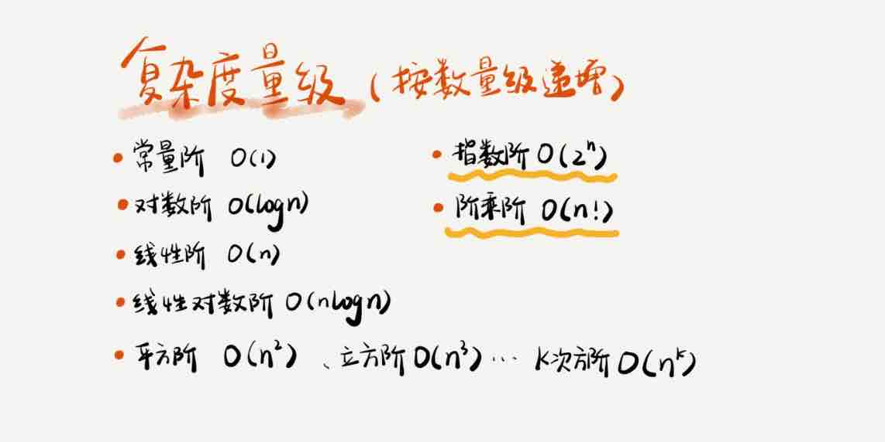

对于上面罗列的复杂度量级，我们可以粗略地分为两类，**多项式量级**和**非多项式量级**。其中，非多项式量级只有两个：O(2<sup>n</sup>) 和 O(n!)，也叫[**NP问题**](https://zh.wikipedia.org/wiki/P/NP问题)(Non-Deterministic Polynomial, 非确定多项式)。 

当数据规模n越来越大时，非多项式量级算法的执行时间会**急剧增加**，求解问题的执行时间会无限增长。所以，非多项式时间复杂度的算法其实是非常低效的算法。我们主要关注几种常见的**多项式时间复杂度**。 


#### O(1)  


```c
int i = 8; 
int j = 6; 
int sum = i + j; 
```

**一般情况下，只要算法中不存在循环语句、递归语句，即使有成千上万行的代码，其时间复杂度也是Ο(1)。** 

#### O(logn)、O(nlogn) 

对数阶时间复杂度非常常见，同时也是**最难分析**的一种时间复杂度。 


```c
i=1; 
while (i <= n)  { 
   i = i * 2; 
} 
```


根据我们前面讲的复杂度分析方法，第三行代码是循环执行次数最多的。所以，我们只要能计算出这行代码被执行了多少次，就能知道整段代码的时间复杂度。 

从代码中可以看出，变量 i 的值从 1 开始取，每循环一次就乘以 2。当大于 n 时，循环结束。还记得我们高中学过的等比数列吗？实际上，变量 i 的取值就是一个等比数列。如果我把它一个一个列出来，就应该是这个样子的： 


所以，我们只要知道 x 值是多少，就知道这行代码执行的次数了。通过 2<sup>x</sup>=n 求解 x， 得x=log<sub>2</sub>n，所以，这段代码的时间复杂度就是 O(log<sub>2</sub>n)。 

现在，我把代码稍微改下，你再看看，这段代码的时间复杂度是多少？ 


```c
i=1; 
while (i <= n)  { 
   i = i * 3; 
} 
```


同上思路，这段代码的时间复杂度为 O(log<sub>3</sub>n)。 

我们知道，对数之间是可以互相转换的，log<sub>3</sub>n 就等于 log<sub>3</sub>2 * log<sub>2</sub>n，所以 O(log<sub>3</sub>n) = O(C * log<sub>2</sub>n)，其中 C=log<sub>3</sub>2 是一个常量。基于我们前面的一个理论：**在采用大 O 标记复杂度的时候，可以忽略系数，即 O(Cf(n)) = O(f(n))**。所以，O(log<sub>2</sub>n) 就等于 O(log<sub>3</sub>n)。因此，在对数阶时间复杂度的表示方法里，我们忽略对数的“底”，统一表示为 O(logn)。 

如果你理解了我前面讲的 O(logn)，那 O(nlogn) 就很容易理解了。还记得我们刚讲的乘法法则吗？如果一段代码的时间复杂度是 O(logn)，我们循环执行 n 遍，时间复杂度就是 O(nlogn) 了。而且，O(nlogn) 也是一种非常常见的算法时间复杂度。比如，归并排序、快速排序的时间复杂度都是 O(nlogn)。 

#### O(m+n)、O(m*n) 

有的代码的复杂度**由两个数据的规模**来决定。 


```c++
int cal(int m, int n) {
  int sum_1 = 0;
  int i = 1;
  for (; i < m; ++i) {
    sum_1 = sum_1 + i;
  }

  int sum_2 = 0;
  int j = 1;
  for (; j < n; ++j) {
    sum_2 = sum_2 + j;
  }

  return sum_1 + sum_2;
}
```


从代码中可以看出，m 和 n 是表示两个数据规模。我们无法事先评估 m 和 n 谁的量级大，所以我们在表示复杂度的时候，就不能简单地利用加法法则，省略掉其中一个。所以，上面代码的时间复杂度就是 O(m+n)。 

针对这种情况，原来的加法法则就不正确了，我们需要将加法规则改为：**T1(m) + T2(n) = O(f(m) + g(n))**。但是乘法法则继续有效：**T1(m)*T2(n) = O(f(m) * f(n))**。 

### 空间复杂度分析

相对而言，空间复杂度分析方法学起来就简单些。 

时间复杂度的全称是**渐进时间复杂度，表示算法的执行时间与数据规模之间的增长关系**。类比一下，空间复杂度全称就是渐进空间复杂度（asymptotic space complexity），**表示算法的存储空间与数据规模之间的增长关系。** 

我还是拿具体的例子来给你说明。（这段代码有点“傻”，一般没人会这么写，我这么写只是为了方便给你解释。） 


```c++
void print(int n) {
  int i = 0;
  int[] a = new int[n];
  for (i; i < n; ++i) {
    a[i] = i * i;
  }

  for (i = n-1; i >= 0; --i) {
    print out a[i]
  }
}
```


跟时间复杂度分析一样，我们可以看到，第 2 行代码中，我们申请了一个空间存储变量 i，但是它是常量阶的，跟数据规模 n 没有关系，所以我们可以忽略。第 3 行申请了一个大小为 n 的 int 类型数组，除此之外，剩下的代码都没有占用更多的空间，所以整段代码的空间复杂度就是 O(n)。 

我们常见的空间复杂度就是 **O(1)、O(n)、O(n2 )**，像 O(logn)、O(nlogn) 这样的对数阶复杂度平时都用不到。而且，空间复杂度分析比时间复杂度分析要简单很多。所以，对于空间复杂度，掌握刚我说的这些内容已经足够了。 


### 小结

复杂度也叫**渐进复杂度**，包括时间复杂度和空间复杂度，用来分析算法执行效率与数据规模之间的增长关系，可以粗略地表示，越高阶复杂度的算法，执行效率越低。常见的复杂度并不多，从低阶到高阶有：O(1)、O(logn)、O(n)、O(nlogn)、O(n<sup>2</sup> )。几乎所有的数据结构和算法的复杂度都跑不出这几个。 

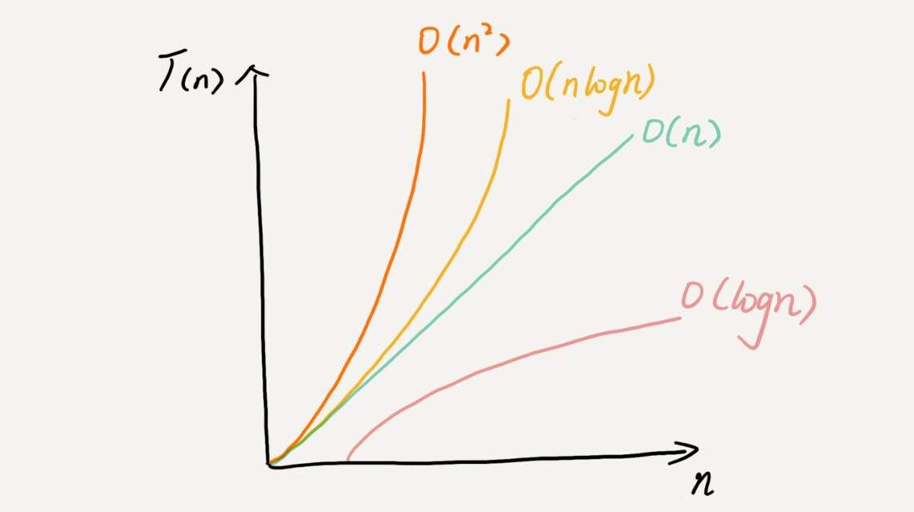

**复杂度分析并不难，关键在于多练**。  


### **课后思考**

有人说，我们项目之前都会进行性能测试，再做代码的时间复杂度、空间复杂度分析，是不是多此一举呢？而且，每段代码都分析一下时间复杂度、空间复杂度，是不是很浪费时间呢？你怎么看待这个问题呢？ 


我不认为是多此一举，渐进时间，空间复杂度分析为我们提供了一个很好的**理论分析的方向**，并且它是宿主平台无关的，能够让我们对我们的程序或算法有一个大致的认识，让我们知道，比如在最坏的情况下程序的执行效率如何，同时也为我们交流提供了一个不错的桥梁，我们可以说，算法1的时间复杂度是O(n)，算法2的时间复杂度是O(logN)，这样我们立刻就对不同的算法有了一个“效率”上的**感性认识**。

当然，渐进式时间，空间复杂度分析只是一个理论模型，只能提供给粗略的估计分析，我们不能直接断定就觉得O(logN)的算法一定优于O(n), 针对不同的宿主环境，不同的数据集，不同的数据量的大小，在实际应用上面可能真正的性能会不同，个人觉得，针对不同的实际情况，进而进行一定的性能基准测试是很有必要的，比如在统一一批手机上(同样的硬件，系统等等)进行横向基准测试，进而选择适合特定应用场景下的最有算法。

综上所述，渐进式时间，空间复杂度分析与性能基准测试并不冲突，而是相辅相成的，但是一个低阶的时间复杂度程序有极大的可能性会优于一个高阶的时间复杂度程序，所以在实际编程中，时刻关心理论时间，空间度模型是有助于产出效率高的程序的，同时，因为渐进式时间，空间复杂度分析只是提供一个粗略的分析模型，因此也不会浪费太多时间，重点在于在编程时，要具有这种复杂度分析的思维。


## 4-复杂度分析（下）：浅析最好、最坏、平均、均摊时间复杂度


四个复杂度分析：<font color=#FF8C00>最好情况时间复杂度</font>（best case time complexity）、<font color=#FF8C00>最坏情况时间复杂度</font>（worst case time complexity）、<font color=#FF8C00>平均情况时间复杂度</font>（average case time complexity）、<font color=#FF8C00>均摊时间复杂度</font>（amortized time complexity）。

### **1.最好、最坏情况时间复杂度**

分析一下这段代码的时间复杂度。 

```c
// n 表示数组 array 的长度
int find(int[] array, int n, int x) {
  int i = 0;
  int pos = -1;
  for (; i < n; ++i) {
    if (array[i] == x) pos = i;
  }
  return pos;
}
```

这段代码要实现的功能是，在一个无序的数组（array）中，查找变量 x 出现的位置。如果没有找到，就返回 -1。按照上节课讲的分析方法，这段代码的复杂度是 O(n)，其中，n 代表数组的长度。 

在数组中查找一个数据，并不需要每次都把整个数组都遍历一遍，因为有可能中途找到就可以提前结束循环了。但是，这段代码写得不够高效。我们可以这样优化一下这段查找代码。 

```c
// n 表示数组 array 的长度
int find(int[] array, int n, int x) {
  int i = 0;
  int pos = -1;
  for (; i < n; ++i) {
    if (array[i] == x) {
       pos = i;
       break;
    }
  }
  return pos;
} 
```

这个时候，问题就来了。我们优化完之后，这段代码的时间复杂度还是 O(n) 吗？很显然，咱们上一节讲的分析方法，解决不了这个问题。 

因为，要查找的变量 x 可能出现在数组的任意位置。如果数组中第一个元素正好是要查找的变量 x，那就不需要继续遍历剩下的 n-1 个数据了，那时间复杂度就是 O(1)。但如果数组中不存在变量 x，那我们就需要把整个数组都遍历一遍，时间复杂度就成了 O(n)。所以，不同的情况下，这段代码的时间复杂度是不一样的。 

为了表示代码在不同情况下的不同时间复杂度，我们需要引入三个概念：最好情况时间复杂度、最坏情况时间复杂度和平均情况时间复杂度。 

顾名思义，**最好情况时间复杂度就是，在最理想的情况下，执行这段代码的时间复杂度**。就像我们刚刚讲到的，在最理想的情况下，要查找的变量 x 正好是数组的第一个元素，这个时候对应的时间复杂度就是最好情况时间复杂度。 

同理，**最坏情况时间复杂度就是，在最糟糕的情况下，执行这段代码的时间复杂度**。就像刚举的那个例子，如果数组中没有要查找的变量 x，我们需要把整个数组都遍历一遍才行，所以这种最糟糕情况下对应的时间复杂度就是最坏情况时间复杂度。 

### **2.平均情况时间复杂度**

上面两种情况都是极端情况下的代码复杂度，引入一个更贴合实际情况的概念：平均情况时间复杂度，后面我简称为**平均时间复杂度**。

要查找的变量 x 在数组中的位置，有 n+1 种情况：**在数组的 0～n-1 位置中和不在数组中**。我们把每种情况下，查找需要遍历的元素个数累加起来，然后再除以 n+1，就可以得到需要遍历的元素个数的平均值，即： 

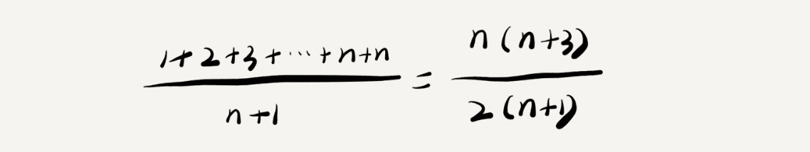

根据大O标记法，省略掉系数、低阶、常量，简化后得到平均时间复杂度就是 O(n)。 

这个结论虽然是正确的，但是计算过程稍微有点儿问题。究竟是什么问题呢？我们刚讲的这 n+1 种情况，出现的概率并不是一样的。我带你具体分析一下。

我们知道，要查找的变量 x，要么在数组里，要么就不在数组里。这两种情况对应的概率统计起来很麻烦，为了方便你理解，我们假设在数组中与不在数组中的概率都为 1/2。另外，要查找的数据出现在 0～n-1 这 n 个位置的概率也是一样的，为 1/n。所以，根据**概率乘法法则**，要查找的数据出现在 0～n-1 中任意位置的概率就是 1/(2n)。 

因此，前面的推导过程中存在的最大问题就是，没有将各种情况发生的概率考虑进去。如果我们把每种情况发生的概率也考虑进去，那平均时间复杂度的计算过程就变成了这样： 


这个值就是概率论中的**加权平均值**，也叫作**期望值**，所以平均时间复杂度的全称应该叫**加权平均时间复杂度**或者**期望时间复杂度**。 

引入概率之后，前面那段代码的加权平均值为 (3n+1)/4。用大 O 表示法来表示，去掉系数和常量，这段代码的加权平均时间复杂度仍然是 O(n)。 

你可能会说，平均时间复杂度分析好复杂啊，还要涉及概率论的知识。<u>实际上，在大多数情况下，我们并不需要区分最好、最坏、平均情况时间复杂度三种情况。</u>像我们上一节课举的那些例子那样，很多时候，我们使用一个复杂度就可以满足需求了。**只有同一块代码在不同的情况下，时间复杂度有量级的差距，我们才会使用这三种复杂度表示法来区分。** 

### **3.均摊时间复杂度**

到此为止，你应该已经掌握了算法复杂度分析的大部分内容了。下面我要给你讲一个更加高级的概念，均摊时间复杂度，以及它对应的分析方法，摊还分析（或者叫**平摊分析**）。 

均摊时间复杂度，听起来跟平均时间复杂度有点儿像。对于初学者来说，这两个概念确实非常容易弄混。我前面说了，大部分情况下，我们并不需要区分最好、最坏、平均三种复杂度。平均复杂度只在某些特殊情况下才会用到，而均摊时间复杂度应用的场景比它更加特殊、更加有限。 

老规矩，我还是借助一个具体的例子来帮助你理解。（当然，这个例子只是我为了方便讲解想出来的，实际上没人会这么写。） 

```c
 // array 表示一个长度为 n 的数组
 // 代码中的 array.length 就等于 n
 int[] array = new int[n];
 int count = 0;
 
 void insert(int val) {
    if (count == array.length) {
       int sum = 0;
       for (int i = 0; i < array.length; ++i) {
          sum = sum + array[i];
       }
       array[0] = sum;
       count = 1;
    }

    array[count] = val;
    ++count;
 }
```

我先来解释一下这段代码。这段代码实现了一个往数组中插入数据的功能。当数组满了之后，也就是代码中的 count == array.length 时，我们用 for 循环遍历数组求和，并清空数组，将求和之后的 sum 值放到数组的第一个位置，然后再将新的数据插入。但如果数组一开始就有空闲空间，则直接将数据插入数组。 

那这段代码的时间复杂度是多少呢？你可以先用我们刚讲到的三种时间复杂度的分析方法来分析一下。 

最理想的情况下，数组中有空闲空间，我们只需要将数据插入到数组下标为 count 的位置就可以了，所以最好情况时间复杂度为 O(1)。最坏的情况下，数组中没有空闲空间了，我们需要先做一次数组的遍历求和，然后再将数据插入，所以最坏情况时间复杂度为 O(n)。 

那平均时间复杂度是多少呢？答案是 O(1)。我们还是可以通过前面讲的概率论的方法来分析。 

假设数组的长度是 n，根据数据插入的位置的不同，我们可以分为 n 种情况，每种情况的时间复杂度是 O(1)。除此之外，还有一种“额外”的情况，就是在数组没有空闲空间时插入一个数据，这个时候的时间复杂度是 O(n)。而且，这 n+1 种情况发生的概率一样，都是 1/(n+1)。所以，根据加权平均的计算方法，我们求得的平均时间复杂度就是： 

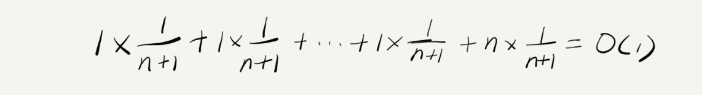


至此为止，前面的最好、最坏、平均时间复杂度的计算，理解起来应该都没有问题。但是这个例子里的平均复杂度分析其实并不需要这么复杂，不需要引入概率论的知识。这是为什么呢？我们先来对比一下这个 insert() 的例子和前面那个 find() 的例子，你就会发现这两者有很大差别。 

首先，find() 函数在极端情况下，复杂度才为 O(1)。但 insert() 在大部分情况下，时间复杂度都为 O(1)。只有个别情况下，复杂度才比较高，为 O(n)。这是 insert()**第一个**区别于 find() 的地方。 

我们再来看**第二个**不同的地方。对于 insert() 函数来说，O(1) 时间复杂度的插入和 O(n) 时间复杂度的插入，出现的频率是非常有规律的，而且有一定的前后时序关系，一般都是一个 O(n) 插入之后，紧跟着 n-1 个 O(1) 的插入操作，循环往复。 

所以，针对这样一种特殊场景的复杂度分析，我们并不需要像之前讲平均复杂度分析方法那样，找出所有的输入情况及相应的发生概率，然后再计算加权平均值。 

针对这种特殊的场景，我们引入了一种更加简单的分析方法：<font color=#FF8C00>**摊还分析法**</font>，通过摊还分析得到的时间复杂度我们起了一个名字，叫**均摊时间复杂度**。 

<u>那究竟如何使用摊还分析法来分析算法的均摊时间复杂度呢？</u> 

我们还是继续看在数组中插入数据的这个例子。每一次 O(n) 的插入操作，都会跟着 n-1 次 O(1) 的插入操作，所以把耗时多的那次操作均摊到接下来的 n-1 次耗时少的操作上，均摊下来，这一组连续的操作的均摊时间复杂度就是 O(1)。这就是均摊分析的大致思路。你都理解了吗？ 

均摊时间复杂度和摊还分析应用场景比较特殊，所以我们并不会经常用到。为了方便你理解、记忆，我这里简单总结一下它们的应用场景。如果你遇到了，知道是怎么回事儿就行了。 

对一个数据结构进行一组连续操作中，大部分情况下时间复杂度都很低，只有个别情况下时间复杂度比较高，而且这些操作之间存在前后连贯的时序关系，这个时候，我们就可以将这一组操作放在一块儿分析，看是否能**将较高时间复杂度那次操作的耗时，平摊到其他那些时间复杂度比较低的操作上**。而且，在能够应用均摊时间复杂度分析的场合，一般均摊时间复杂度就等于最好情况时间复杂度。 

尽管很多数据结构和算法书籍都花了很大力气来区分平均时间复杂度和均摊时间复杂度，但其实我个人认为，**均摊时间复杂度就是一种特殊的平均时间复杂度**，我们没必要花太多精力去区分它们。你最应该掌握的是它的分析方法，摊还分析。至于分析出来的结果是叫平均还是叫均摊，这只是个说法，并不重要。 

### **4.内容小结**

最好、最坏情况下的时间复杂度分析起来比较简单，但平均、均摊两个复杂度分析相对比较复杂。如果你觉得理解得还不是很深入，不用担心，在后续具体的数据结构和算法学习中，我们可以继续慢慢实践！ 

### **5.课后思考**

分析一下下面这个 add() 函数的时间复杂度。 


```c
// 全局变量，大小为 10 的数组 array，长度 len，下标 i。
int array[] = new int[10]; 
int len = 10;
int i = 0;

// 往数组中添加一个元素
void add(int element) {
   if (i >= len) { // 数组空间不够了
     // 重新申请一个 2 倍大小的数组空间
     int new_array[] = new int[len*2];
     // 把原来 array 数组中的数据依次 copy 到 new_array
     for (int j = 0; j < len; ++j) {
       new_array[j] = array[j];
     }
     // new_array 复制给 array，array 现在大小就是 2 倍 len 了
     array = new_array;
     len = 2 * len;
   }
   // 将 element 放到下标为 i 的位置，下标 i 加一
   array[i] = element;
   ++i;
}

```


最好是O(1)，最差是O(n), 均摊是O(1)


# 基础篇

## 5-数组：为什么很多编程语言中数组都从0开始编号？ 

 

### 如何实现随机访问？

**数组（Array）是一种<font color=#FF8C00>线性表</font>数据结构。它用一组<font color=#FF8C00>连续的内存空间</font>，来存储一组具有<font color=#FF8C00>相同类型</font>的数据。** 

1. **<font color=#FF8C00>线性表（Linear List）</font>**就是数据排成像一条线一样的结构。每个线性表上的数据最多只有**前和后**两个方向。其实除了<font color=#FF8C00>数组，链表、队列、栈</font>等也是线性表结构。 


​		**<font color=#FF8C00>非线性表</font>**，比如<font color=#FF8C00>二叉树、堆、图</font>等。在非线性表中，数据之间并不是简单的**前后关系**。


2. <font color=#FF8C00>连续的内存空间和相同类型的数据</font>。

​	利：“**随机访问**”。

​	弊：很多操作变得非常低效，比如要想在数组中删除、插入一个数据，为了保证连续性，就需要做大量的数据搬移工作。 

#### 数组是如何实现根据下标随机访问数组元素的吗？

以长度为 10 的 int 类型的数组 `int[] a = new int[10]` 为例。

如下图，计算机给数组 a[10]，分配了一块连续内存空间 1000～1039，其中，内存块的首地址为 base_address = 1000。 


计算机会给每个内存单元分配一个地址，计算机通过地址来访问内存中的数据。当计算机需要随机访问数组中的某个元素时，它会首先通过下面的**==寻址公式==**，计算出该元素存储的内存地址： 


```java
a[i]_address = base_address + i * data_type_size 
```


其中 **data_type_size** 表示数组中每个元素的大小。这个例子数组中存储的是 int 类型数据，所以 data_type_size 就为 4 个字节。 

#### 数组和链表的区别？

不准确表达，“链表适合插入、删除，时间复杂度 O(1)；数组适合查找，查找时间复杂度为 O(1)”。 

数组是适合查找操作，但是查找的时间复杂度并不为 O(1)。即便是排好序的数组，你用二分查找，时间复杂度也是 O(logn)。所以，正确的表述应该是，**<font color=#FF8C00>数组支持随机访问，根据下标随机访问的时间复杂度为 O(1)</font>**。 


### 低效的“插入”和“删除”

数组为了保持内存数据的连续性，会导致插入、删除比较低效。

#### **插入操作** 

假设数组的长度为 n，现在，如果我们需要将一个数据插入到数组中的第 k 个位置。为了把第 k 个位置腾出来，给新来的数据，我们需要将第 k～n 这部分的元素都顺序地往后挪一位。那插入操作的时间复杂度是多少呢？

如果在数组的末尾插入元素，那就不需要移动数据了，这时的时间复杂度为 O(1)。但如果在数组的开头插入元素，那所有的数据都需要依次往后移动一位，所以最坏时间复杂度是 O(n)。 因为我们在每个位置插入元素的概率是一样的，所以平均情况时间复杂度为 <u>(1+2+…n)/n=O(n)</u>。 

如果数组中的数据是有序的，我们在某个位置插入一个新的元素时，就必须按照刚才的方法搬移 k 之后的数据。但是，如果数组中存储的数据并没有任何规律，数组只是被当作一个存储数据的集合。在这种情况下，如果要将某个数组插入到第 k 个位置，为了避免大规模的数据搬移，我们还有一个简单的办法就是，==**直接将第 k 位的数据搬移到数组元素的最后，把新的元素直接放入第 k 个位置。**== 

为了更好地理解，我们举一个例子。假设数组 a[10] 中存储了如下 5 个元素：a，b，c，d，e。 

我们现在需要将元素 x 插入到第 3 个位置。我们只需要将 c 放入到 a[5]，将 a[2] 赋值为 x 即可。最后，数组中的元素如下： a，b，x，d，e，c。 


利用这种处理技巧，在特定场景下，在第 k 个位置插入一个元素的时间复杂度就会降为 O(1)。这个处理思想在快排中也会用到。 

#### 删除操作

跟插入数据类似，如果我们要删除第 k 个位置的数据，为了内存的连续性，也需要搬移数据，不然中间就会出现空洞，内存就不连续了。 

和插入类似，如果删除数组末尾的数据，则最好情况时间复杂度为 O(1)；如果删除开头的数据，则最坏情况时间复杂度为 O(n)；平均情况时间复杂度也为 O(n)。 

实际上，在某些特殊场景下，我们并不一定非得追求数组中数据的连续性。如果我们**将多次删除操作集中在一起执行**，删除的效率是不是会提高很多呢？ 

我们继续来看例子。数组 a[10] 中存储了 8 个元素：a，b，c，d，e，f，g，h。现在，我们要依次删除 a，b，c 三个元素。 

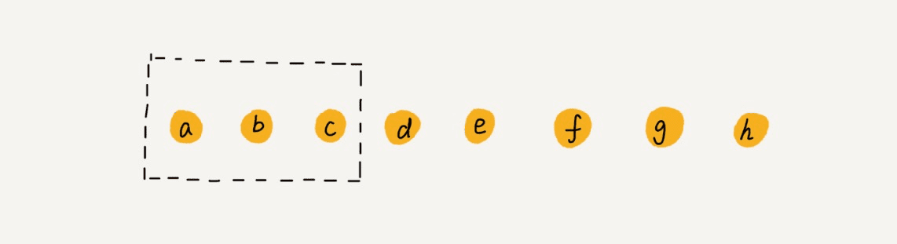


为了避免 d，e，f，g，h 这几个数据会被搬移三次，我们可以先记录下已经删除的数据。<u>每次的删除操作并不是真正地搬移数据，只是记录数据已经被删除。当数组没有更多空间存储数据时，我们再触发执行一次真正的删除操作，这样就大大减少了删除操作导致的数据搬移。</u> 

如果你了解 **JVM**(JAVAV虚拟机)，你会发现，这不就是**JVM标记清除垃圾回收算法**的核心思想吗？没错，数据结构和算法的魅力就在于此，<font color=#FF8C00>很多时候我们并不是要去死记硬背某个数据结构或者算法，而是要学习它背后的思想和处理技巧，这些东西才是最有价值的</font>。如果你细心留意，不管是在软件开发还是架构设计中，总能找到某些算法和数据结构的影子。 

### 警惕数组的访问越界问题

> 在C语言中，只要不是访问受限的内存，所有的内存空间都是可以自由访问的。

数组越界在 C 语言中是一种**未决行为**，并没有规定数组访问越界时编译器应该如何处理。因为，**访问数组的本质就是访问一段连续内存，只要数组通过偏移计算得到的内存地址是可用的，那么程序就可能不会报任何错误**。

很多计算机病毒也正是利用到了代码中的数组越界可以访问非法地址的漏洞，来攻击系统。

🔖

Java有越界检查，`java.lang.ArrayIndexOutOfBoundsException`。

### 容器能否完全替代数组？

针对数组类型，很多语言都提供了容器类，比如 Java 中的 ArrayList、C++ STL 中的 vector。

Java中`ArrayList`的优势：**将很多数组操作（比如插入、删除等）的细节封装起来**；**支持动态扩容**。

最好在创建 ArrayList 的时候事先指定数据大小。事先指定数据大小可以省掉很多次内存申请和数据搬移操作。

数组更适合的情况：

1. ArrayList无法存储基本类型，需要封装为包装类；
2. 如果数据大小事先已知，并且对数据的操作非常简单，用不到 ArrayList 提供的大部分方法，也可以直接使用数组。
3. 多维数组时，用数组往往会更加直观

```java
Object[][] array;
  
ArrayList<ArrayList<Object>> array;
```

总结：对于**业务开发**，直接使用容器就足够了。一些非常**底层的开发**，比如开发网络框架，性能的优化需要做到极致，这个时候数组就会优于容器。


### 思考题

> 为什么数组要从 0 开始编号，而不是从 1 开始呢？

原因一：”下标“理解为”偏移（offset）“，从1开始，对CPU来说，就多了一次减法指令。

```c
a[k]_address = base_address + k * type_size

a[k]_address = base_address + (k-1)*type_size
```

原因二：历史原因。C语言设计者用 0 开始计数数组下标。

> 前面我基于数组的原理引出 **JVM的标记清除垃圾回收算法**的核心理念。那怎么理解的标记清除垃圾回收算法。 

大多数主流虚拟机采用可达性分析算法来判断对象是否存活，在标记阶段，会遍历所有 GC ROOTS，将所有 GC ROOTS 可达的对象标记为存活。只有当标记工作完成后，清理工作才会开始。

不足：

1. 效率问题。标记和清理效率都不高，但是当知道只有少量垃圾产生时会很高效。
2. 空间问题。会产生不连续的内存空间碎片。

> 前面我们讲到一维数组的内存寻址公式，那你可以思考一下，类比一下，二维数组的内存寻址公式是怎样的呢？ 

对于 m * n 的数组，`a [i][j]` (i < m,j < n)的地址为：`address = base_address + ( i * n + j) * type_size`


## 06 链表（上）：如何实现LRU缓存淘汰算法?

缓存是一种提高数据读取性能的技术，在硬件设计、软件开发中都有着非常广泛的应用，比如常见的 CPU 缓存、数据库缓存、浏览器缓存等等。

> 当缓存被用满时，哪些数据应该被清理出去，哪些数据应该被保留？

这就需要**==缓存淘汰策==**略来决定。常见的策略有三种：

- 先进先出策略 FIFO（First In，First Out）
- 最少使用策略 LFU（Least Frequently Used）
- 最近最少使用策略 LRU（Least Recently Used）

> 数组和链表是两个**非常基础、非常常用**的数据结构。
>
> 某种意义上是仅有的两种数据存储结构。 因为使用内存空间时，只有两种方式：要么是连续的内存空间——数组，要么是不连续的内存空间——链表。 ==其它复杂的数据结构，其实都是在数组和链表的基础上形成的==。

### 五花八门的链表结构


三种最常见的链表结构：

#### 1 单链表


>  结点
>
> 后继指针 next
>
> 头结点
>
> 尾结点 		空地址 NULL

链表也支持数据的查找、插入和删除操作。


单链表的插入、删除操作的时间复杂度都是 O(1) 。

#### 2 循环链表

循环链表是一种特殊的单链表。


和单链表相比，循环链表的优点是从链尾到链头比较方便。当要处理的数据具有**环型结构**特点时，就特别适合采用循环链表。比如著名的**约瑟夫问题**。

#### 3 双向链表


> 前驱指针 prev

双向遍历

🔖


### 思考题

> 如何基于链表实现 LRU 缓存淘汰算法？


> 如果字符串是通过单链表来存储的，那该如何来判断是一个回文串呢？你有什么好的解决思路呢？相应的时间空间复杂度又是多少呢？


> “数组简单易用，在实现上使用的是连续的内存空间，可以借助 CPU 的缓存机制，预读数组中的数据，所以访问效率更高。而链表在内存中并不是连续存储，所以对 CPU 缓存不友好，没办法有效预读。” 
>
> 这里的**CPU缓存机制**指的是什么？为什么就数组更好了？

CPU在从内存读取数据的时候，会先把读取到的数据加载到CPU的缓存中。而CPU每次从内存读取数据并不是只读取那个特定要访问的地址，而是读取一个数据块并保存到CPU缓存中，然后下次访问内存数据的时候就会先从CPU缓存开始查找，如果找到就不需要再从内存中取。

这样就实现了比内存访问速度更快的机制，也就是CPU缓存存在的意义:<u>为了弥补内存访问速度过慢与CPU执行速度快之间的差异而引入</u>。

 对于数组来说，存储空间是连续的，所以在加载某个下标的时候可以把以后的几个下标元素也加载到CPU缓存这样执行速度会快于存储空间不连续的链表存储。


## 07 链表（下）：如何轻松写出正确的链表代码？

复杂的链表操作，比如**链表反转、有序链表合并**等。

### 技巧一：理解指针或引用的含义

将某个变量赋值给指针，实际上就是将这个变量的地址赋值给指针，或者反过来说，指针中存储了这个变量的内存地址，指向了这个变量，通过指针就能找到这个变量。


### 技巧二：警惕指针丢失和内存泄漏

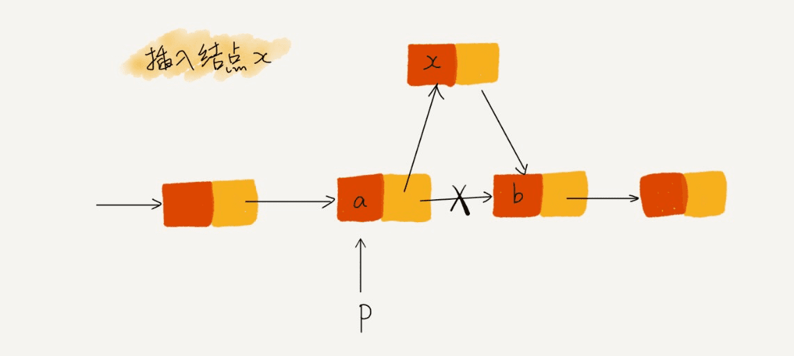

### 技巧三：利用哨兵简化实现难度


#### 技巧四：重点留意边界条件处理


### 技巧五：举例画图，辅助思考


### 技巧六：多写多练，没有捷径


5个常见的链表操作：

- 单链表反转
- 链表中环的检测
- 两个有序的链表合并
- 删除链表倒数第 n 个结点
- 求链表的中间结点


## 08 栈：如何实现浏览器的前进和后退功能？

### 如何理解“栈”？

后进者先出，先进者后出，这就是典型的“栈”结构。

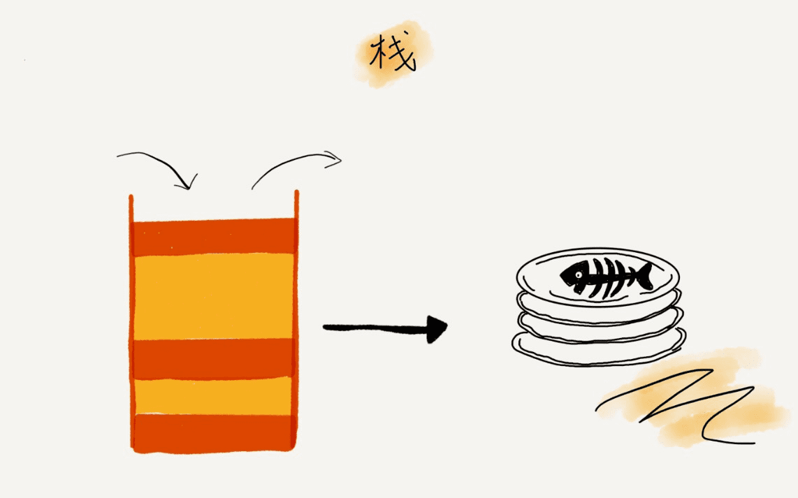

栈是**一种“操作受限”的线性表**，只允许在一端插入和删除数据。

从功能上来说，数组或链表确实可以替代栈，但==特定的数据结构是对特定场景的抽象==，而且，数组或链表暴露了太多的操作接口，操作上的确灵活自由，但使用时就比较不可控，自然也就更容易出错。

> 当某个数据集合只涉及在一端插入和删除数据，并且满足后进先出、先进后出的特性，这时就应该首选“栈”这种数据结构。

### 如何实现一个“栈”？

栈既可以用数组来实现（==顺序栈==），也可以用链表来实现（==链式栈==）。

### 支持动态扩容的顺序栈


### 栈在函数调用中的应用

```java

int main() {
   int a = 1; 
   int ret = 0;
   int res = 0;
   ret = add(3, 5);
   res = a + ret;
   printf("%d", res);
   reuturn 0;
}

int add(int x, int y) {
   int sum = 0;
   sum = x + y;
   return sum;
}
```


### 栈在表达式求值中的应用

编译器如何利用栈来实现表达式求值?

```
34+13*9+44-12/3
```

编译器就是通过两个栈来实现的:

1. 一个保存操作数的栈
2. 另一个是保存运算符的栈。

从左向右遍历表达式，当遇到数字，我们就直接压入操作数栈；当遇到运算符，就与运算符栈的栈顶元素进行比较。如果比运算符栈顶元素的优先级高，就将当前运算符压入栈；如果比运算符栈顶元素的优先级低或者相同，从运算符栈中取栈顶运算符，从操作数栈的栈顶取 2 个操作数，然后进行计算，再把计算完的结果压入操作数栈，继续比较。


### 栈在括号匹配中的应用

借助栈来检查表达式中的括号是否匹配。

用栈来保存未匹配的左括号，从左到右依次扫描字符串。当扫描到左括号时，则将其压入栈中；当扫描到右括号时，从栈顶取出一个左括号。如果能够匹配，比如“(”跟“)”匹配，“[”跟“]”匹配，“{”跟“}”匹配，则继续扫描剩下的字符串。如果扫描的过程中，遇到不能配对的右括号，或者栈中没有数据，则说明为非法格式。当所有的括号都扫描完成之后，如果栈为空，则说明字符串为合法格式；否则，说明有未匹配的左括号，为非法格式。


### 思考题

> 如何实现浏览器的前进、后退功能？

使用两个栈，X 和 Y，把首次浏览的页面依次压入栈 X，当点击后退按钮时，再依次从栈 X 中出栈，并将出栈的数据依次放入栈 Y。当我们点击前进按钮时，我们依次从栈 Y 中取出数据，放入栈 X 中。当栈 X 中没有数据时，那就说明没有页面可以继续后退浏览了。当栈 Y 中没有数据，那就说明没有页面可以点击前进按钮浏览了。

## 09 队列：队列在线程池等有限资源池中的应用


### 如何理解“队列”？

先进者先出，这就是典型的“队列”。


栈只支持两个基本操作：**入栈 push()，出栈 pop()**。

队列最基本的两个操作：**入队 enqueue()，出队 dequeue()**。


### 顺序队列和链式队列


### 循环队列


### 阻塞队列和并发队列


### 思考题

> 线程池没有空闲线程时，新的任务请求线程资源时，线程池该如何处理？各种处理策略又是如何实现的呢？

## 10 递归：如何用三行代码找到“最终推荐人”？

> 推荐注册返佣金：用户 A 推荐用户 B 来注册，用户 B 又推荐了用户 C 来注册。我们可以说，用户 C 的“最终推荐人”为用户 A，用户 B 的“最终推荐人”也为用户 A，而用户 A 没有“最终推荐人”。
>
> <u>给定一个用户 ID，如何查找这个用户的“最终推荐人”？</u>

### 如何理解“递归”？

递归是一种应用非常广泛的算法（或者编程技巧）。很多数据结构和算法的编码实现都要用到递归，比如 <u>DFS 深度优先搜索、前中后序二叉树遍历</u>等等。

去的过程叫“递”，回来的过程叫“归”。

递推公式

### 递归需要满足的三个条件

#### 1 一个问题的解可以分解为几个子问题的解

#### 2 这个问题与分解之后的子问题，除了数据规模不同，求解思路完全一样

#### 3 存在递归终止条件


### 如何编写递归代码？

写递归代码最关键的是**写出递推公式，找到终止条件**。


### 递归代码要警惕堆栈溢出


### 递归代码要警惕重复计算


### 怎么将递归代码改写为非递归代码？


### 思考题


## 11 排序（上）：为什么插入排序比冒泡排序更受欢迎？

排序算法有很多，最经典、最常用的又：


## 12 排序（下）：如何用快排思想在O(n)内查找第K大元素？


## 13 线性排序：如何根据年龄给100万用户数据排序？

桶排序、计数排序、基数排序的时间复杂度是线性的，把这类排序算法叫作**线性排序（Linear sort）**。


## 14 排序优化：如何实现一个通用的、高性能的排序函数？


## 15 二分查找（上）：如何用最省内存的方式实现快速查找功能？


## 16 二分查找（下）：如何快速定位IP对应的省份地址？


## 17 跳表：为什么Redis一定要用跳表来实现有序集合？

二分查找底层依赖的是数组随机访问的特性，所以只能用数组来实现。

如果数据存储在链表中，对链表稍加改造，就可以支持类似“二分”的查找算法。这个改造之后的数据结构叫做**跳表（Skip list）**。

跳表是一种各方面性能都比较优秀的**==动态数据结构==**，可以支持快速地插入、删除、查找操作，写起来也不复杂，甚至可以替代红黑树（Red-black tree）。

### 如何理解“跳表”？

单链表，即便数据是有序的，查找时也是从头遍历链表，O(n)。


为了提高效率。像下图，对链表建立一级“索引”，每两个结点提取一个结点到上一级，down 表示 down 指针，指向下一级结点。


加来一层索引之后，查找一个结点需要遍历的结点个数减少了，也就是说查找效率提高了。

如果再建立一层索引，需要遍历的结点数会更少。

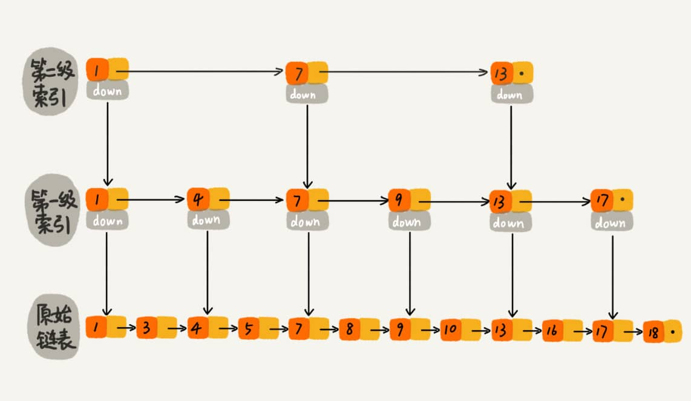

链表的长度越大，在构建索引之后，查找效率的提升就会非常明显。

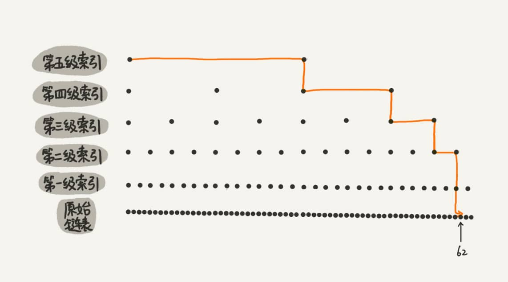

**这种链表加多级索引的结构，就是跳表。**

### 用跳表查询到底有多快？


### 跳表是不是很浪费内存？


### 高效的动态插入和删除


### 跳表索引动态更新


### 思考

> 为什么 Redis 要用跳表来实现有序集合，而不是红黑树？


## 18 散列表（上）：Word文档中的单词拼写检查功能是如何实现的？

散列表（Hash Table），“哈希表”或者“Hash 表”。

散列表用的是数组支持按照下标随机访问数据的特性，所以散列表其实就是数组的一种扩展，由数组演化而来。可以说，如果没有数组，就没有散列表。


参赛选手的编号我们叫做**键（key）**或关键字。

参赛编号转化为数组下标的映射方法就叫作**散列函数**（或“Hash 函数”“哈希函数”）。

散列函数计算得到的值就叫作**散列值**（或“Hash 值”“哈希值”）。

散列表用的就是数组支持按照下标随机访问的时候，时间复杂度是 O(1) 的特性。我们通过散列函数把元素的键值映射为下标，然后将数据存储在数组中对应下标的位置。当我们按照键值查询元素时，我们用同样的散列函数，将键值转化数组下标，从对应的数组下标的位置取数据。

### 散列函数

三点散列函数设计的基本要求：

1. 散列函数计算得到的散列值是一个非负整数；
2. 如果 key1 = key2，那 hash(key1) == hash(key2)；
3. 如果 key1 ≠ key2，那 hash(key1) ≠ hash(key2)。

真实的情况下，要想找到一个不同的 key 对应的散列值都不一样的散列函数，几乎是不可能的。即便像业界著名的MD5、SHA、CRC等哈希算法，也**无法完全避免**这种**==散列冲突==**。而且，因为数组的存储空间有限，也会加大散列冲突的概率。

### 散列冲突

常用的散列冲突解决方法有两类：

#### 1 开放寻址法（open addressing）

开放寻址法的核心思想是，**如果出现了散列冲突，我们就重新探测一个空闲位置，将其插入**。

重新探测新位置的方法：

##### **线性探测（Linear Probing）**

- 插入

如果某个数据经过散列函数散列之后，存储位置已经被占用了，我们就从当前位置开始，依次往后查找，看是否有空闲位置，直到找到为止。


- 查找

有点类似插入过程。

通过散列函数求出要查找元素的键值对应的散列值；

然后比较数组中下标为散列值的元素和要查找的元素；

如果相等，则说明就是我们要找的元素，否则就顺序往后依次查找；

如果遍历到数组中的空闲位置，还没有找到，就说明要查找的元素并没有在散列表中。


- 删除

不能单纯地把要删除的元素设置为空。因为影响查找操作。

将删除的元素，特殊标记为 **deleted**。当线性探测查找的时候，遇到标记为 deleted 的空间，并不是停下来，而是继续往下探测。


> 线性探测法的问题：
>
> 当散列表中插入的数据越来越多时，散列冲突发生的可能性就会越来越大，空闲位置会越来越少，线性探测的时间就会越来越久。极端情况下，我们可能需要探测整个散列表，所以最坏情况下的时间复杂度为 O(n)。
>
> 查找和删除操作情况类似。

##### 二次探测（Quadratic probing）

跟线性探测很像，线性探测每次探测的步长是 1，那它探测的下标序列就是hash(key)+0，hash(key)+1^2^，hash(key)+2^2^，hash(key)+3^2^……（步长变为原来的平方）。

##### 双重散列（Double hashing）

不仅要使用一个散列函数，而是使用一组散列函数 hash1(key)，hash2(key)，hash3(key)……

先用第一个散列函数，如果计算得到的存储位置已经被占用，再用第二个散列函数，依次类推，直到找到空闲的存储位置。


不管采用哪种探测方法，当散列表中空闲位置不多的时候，散列冲突的概率就会大大提高。为了尽可能保证散列表的操作效率，一般，会尽可能保证散列表中有一定比例的空闲槽位。用**==装载因子（load factor）==**来表示空位的多少。

> **==散列表的装载因子 = 填入表中的元素个数 / 散列表的长度==**

装载因子越大，说明空闲位置越少，冲突越多，散列表的性能会下降。

#### 2 链表法（chaining）

链表法是一种更加常用的散列冲突解决办法，相比开放寻址法，它要简单很多。

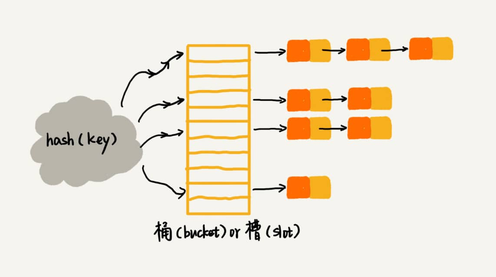

在散列表中，每个“桶（bucket）”或者“槽（slot）”会对应一条链表，所有散列值相同的元素我们都放到相同槽位对应的链表中。

插入，只需要通过散列函数计算出对应的散列槽位，将其插入到对应链表中即可，所以插入的时间复杂度是 O(1)。

查找、删除，通过散列函数计算出对应的槽，然后遍历链表查找或者删除。它们的时间复杂度跟链表的长度 k 成正比，也就是 O(k)。

对于散列比较均匀的散列函数来说，理论上讲，k=n/m，其中 n 表示散列中数据的个数，m 表示散列表中“槽”的个数。

### 思考题

- Word 文档中单词拼写检查功能是如何实现的？

  常用的英文单词有 20 万个左右，假设单词的平均长度是 10 个字母，平均一个单词占用 10 个字节的内存空间，那 20 万英文单词大约占 2MB 的存储空间，就算放大 10 倍也就是 20MB。对于现在的计算机来说，这个大小完全可以放在内存里面。所以我们可以用散列表来存储整个英文单词词典。

  当用户输入某个英文单词时，我们拿用户输入的单词去散列表中查找。如果查到，则说明拼写正确；如果没有查到，则说明拼写可能有误，给予提示。借助散列表这种数据结构，我们就可以轻松实现快速判断是否存在拼写错误。

- 假设我们有 10 万条 URL 访问日志，如何按照访问次数给 URL 排序？

  遍历 10 万条数据，以 URL 为 key，访问次数为 value，存入散列表，同时记录下访问次数的最大值 K，时间复杂度 O(N)。 

  如果 K 不是很大，可以使用桶排序，时间复杂度 O(N)。如果 K 非常大（比如大于 10 万），就使用快速排序，复杂度 O(NlogN)。

- 有两个字符串数组，每个数组大约有 10 万条字符串，如何快速找出两个数组中相同的字符串？

  以第一个字符串数组构建散列表，key 为字符串，value 为出现次数。再遍历第二个字符串数组，以字符串为 key 在散列表中查找，如果 value 大于零，说明存在相同字符串。时间复杂度 O(N)。


## 19 散列表（中）：如何打造一个工业级水平的散列表？

散列表的查询效率与散列函数、装载因子、散列冲突等都有关系。

在极端情况下，有些恶意的攻击者，还有可能通过精心构造的数据，使得所有的数据经过散列函数之后，都散列到同一个槽里。

**散列表碰撞攻击**

> 如何设计一个可以应对各种异常情况的工业级散列表，来避免在散列冲突的情况下，散列表性能的急剧下降，并且能抵抗散列碰撞攻击？

### 如何设计散列函数？

1. 散列函数的设计不能太复杂。
2. 散列函数生成的值要尽可能**随机**并且**均匀**分布

实际工作，还要考虑因素有**关键字的长度、特点、分布，散列表的大小**等。

常用的、简单的散列函数的设计方法：

- “数据分析法”。

  学生运动会，通过分析参赛编号的特征，把编号中的后两位作为散列值；

  手机号码前几位重复的可能性很大，后面几位就比较随机，可以取手机号的后四位作为散列值。

- 实现 Word 拼写检查功能：<u>将单词中每个字母的ASCll 码值“进位”相加，然后再跟散列表的大小求余、取模，作为散列值</u>。比如单词nice，转化成散列值：

  ```java
  hash("nice")=(("n" - "a") * 26*26*26 + ("i" - "a")*26*26 + ("c" - "a")*26+ ("e"-"a")) / 78978
  ```

- 其它方法有：<u>直接寻址法、平方取中法、折叠法、随机数法</u>等。

### 装载因子过大了怎么办？

装载因子越大，说明散列表中的元素越多，空闲位置越少，散列冲突的概率就越大。

- 对于没有频繁插入和删除的静态数据集合，容易设计散列函数。

- 对于动态散列表，数据集合是频繁变动的，事先无法预估加入的数据个数。**动态扩容**

  针对数组的扩容，数据搬移操作比较简单。但是，针对散列表的扩容，数据搬移操作要复杂很多。因为散列表的大小变了，数据的存储位置也变了，需要通过散列函数重新计算每个数据的存储位置。

  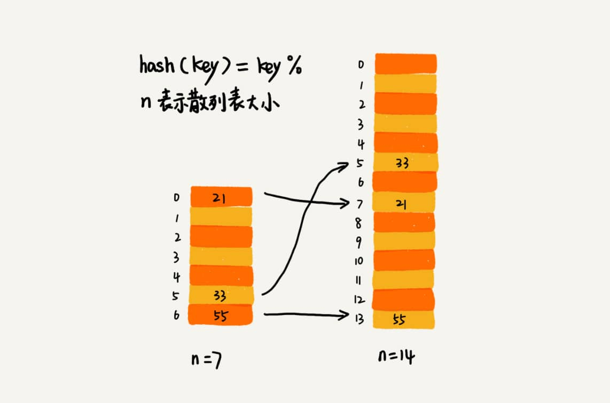

一些数据删除后，如果对空间敏感，可通过**动态缩容**。

### 如何避免低效的扩容？

为了解决一次性扩容耗时过多的情况，可以将扩容操作穿插在插入操作的过程中，分批完成。

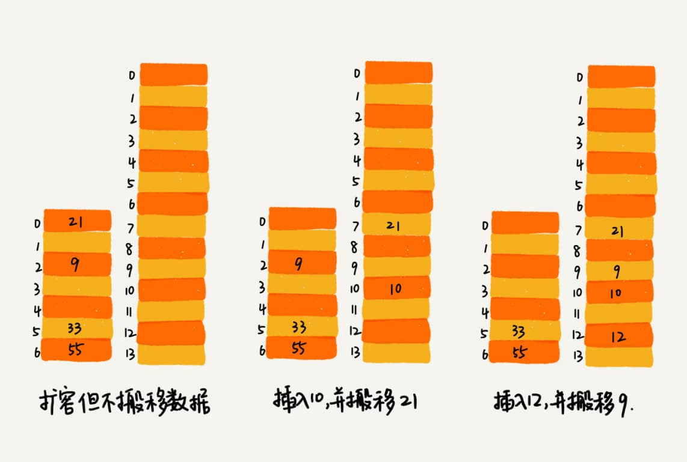

对于这期间的查询操作，为了兼容了新、老散列表中的数据，我们先从新散列表中查找，如果没有找到，再去老的散列表中查找。

### 如何选择冲突解决方法？

Java 中 LinkedHashMap 就采用了链表法解决冲突，ThreadLocalMap 是通过线性探测的开放寻址法来解决冲突。

|          | 开放寻址法                                                   | 链表法                                                       |
| -------- | ------------------------------------------------------------ | ------------------------------------------------------------ |
| 优点     | 不需要很多链表，数据都存储在数组中，可以有效地利用 CPU 缓存加快查询速度；<br />序列化起来比较简单； | 对内存的利用率更高；<br />链表结点可以在需要的时候再创建，不要事先申请好；<br /><br />装载因子可很大； |
| 缺点     | 删除数据麻烦；<br />数据都存储在一个数组中，冲突代价更高；<br />装载因子的上限不能太大，更浪费内存空间； | 链表中的节点在内存中不是连续的，对CPU缓存不友好；<br />链表需要存储指针，比较小的对象比较消耗内存；（如果对象的代销远远大于一个指针的大小，就可以忽略） |
| 适用场景 | 当数据量比较小、装载因子小的时候，适合采用开放寻址法。       | 基于链表的散列冲突处理方法比较适合存储大对象、大数据量的散列表，而且，比起开放寻址法，它更加灵活，支持更多的优化策略，比如用红黑树代替链表。 |


### 工业级散列表举例分析

HashMap

1. 初始大小

   16。可以根据数量大概量，修改初始大小，减少动态扩容的次数。

2. 装载因子和动态扩容

   0.75。每次扩容为原来的两倍。

3. 散列冲突解决方法

   HashMap 底层采用链表法来解决冲突。

   JDK8后，引入红黑树，优化链表过长的情况；当红黑树结点个数少于 8 个的时候，又会将红黑树转化为链表。

4. 散列函数

   追求的是简单高效、分布均匀。

   ```java
       static final int hash(Object key) {
           int h;
           return (key == null) ? 0 : (h = key.hashCode()) ^ (h >>> 16);
       }
   ```

   hashCode() 返回的是 Java 对象的 hash code。比如 String 类型的对象的 hashCode() 就是：

   ```java
       public int hashCode() {
           int h = hash;
           if (h == 0 && value.length > 0) {
               char val[] = value;
   
               for (int i = 0; i < value.length; i++) {
                   h = 31 * h + val[i];
               }
               hash = h;
           }
           return h;
       }
   ```

   

### 思考题

> 如何设计一个工业级的散列函数？

要求：

- 支持快速地查询、插入、删除操作；
- 内存占用合理，不能浪费过多的内存空间；
- 性能稳定，极端情况下，散列表的性能也不会退化到无法接受的情况。

实现：

- 设计一个合适的散列函数；
- 定义装载因子阈值，并且设计动态扩容策略；
- 选择合适的散列冲突解决方法。

> 在你熟悉的编程语言中，哪些数据类型底层是基于散列表实现的？散列函数是如何设计的？散列冲突是通过哪种方法解决的？是否支持动态扩容呢？


## 20 散列表（下）：为什么散列表和链表经常会一起使用？

🔖

### LRU 缓存淘汰算法


### Redis 有序集合


### Java的LinkedHashMap


### 思考题

> 为什么散列表和链表会经常一块使用？

散列表这种数据结构虽然支持非常高效的数据插入、删除、查找操作，但是散列表中的数据都是通过散列函数打乱之后无规律存储的。也就说，它无法支持按照某种顺序快速地遍历数据。如果希望按照顺序遍历散列表中的数据，那我们需要将散列表中的数据拷贝到数组中，然后排序，再遍历。

因为散列表是动态数据结构，不停地有数据的插入、删除，所以每当我们希望按顺序遍历散列表中的数据的时候，都需要先排序，那效率势必会很低。为了解决这个问题，我们将散列表和链表（或者跳表）结合在一起使用。


>  上面的几个散列表和链表结合使用的例子里，用的都是双向链表。如果把双向链表改成单链表，还能否正常工作呢？为什么呢？


> 假设猎聘网有 10 万名猎头，每个猎头都可以通过做任务（比如发布职位）来积累积分，然后通过积分来下载简历。假设你是猎聘网的一名工程师，如何在内存中存储这 10 万个猎头 ID 和积分信息，让它能够支持这样几个操作：
>
> - 根据猎头的 ID 快速查找、删除、更新这个猎头的积分信息；
> - 查找积分在某个区间的猎头 ID 列表；
> - 查找按照积分从小到大排名在第 x 位到第 y 位之间的猎头 ID 列表。


> 总结：
>
> 两种数据结构，链表和数组。 
>
> 数组占据**随机访问**的优势，却有需要连续内存的缺点。 
>
> 链表具有**可不连续存储**的优势，但访问查找是线性的。 
>
> 散列表和链表、跳表的混合使用，是为了结合数组和链表的优势，规避它们的不足。
>
>  得出数据结构和算法的重要性排行榜：**==连续空间 > 时间 > 碎片空间==**。

## 21 哈希算法（上）：如何防止数据库中的用户信息被脱库？

如何用哈希算法解决问题。

### 什么是哈希算法？

> hash，翻译为哈希、散列

**将任意长度的二进制值串映射为固定长度的二进制值串**，这个**映射的规则**就是**==哈希算法==**，得到固定长度的二进制值串就是**哈希值**。

优秀哈希算法设计要点：

- 从哈希值不能**反向**推导出原始数据（所以哈希算法也叫单向哈希算法）；
- 对输入数据非常**敏感**，哪怕原始数据只修改了一个 Bit，最后得到的哈希值也大不相同；
- 散列冲突的**概率**要很小，对于不同的原始数据，哈希值相同的概率非常小；
- 哈希算法的执行**效率**要尽量高效，针对较长的文本，也能快速地计算出哈希值。


哈希算法常见七个应用：安全加密、唯一标识、数据校验、散列函数、负载均衡、数据分片、分布式存储。

### 安全加密

 MD5（MD5 Message-Digest Algorithm，MD5 消息摘要算法），128bit二进制串，一般用32个16进制数表示。

SHA（Secure Hash Algorithm，安全散列算法）

DES（Data Encryption Standard，数据加密标准）

AES（Advanced Encryption Standard，高级加密标准）

> 组合数学（离散数学）一个非常基础的理论，鸽巢原理（也叫抽屉原理）：
>
> 如果有 10 个鸽巢，有 11 只鸽子，那肯定有 1 个鸽巢中的鸽子数量多于 1 个，换句话说就是，肯定有 2 只鸽子在 1 个鸽巢内。


### 唯一标识

图库

为每张图片去一个唯一标识（或者说信息摘要）。比如，我们可以从图片的二进制码串开头取 100 个字节，从中间取 100 个字节，从最后再取 100 个字节，然后将这 300 个字节放到一块，通过哈希算法（比如 MD5），得到一个哈希字符串，用它作为图片的唯一标识。


### 数据校验

BT下载，基于 P2P 协议的，文件被分割成很多块。


### 散列函数

相对哈希算法的其他应用，散列函数对于散列算法冲突的要求要低很多。即便出现个别散列冲突，只要不是过于严重，我们都可以通过开放寻址法或者链表法解决。

散列函数用的散列算法一般都比较简单，比较追求效率。


### 思考题

选择相对安全的加密算法，对用户密码进行加密之后再存储。

**字典攻击**：维护一个常用密码的字典表，把字典中的每个密码用哈希算法计算哈希值，然后拿哈希值跟脱库后的密文比对。

针对字典攻击，我们可以引入一个**盐（salt）**，跟用户的密码组合在一起，增加密码的复杂度。

> 区块链底层的实现原理并不复杂。其中，哈希算法就是它的一个非常重要的理论基础。
>
> 你能讲一讲区块链使用的是哪种哈希算法吗？是为了解决什么问题而使用的呢？

区块链是一块块区块组成的，每个区块分为两部分：区块头和区块体。 

区块头保存着 自己区块体 和 上一个区块头 的哈希值。 

因为这种链式关系和哈希值的唯一性，只要区块链上任意一个区块被修改过，后面所有区块保存的哈希值就不对了。 

区块链使用的是 SHA256 哈希算法，计算哈希值非常耗时，如果要篡改一个区块，就必须重新计算该区块后面所有的区块的哈希值，短时间内几乎不可能做到。

## 22 哈希算法（下）：哈希算法在分布式系统中有哪些应用？

### 负载均衡

负载均衡算法有**轮询、随机、加权轮询**等。


### 数据分片

#### 1 如何统计“搜索关键词”出现的次数？


#### 2 如何快速判断图片是否在图库中？


### 分布式存储


### 思考题

哈希算法其它的应用：网络协议中的 CRC 校验、Git commit id等等。


## 23 二叉树基础（上）：什么样的二叉树适合用数组来存储？

> 二叉树有哪几种存储方式？什么样的二叉树适合用数组来存储？

### 树（Tree）

**父节点**

**子节点**

**兄弟节点**

**叶子节点/叶节点**

节点的**高度**（Height） = 节点到叶子节点的**最长路径**（边数）

节点的**深度**（Depth） = 根节点到这个节点所经历的**边的个数**

节点的**层**（Level） = 节点的深度 + 1

树的高度 = 根节点的高度


> “高度”就是从下往上度量；深度”是从上往下度量的；“层数”跟深度类似，不过计数起点是 1。

### 二叉树（Binary Tree）

每个节点**最多**有两个“叉”，分别是**左子节点**和**右子节点**。


编号 2 的二叉树中，叶子节点全都在最底层，除了叶子节点之外，每个节点都有左右两个子节点，这种二叉树就叫做**满二叉树**。

编号 3 的二叉树中，叶子节点都在最底下两层，最后一层的叶子节点都**靠左**排列，并且除了最后一层，其他层的节点个数都要达到最大，这种二叉树叫做**完全二叉树**。

>  如何表示（或者存储）一棵二叉树？

1. 基于指针或者引用的二叉**链式存储法**


2. 基于数组的**顺序存储法**

### 二叉树的遍历

- **==前序遍历==**，对于树中的任意节点来说，先打印这个节点，然后再打印它的左子树，最后打印它的右子树。

- **==中序遍历==**，对于树中的任意节点来说，先打印它的左子树，然后再打印它本身，最后打印它的右子树。

- **==后序遍历==**，对于树中的任意节点来说，先打印它的左子树，然后再打印它的右子树，最后打印这个节点本身。

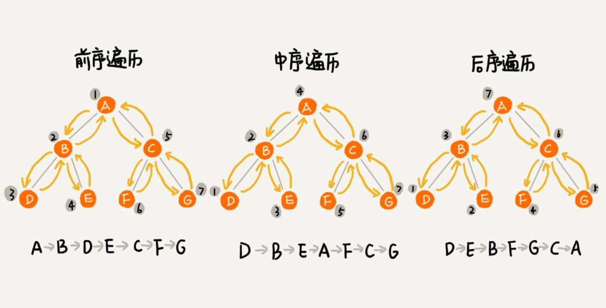


### 思考

二叉树既可以用链式存储，也可以用数组顺序存储。数组顺序存储的方式比较适合完全二叉树，其他类型的二叉树用数组存储会比较浪费存储空间。

> 给定一组数据，比如 1，3，5，6，9，10。你来算算，可以构建出多少种不同的二叉树？


## 24 二叉树基础（下）：有了如此高效的散列表，为什么还需要二叉树？


### 二叉查找树（Binary Search Tree）

**==二叉查找树==**是为了实现**快速查找**而生的。

二叉查找树要求，在树中的任意一个节点，其左子树中的每个节点的值，都要小于这个节点的值，而右子树节点的值都大于这个节点的值。


### 支持重复数据的二叉查找树


### 二叉查找树的时间复杂度分析


### 思考

> 散列表的插入、删除、查找操作的时间复杂度可以做到常量级的 O(1)，非常高效。
>
> 而二叉查找树在比较平衡的情况下，插入、删除、查找操作时间复杂度才是 O(logn)，相对散列表，好像并没有什么优势，那我们为什么还要用二叉查找树呢？

1. 散列表中的数据是无序存储的，如果要输出有序的数据，需要先进行排序。而对于二叉查找树来说，我们只需要中序遍历，就可以在 O(n) 的时间复杂度内，输出有序的数据序列。
2. 散列表扩容耗时很多，而且当遇到散列冲突时，性能不稳定，尽管二叉查找树的性能不稳定，但是在工程中，我们**最常用的平衡二叉查找树的性能非常稳定，时间复杂度稳定在 O(logn)**。
3. 笼统地来说，尽管散列表的查找等操作的时间复杂度是常量级的，但因为哈希冲突的存在，这个常量不一定比 logn 小，所以实际的查找速度可能不一定比 O(logn) 快。加上哈希函数的耗时，也不一定就比平衡二叉查找树的效率高。
4. 散列表的构造比二叉查找树要复杂，需要考虑的东西很多。比如<u>散列函数的设计、冲突解决办法、扩容、缩容</u>等。平衡二叉查找树只需要考虑**平衡性**这一个问题，而且这个问题的解决方案比较成熟、固定。
5. 为了避免过多的散列冲突，散列表装载因子不能太大，特别是基于开放寻址法解决冲突的散列表，不然会浪费一定的存储空间。

> 如何通过编程，求出一棵给定二叉树的确切高度呢？


## 25 红黑树（上）：为什么工程中都用红黑树这种二叉树？

二叉查找树是最常用的一种二叉树，它支持快速插入、删除、查找操作，各个操作的时间复杂度跟树的高度成正比，理想情况下，时间复杂度是 O(logn)。

二叉查找树在频繁的动态更新过程中，可能会出现树的高度远大于 log~2~n 的情况，从而导致各个操作的效率下降。极端情况下，二叉树会退化为链表，时间复杂度会退化到 O(n)。

### 什么是“平衡二叉查找树”？

**==平衡二叉树==**的严格定义：**二叉树中任意一个节点的左右子树的高度相差不能大于 1**。

完全二叉树、满二叉树其实都是平衡二叉树，但是非完全二叉树也有可能是平衡二叉树。

**==平衡二叉查找树==**既是平衡二叉树，又有二叉查找树的特点。最先被发明的平衡二叉查找树是**AVL树**。

> 我们学习数据结构和算法是为了应用到实际的开发中的，没必去死抠定义。

发明平衡二叉查找树这类数据结构的初衷是，**解决普通二叉查找树在频繁的插入、删除等动态更新的情况下，出现时间复杂度退化的问题**。

平衡二叉查找树中“**平衡**”的意思，其实就是让整棵树左右看起来比较“对称”、比较“平衡”，不要出现左子树很高、右子树很矮的情况。这样就能<u>让整棵树的高度相对来说低一些，相应的插入、删除、查找等操作的效率高一些</u>。

### 如何定义一棵“红黑树”？

平衡二叉查找树有很多，比如，AVL树、Splay Tree（伸展树）、Treap（树堆）等，但最出名的是红黑树。

红黑树，“Red-Black Tree”，简称 R-B Tree，是一种不严格的平衡二叉查找树。

- 红黑树中的节点，一类被标记为黑色，一类被标记为红色。
- 根节点是黑色的；
- 每个叶子节点都是黑色的空节点（NIL），也就是说，叶子节点不存储数据；
- 任何相邻的节点都不能同时为红色，也就是说，红色节点是被黑色节点隔开的；
- 每个节点，从该节点到达其可达叶子节点的所有路径，都包含相同数目的黑色节点；

### 为什么说红黑树是“近似平衡”的？

“平衡”的意思可以等价为性能不退化。“近似平衡”就等价为性能不会退化得太严重。


### 思考

> 为什么工程中都喜欢用红黑树，而不是其他平衡二叉查找树呢？

Treap、Splay Tree，绝大部分情况下，它们操作的效率都很高，但是也无法避免极端情况下时间复杂度的退化。尽管这种情况出现的概率不大，但是对于单次操作时间非常敏感的场景来说，它们并不适用。

AVL 树是一种高度平衡的二叉树，所以查找的效率非常高，但是，有利就有弊，AVL 树为了维持这种高度的平衡，就要付出更多的代价。每次插入、删除都要做调整，就比较复杂、耗时。所以，对于有频繁的插入、删除操作的数据集合，使用 AVL 树的代价就有点高了。

红黑树只是做到了近似平衡，并不是严格的平衡，所以在维护平衡的成本上，要比 AVL 树要低。

> 动态数据结构支持动态的数据插入、删除、查找操作，除了红黑树，我们前面还学习过哪些呢？能对比一下各自的优势、劣势，以及应用场景吗？

散列表：插入删除查找都是O(1), 是最常用的，但其缺点是不能顺序遍历以及扩容缩容的性能损耗。适用于那些不需要顺序遍历，数据更新不那么频繁的。 

跳表：插入删除查找都是O(logn), 并且能顺序遍历。缺点是空间复杂度O(n)。适用于不那么在意内存空间的，其顺序遍历和区间查找非常方便。 

红黑树：插入删除查找都是O(logn), 中序遍历即是顺序遍历，稳定。缺点是难以实现，去查找不方便。其实跳表更佳，但红黑树已经用于很多地方了。


## *26 红黑树（下）：掌握这些技巧，你也可以实现一个红黑树

红黑树好的是因为它稳定、高效的性能，坏的是实现起来实在太难了。


## 27 递归树：如何借助树来求解递归算法的时间复杂度？

借助递归树来分析递归算法的时间复杂度。

### 递归树与时间复杂度分析

递归的思想：将大问题分解为小问题来求解，然后再将小问题分解为小小问题。

如果我们把这个一层一层的分解过程画成图，它其实就是一棵树，叫作**递归树**。


归并排序算法

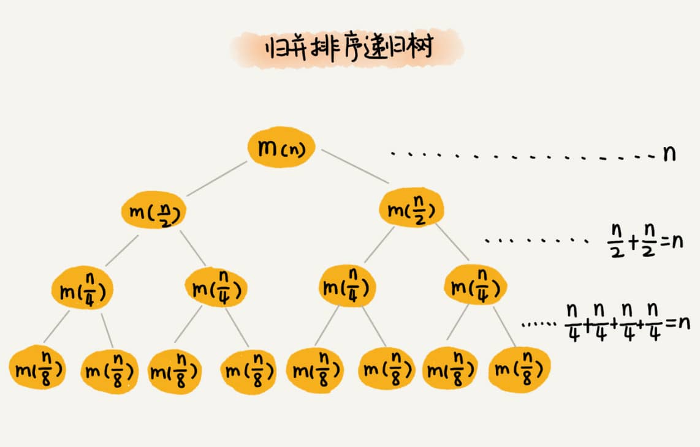

归并算法中分解代价很低，比较耗时的是归并操作，也就是把两个子数组合并为大数组。

### 实战一：分析快速排序的时间复杂度


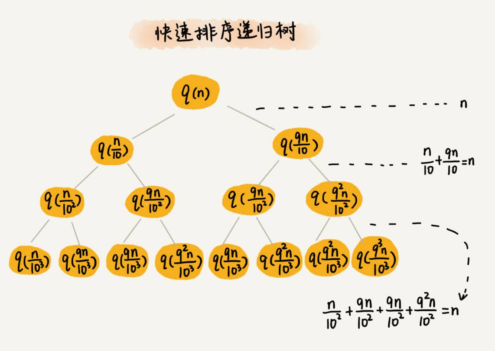


### 实战二：分析斐波那契数列的时间复杂度


### 实战三：分析全排列的时间复杂度


### 思考题

> 1 个细胞的生命周期是 3 小时，1 小时分裂一次。求 n 小时后，容器内有多少细胞？请你用已经学过的递归时间复杂度的分析方法，分析一下这个递归问题的时间复杂度。

## 28 堆和堆排序：为什么说堆排序没有快速排序快？

堆排序是一种原地的、时间复杂度为 O(nlogn) 的排序算法。

### 如何理解“堆”？

堆是一种特殊的树。

- 堆是一个完全二叉树；
- 堆中每一个节点的值都必须大于等于（或小于等于）其子树中每个节点的值。

“**大顶堆**”：每个节点的值都大于等于子树中每个节点值的堆。

“**小顶堆**”：每个节点的值都小于等于子树中每个节点值的堆。

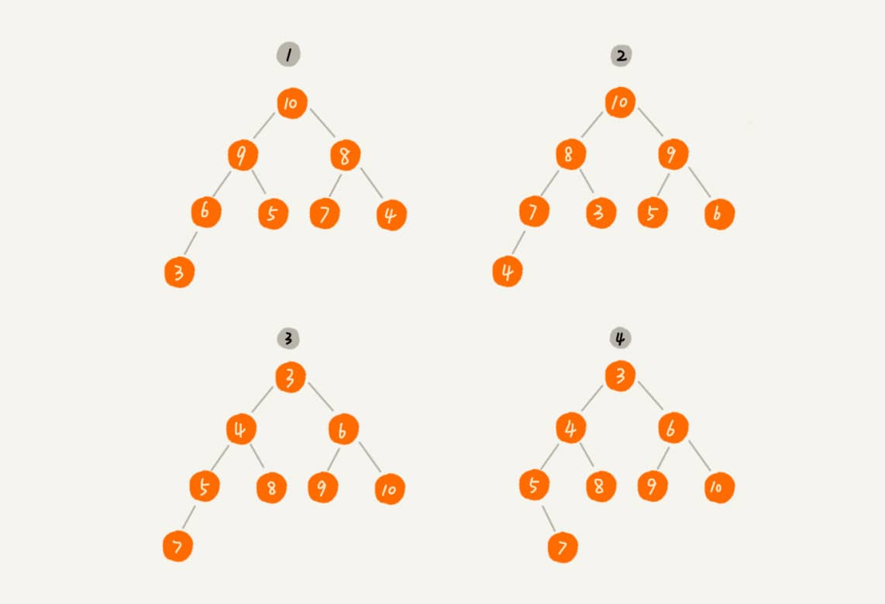

其中第 1 个和第 2 个是大顶堆，第 3 个是小顶堆，第 4 个不是堆。

### 如何实现一个堆？

> 堆都支持哪些操作？
>
> 如何存储一个堆？

完全二叉树比较适合用数组来存储。用数组来存储完全二叉树是非常节省存储空间的。

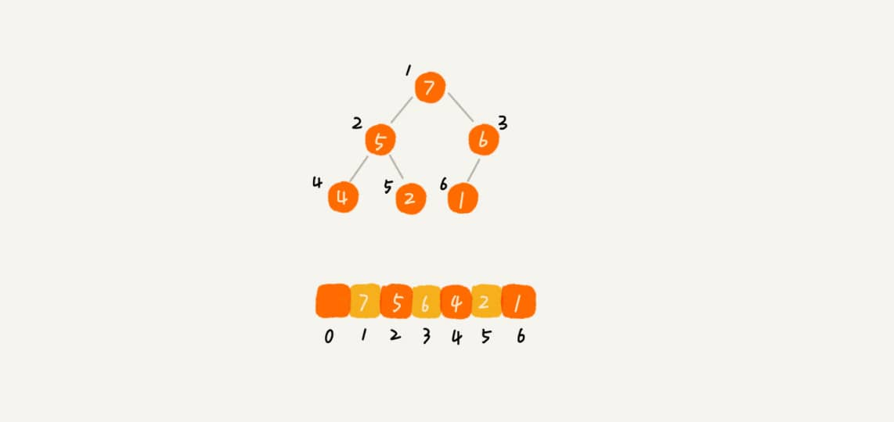

数组中下标为 i 的节点的左子节点，就是下标为 `i*2` 的节点，右子节点就是下标为 `i*2+1` 的节点，父节点就是下标为 `i/2` 的节点。

#### 1 往堆中插入一个元素

堆化（heapify）


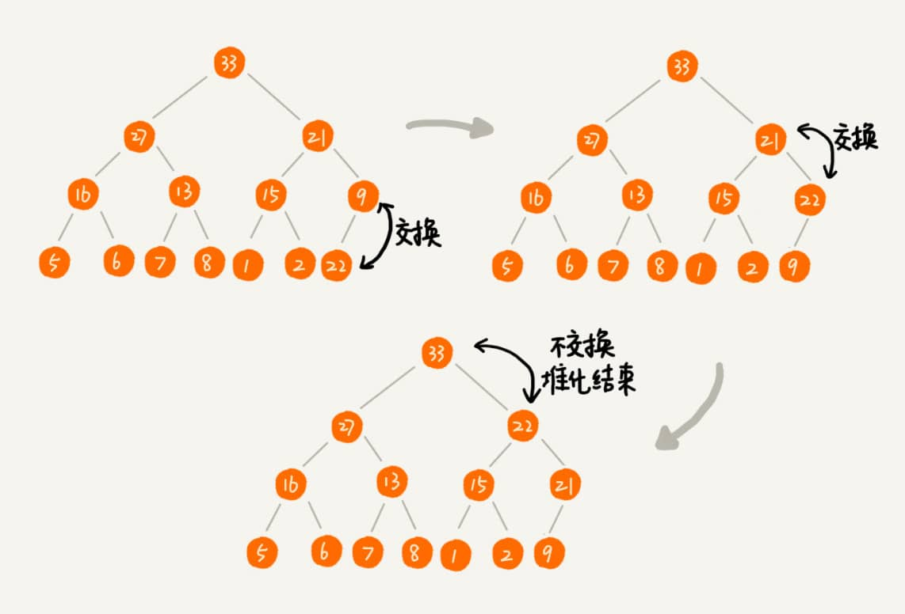

#### 2 删除堆顶元素


### 如何基于堆实现排序？

#### 1 建堆


#### 2 排序

### 思考题

> 两种排序算法的时间复杂度都是 O(nlogn)，甚至堆排序比快速排序的时间复杂度还要稳定，但是，在实际的软件开发中，快速排序的性能要比堆排序好，这是为什么呢？

1. 堆排序数据访问的方式没有快速排序友好。
2. 对于同样的数据，在排序过程中，堆排序算法的数据交换次数要多于快速排序。


> 在讲堆排序建堆的时候，我说到，对于完全二叉树来说，下标从 n/2+1 到 n 的都是叶子节点，这个结论是怎么推导出来的呢？


> 上面是堆的一种经典应用，堆排序。关于堆，你还能想到它的其他应用吗？

## 29 堆的应用：如何快速获取到Top 10最热门的搜索关键词？


### 堆的应用一：优先级队列

#### 1 合并有序小文件


#### 2 高性能定时器


### 堆的应用二：利用堆求 Top K


### 堆的应用三：利用堆求中位数


### 思考题

> 有一个包含 10 亿个搜索关键词的日志文件，如何快速获取到 Top 10 最热门的搜索关键词呢？


> 有一个访问量非常大的新闻网站，我们希望将点击量排名 Top 10 的新闻摘要，滚动显示在网站首页 banner 上，并且每隔 1 小时更新一次。如果你是负责开发这个功能的工程师，你会如何来实现呢？


## 30 图的表示：如何存储微博、微信等社交网络中的好友关系？

涉及图的算法：比如图的搜索、最短路径、最小生成树、二分图等等。

### 如何理解“图”？

图（Graph） 

顶点（vertex） 

边（edge），图中的一个顶点可以与任意其他顶点建立连接关系。

微信的好友关系，其中，每个用户有多少个好友，对应到图中，就叫做顶点的**度（degree）**，就是跟顶点相连接的边的条数。


“有向图”  “无向图”


在有向图中，度分为**入度（In-degree）**和**出度（Out-degree）**。

> 对应微博，入度就表示有多少粉丝，出度就表示关注了多少人。


**带权图（weighted graph）**，每条边都有一个权重（weight）（可以通过这个权重来表示 QQ 好友间的亲密度）。


#### 邻接矩阵存储方法

**邻接矩阵（Adjacency Matrix）**


#### 邻接表存储方法

**邻接表（Adjacency List）**


### 思考题

> 如何存储微博、微信等这些社交网络的好友关系吗？

## 31 深度和广度优先搜索：如何找出社交网络中的三度好友关系？

六度分割理论

### 什么是“搜索”算法？

**==算法是作用于具体数据结构之上的==**，深度优先搜索算法和广度优先搜索算法都是基于“图”这种数据结构的。


### 广度优先搜索

广度优先搜索（Breadth-First-Search，BFS），就是一种“地毯式”层层推进的搜索策略，即先查找离起始顶点最近的，然后是次近的，依次往外搜索。


广度优先搜索的分解图：


### 深度优先搜索

深度优先搜索（Depth-First-Search，DFS） 。

最直观的例子就是“走迷宫”。

假设你站在迷宫的某个岔路口，然后想找到出口。你随意选择一个岔路口来走，走着走着发现走不通的时候，你就回退到上一个岔路口，重新选择一条路继续走，直到最终找到出口。这种走法就是一种深度优先搜索策略。

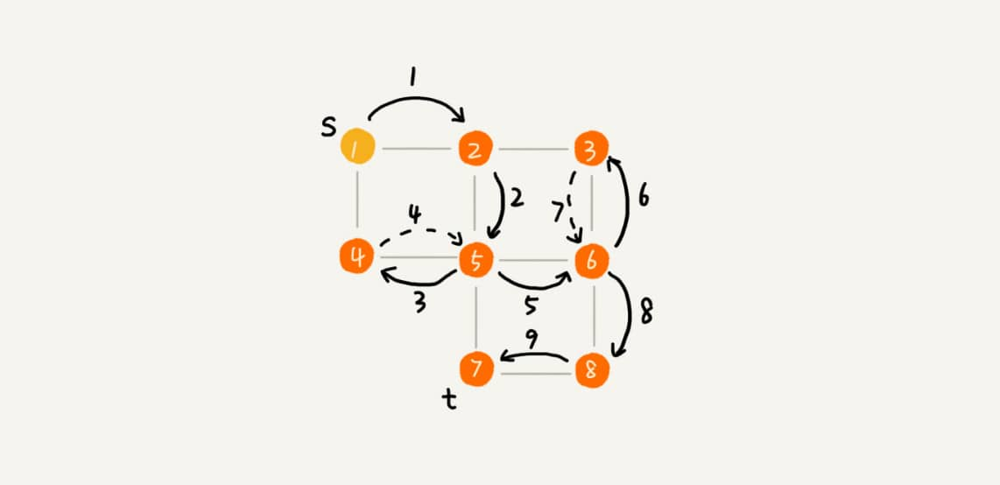

深度优先搜索用的是一种比较著名的算法思想，**回溯思想**。

### 思考题

> 如何找出社交网络中某个用户的三度好友关系？

## 32 字符串匹配基础（上）：如何借助哈希算法实现高效字符串匹配？

字符串查找函数

字符串匹配算法有很多。

- 单模式串匹配的算法
  - BF 算法和 RK 算法  （简单、好理解）
  - BM 算法和 KMP 算法  （难理解、高效）
- 多模式串匹配算法
  - Trie 树
  - AC 自动机

RK 算法是 BF 算法的改进，它借助了哈希算法，让匹配的效率有了很大的提升。

### BF 算法

BF 算法， Brute Force，中文叫作暴力匹配算法 或者 朴素匹配算法。


### RK 算法

Rabin-Karp 算法

## 33 字符串匹配基础（中）：如何实现文本编辑器中的查找功能？

BM（Boyer-Moore）算法

### BM 算法的核心思想


### BM 算法原理分析

坏字符规则（bad character rule）和好后缀规则（good suffix shift）


### BM 算法代码实现


### BM 算法的性能分析及优化


## 34 字符串匹配基础（下）：如何借助BM算法轻松理解KMP算法？


### KMP 算法基本原理

KMP 算法是根据三位作者（D.E.Knuth，J.H.Morris 和 V.R.Pratt）的名字来命名的。


### 失效函数计算方法


### KMP 算法复杂度分析


## 35 Trie树：如何实现搜索引擎的搜索关键词提示功能？

搜索引擎的搜索关键词提示功能，我们经常使用。Google、百度等搜索引擎，这个功能肯定辽很多优化，但基本原理还是：**Trie树**。


### 什么是“Trie 树”？

Trie 树，也叫“字典树”，是一个树形结构，是一种专门处理字符串匹配的数据结构，用来解决在一组字符串集合中快速查找某个字符串的问题。

有6个字符串，分别是：how，hi，her，hello，so，see。如何多次查找某个字符串是否在前面的几个字符串中？

一般情况下就是，拿要查找到的字符串依次和6个字符串匹配，这是可行的，但效率比较低下。

先对6个字符串预处理一下，组织成字典树的结构，然后在字典树中匹配查找。

Trie 树的本质，就是利用字符串之间的公共前缀，将重复的前缀合并在一起。

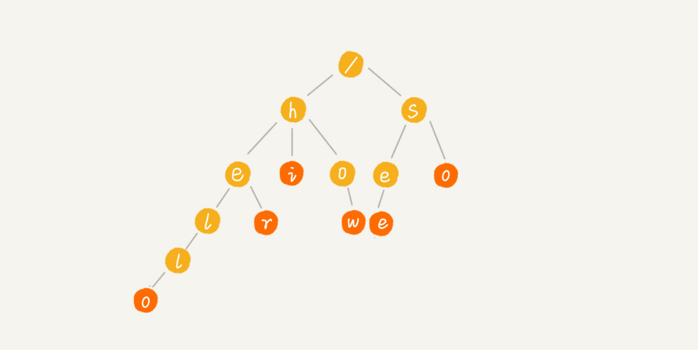

其中，字典树有几个特点：

- 根节点不包含任何信息
- 每个节点表示一个字符串中的一个字符

- 根节点到红色节点的一条路径表示一个字符串（注：红色节点不都是叶子节点）

字典树的具体构造过程：


在字典树种查找字符串的过程，就很好理解了，比如查找“her”，先把它分割成三个字符h、e、r，然后从根节点依次匹配：

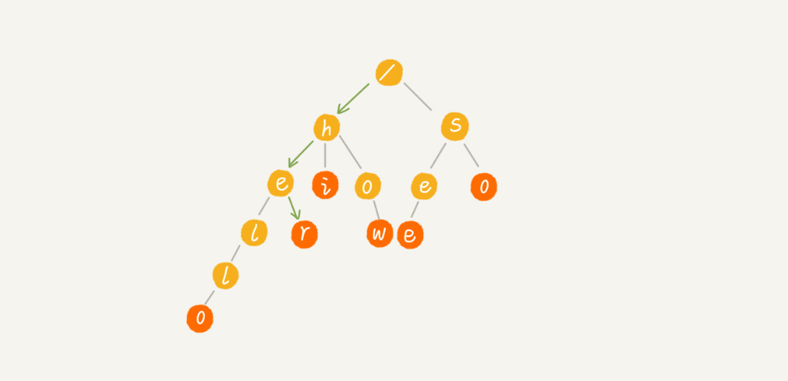


### 如何实现一棵 Trie树？

上面的过程可以分为两步：

1. **将字符串集合构造成Trie树**。
2. **在Trie树中查询一个字符串**。


### Trie 树真的很耗内存吗？


### Trie 树与散列表、红黑树的比较


### 思考题

> 如何利用 Trie 树，实现搜索关键词的提示功能？


## 36 AC自动机：如何用多模式串匹配实现敏感词过滤功能？

> 敏感词过滤功能最基本的原理就是字符串匹配算法，也就是通过维护一个敏感词的字典，当用户输入一段文字内容之后，通过字符串匹配算法，来查找用户输入的这段文字，是否包含敏感词。如果有，就用“***”把它替代掉。

> 那如何才能实现一个高性能的敏感词过滤系统呢？

### 基于单模式串和 Trie 树实现的敏感词过滤


### 经典的多模式串匹配算法：AC 自动机

Aho-Corasick 算法

AC 自动机实际上就是在 Trie 树之上，加了类似 KMP 的 next 数组，只不过此处的 next 数组是构建在树上罢了。


## 37 贪心算法：如何用贪心算法实现Huffman压缩编码？

一些**==算法思想==**：贪心算法、分治算法、回溯算法、动态规划。

贪心算法（greedy algorithm）有很多经典的应用，比如霍夫曼编码（Huffman Coding）、Prim 和 Kruskal 最小生成树算法、还有 Dijkstra 单源最短路径算法。

> 霍夫曼编码是如何利用贪心算法来实现对数据压缩编码，有效节省数据存储空间的？

### 如何理解“贪心算法”？


### 贪心算法实战分析

#### 1 分糖果


#### 2 钱币找零


#### 3 区间覆盖


贪心算法的最难的一块是如何将要解决的问题抽象成贪心算法模型。


### 思考题

> 在一个非负整数 a 中，我们希望从中移除 k 个数字，让剩下的数字值最小，如何选择移除哪 k 个数字呢？


> 假设有 n 个人等待被服务，但是服务窗口只有一个，每个人需要被服务的时间长度是不同的，如何安排被服务的先后顺序，才能让这 n 个人总的等待时间最短？


## 38 分治算法：谈一谈大规模计算框架MapReduce中的分治思想

**==MapReduce==** 是 Google 大数据处理的三驾马车之一，另外两个是 ==**GFS 和 Bigtable**==。它在**倒排索引、PageRank 计算、网页分析**等搜索引擎相关的技术中都有大量的应用。

MapRedue 的本质就是分治算法。

### 如何理解分治算法？

分治算法（divide and conquer）的核心思想其实就是四个字，**==分而治之==** ，也就是将原问题划分成 n 个规模较小，并且结构与原问题相似的子问题，递归地解决这些子问题，然后再合并其结果，就得到原问题的解。

**分治算法是一种处理问题的思想，递归是一种编程技巧。**

实际上，分治算法一般都比较适合用递归来实现。分治算法的递归实现中，每一层递归都会涉及这样三个操作：

- 分解：将原问题分解成一系列子问题；
- 解决：递归地求解各个子问题，若子问题足够小，则直接求解；
- 合并：将子问题的结果合并成原问题。

分治算法能解决的问题，一般需要满足下面这几个条件：

- 原问题与分解成的小问题具有**相同的模式**；
- 原问题分解成的子问题可以**独立求解**，子问题之间**没有相关性**，这一点是分治算法跟动态规划的明显区别，等我们讲到动态规划的时候，会详细对比这两种算法；
- 具有分解**终止条件**，也就是说，当问题足够小时，可以**直接求解**；
- 可以将子问题合并成原问题，而这个合并操作的复杂度不能太高，否则就起不到减小算法总体复杂度的效果了。

### 分治算法应用举例分析


### 分治思想在海量数据处理中的应用


> ==创新并非离我们很远，创新的源泉来自对事物本质的认识。无数优秀架构设计的思想来源都是基础的数据结构和算法，这本身就是算法的一个魅力所在。==

### 思考题


> 为什么说 MapReduce 的本质就是分治思想？

实际上，MapReduce 框架只是一个任务调度器，底层依赖 GFS 来存储数据，依赖 Borg 管理机器。它从 GFS 中拿数据，交给 Borg 中的机器执行，并且时刻监控机器执行的进度，一旦出现机器宕机、进度卡壳等，就重新从 Borg 中调度一台机器执行。

## 39 回溯算法：从电影《蝴蝶效应》中学习回溯算法的核心思想

回溯算法思想的应用：

深度优先搜索算

实际的软件开发场景中，比如正则表达式匹配、编译原理中的语法分析等

很多经典的数学问题，比如数独、八皇后、0-1 背包、图的着色、旅行商问题、全排列等等。

### 如何理解“回溯算法”？


### 两个回溯算法的经典应用


## 40 初识动态规划：如何巧妙解决“双十一”购物时的凑单问题？


## 41 动态规划理论：一篇文章带你彻底搞懂最优子结构、无后效性和重复子问题


## 42 动态规划实战：如何实现搜索引擎中的拼写纠错功能？


# 高级篇

## 43 拓扑排序：如何确定代码源文件的编译依赖关系？

编译器通过分析源文件或者程序员事先写好的编译配置文件（比如 Makefile 文件），来获取这种局部的依赖关系。<u>那编译器又该如何通过源文件两两之间的局部依赖关系，确定一个全局的编译顺序呢？</u>

### 算法解析


#### 1 Kahn 算法


#### 2 DFS 算法


## 44 最短路径：地图软件是如何计算出最优出行路径的？


## 45 位图：如何实现网页爬虫中的URL去重功能？


## 46 概率统计：如何利用朴素贝叶斯算法过滤垃圾短信？

### 算法解析

#### 1 基于黑名单的过滤器


#### 2 基于规则的过滤器


#### 3 基于概率统计的过滤器


## 47 向量空间：如何实现一个简单的音乐推荐系统？

### 算法解析

#### 1 基于相似用户做推荐


#### 2 基于相似歌曲做推荐


## 48 B+树：MySQL数据库索引是如何实现的？

### 解决问题的前提是定义清楚问题

> 如何定义清楚问题呢？

- 对问题进行详细的调研
- 通过对一些模糊的需求进行假设，来限定要解决的问题的范围。

功能性需求

非功能性需求(比如安全、性能、用户体验等等)

### 尝试用学过的数据结构解决这个问题


### 改造二叉查找树来解决这个问题


> 通常内存的访问速度是纳秒级别的，而磁盘访问的速度是毫秒级别的。读取同样大小的数据，从磁盘中读取花费的时间，是从内存中读取所花费时间的上万倍，甚至几十万倍。


### B+树和B树

B树（B-Tree）有时也写成B-树，这里-只是一个连接符不是减号。

B 树实际上是低级版的 B+ 树，或者说 B+ 树是 B 树的改进版。不同点：

- B+ 树中的节点不存储数据，只是索引，而 B 树中的节点存储数据；
- B 树中的叶子节点并不需要链表来串联。

也就是说，B 树只是一个每个节点的子节点个数不能小于 m/2 的 m 叉树。


### 思考题

> B+ 树中，将叶子节点串起来的链表，是单链表还是双向链表？为什么？


## 49 搜索：如何用A*搜索算法实现游戏中的寻路功能？

> 魔兽世界、仙剑奇侠传这类 MMRPG （大型多人在线角色扮演游戏）游戏，有一个非常重要的功能，那就是人物角色自动寻路。当人物处于游戏地图中的某个位置的时候，我们用鼠标点击另外一个相对较远的位置，人物就会自动地绕过障碍物走过去。
> 这个功能是怎么实现的呢？


## 50 索引：如何在海量数据中快速查找某个数据？

### 为什么需要索引？


### 索引的需求定义

#### 1 功能性需求

数据是格式化数据还是非格式化数据？

数据是静态数据还是动态数据？

索引存储在内存还是硬盘？

单值查找还是区间查找？

单关键词查找还是多关键词组合查找？

#### 2 非功能性需求

不管是存储在内存中还是磁盘中，索引对存储空间的消耗不能过大。

在考虑索引查询效率的同时，我们还要考虑索引的维护成本。


### 构建索引常用的数据结构有哪些？

常用来构建索引的数据结构，就是几种支持**动态数据集合**的数据结构。比如，**散列表、红黑树、跳表、B+ 树**。除此之外，**位图、布隆过滤器**可以作为辅助索引，**有序数组**可以用来对静态数据构建索引。


## 51 并行算法：如何利用并行处理提高算法的执行效率？


# 实战篇


## 52


## 56
