# 基础篇

## 32 字符串匹配基础（上）：如何借助哈希算法实现高效字符串匹配？

编程语言提供的**字符串查找函数**，比如Java中的indexOf()，Python中的find()函数等，它们底层就是依赖**字符串匹配算法**。

字符串匹配算法有很多。

- ==单模式==串匹配的算法：一个串跟一个串进行匹配
  - BF算法和RK算法  （简单、好理解）
  - BM算法和KMP算法  （难理解、高效）
- ==多模式==串匹配算法：一个串中同时查找多个串
  - Trie树
  - AC自动机

RK算法是BF算法的改进，它借助了哈希算法，让匹配的效率有了很大的提升。

### BF算法

BF算法，Brute Force，中文叫作**暴力匹配算法** 或者朴素匹配算法。

在字符串A中查找字符串B，那字符串A就是==主串==，字符串B就是==模式串==。把主串的长度记作n，模式串的长度记作m，n>m。

BF算法就是**在主串中，检查起始位置分别是 0、1、2....n-m 且长度为 m 的 n-m+1 个子串，看有没有跟模式串匹配的**。


最坏情况时间复杂度是 O(n*m)，虽然时间复杂度很高，但实际开发中BF算法比较常用，因为：

1. 实际的软件开发中，大部分情况下，模式串和主串的长度都不会太长。
2. 朴素字符串匹配算法思想简单，代码实现也非常简单。在工程中，在满足性能要求的前提下，简单是首选。这也是我们常说的==KISS==（Keep it Simple and Stupid）设计原则。

### RK算法

Rabin-Karp算法

RK算法是**借助哈希算法对BF算法进行改造**，即对每个子串分别求哈希值，然后拿子串的哈希值与模式串的哈希值比较，减少了比较的时间。理想情况下，RK 算法的时间复杂度是 O(n)。


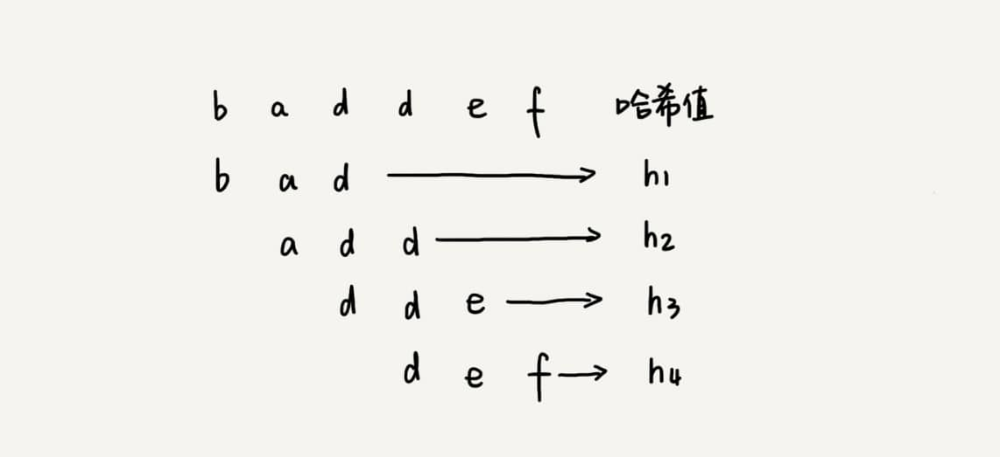


### 小结


## 33 字符串匹配基础（中）：如何实现文本编辑器中的查找功能？

如何实现文本编辑器中的查找替换功能？

在某些极端情况下，BF算法性能会**退化**的比较严重，而 RK算法需要用到哈希算法，**设计一个可以应对各种类型字符的哈希算法并不简单**。

对于工业级的软件开发来说，希望算法尽可能的高效，并且在极端情况下，性能也不要退化的太严重。

BM（Boyer-Moore）算法，非常高效的字符串匹配算法，原理复杂难懂。

### BM算法的核心思想

把模式串和主串的匹配过程，看作模式串在主串中不停地往后滑动。当遇到不匹配的字符时，BF 算法和 RK 算法的做法是，模式串往后滑动**一位**，然后从模式串的第一个字符开始重新匹配。


在这个例子里，主串中的c，在模式串中是不存在的，所以，模式串向后滑动的时候，只要有c就会与模式串没有重合，肯定无法匹配。所以，可以一次性把模式串往后多滑动几位，把模式串移动到c的后面。


由现象找规律，当遇到不匹配的字符时，有什么固定的规律，可以将模式串往后多滑动几位呢？这样一次性往后滑动好几位，那匹配的效率岂不是就提高了？

BM算法，本质上其实就是在寻找这种规律。借助这种规律，在模式串与主串匹配的过程中，当模式串和主串某个字符不匹配的时候，能够跳过一些肯定不会匹配的情况，将模式串往后多滑动**几位**。

### BM算法原理分析

BM算法包含两部分：==坏字符规则==（bad character rule）和==好后缀规则==（good suffix shift）

#### 1.坏字符规则

之前两个算法都是按模式串的下标从小到大的顺序，依次与主串中的字符进行匹配的：

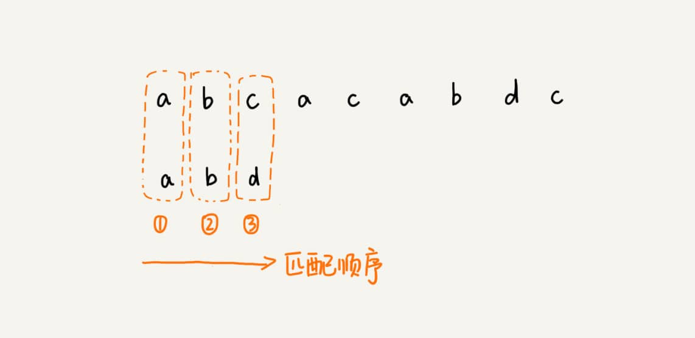

而 BM 算法的匹配顺序比较特别，它是按照模式串下标从大到小的顺序，倒着匹配的：


从模式串的末尾往前倒着匹配，当发现某个字符没法匹配的时候，把这个没有匹配的字符叫作**坏字符**（主串中的字符）：


拿坏字符 c 在模式串中查找，发现模式串中并不存在这个字符，也就是说，字符 c 与模式串中的任何字符都不可能匹配。这个时候，我们可以将模式串直接往后滑动三位，将模式串滑动到 c 后面的位置，再从模式串的末尾字符开始比较。

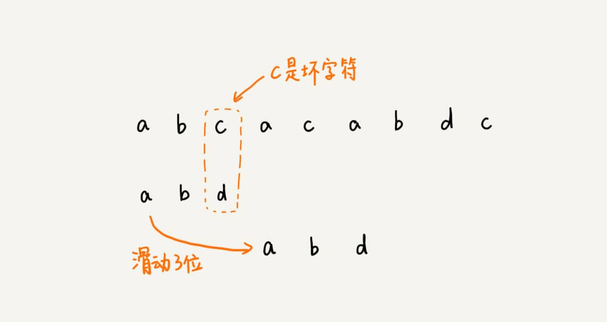

这个时候，我们发现，模式串中最后一个字符 d，还是无法跟主串中的 a 匹配，这个时候，还能将模式串往后滑动三位吗？答案是不行的。因为这个时候，坏字符 a 在模式串中是存在的，模式串中下标是 0 的位置也是字符 a。这种情况下，我们可以将模式串往后滑动两位，让两个 a 上下对齐，然后再从模式串的末尾字符开始，重新匹配。


那么不匹配滑动几位的规律是什么？

当发生不匹配的时候，把坏字符对应的模式串中的字符下标记作 `si`。如果坏字符在模式串中存在，我们把这个坏字符在模式串中的下标记作`xi`。如果不存在，我们把xi记作 -1。那模式串往后移动的位数就等于==si-xi==。（注意，我这里说的下标，都是字符在模式串的下标）。

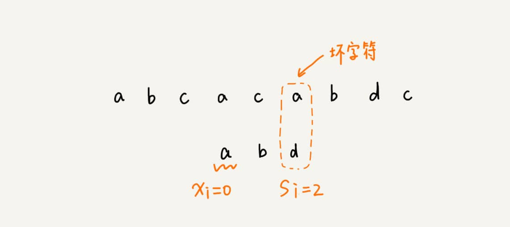

> 如果坏字符在模式串里多处出现，那我们在计算xi的时候，选择最靠后的那个，因为这样不会让模式串滑动过多，导致本来可能匹配的情况被滑动略过。

利用坏字符规则，BM算法在最好情况下的时间复杂度非常低，是 O(n/m)。比如，主串是 aaabaaabaaabaaab，模式串是 aaaa。每次比对，模式串都可以直接后移四位，所以，匹配具有类似特点的模式串和主串的时候，BM算法非常高效。

不过，单纯使用坏字符规则还是不够的。因为根据 si-xi 计算出来的移动位数，有可能是负数，比如主串是 aaaaaaaaaaaaaaaa，模式串是 baaa。不但不会向后滑动模式串，还有可能倒退。

#### 2.好后缀规则

好后缀规则实际上跟坏字符规则的思路很类似。。当模式串滑动到图中的位置的时候，模式串和主串有 2 个字符是匹配的，倒数第 3 个字符发生了不匹配的情况。

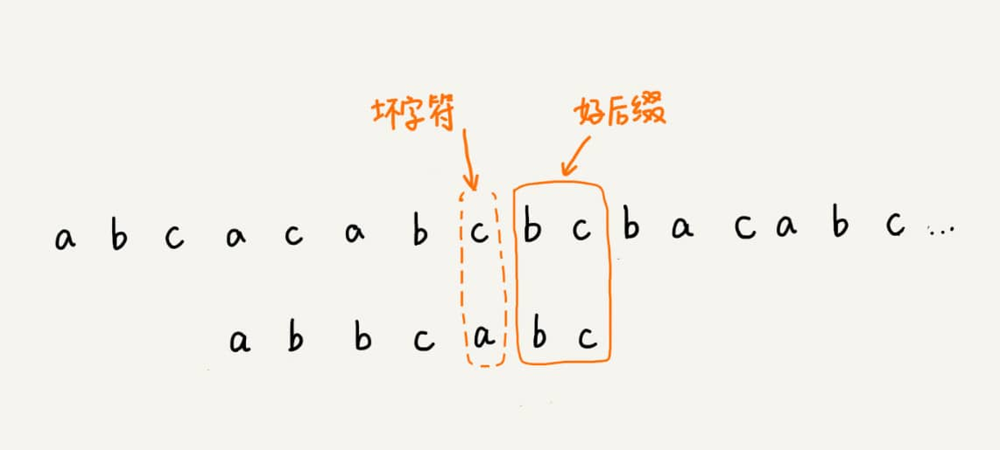

把已经匹配的 bc叫作好后缀，记作`{u}`。我们拿它在模式串中查找，如果找到了另一个跟{u}相匹配的子串`{u*}`，那我们就将模式串滑动到子串`{u*}`与主串中`{u}`对齐的位置。

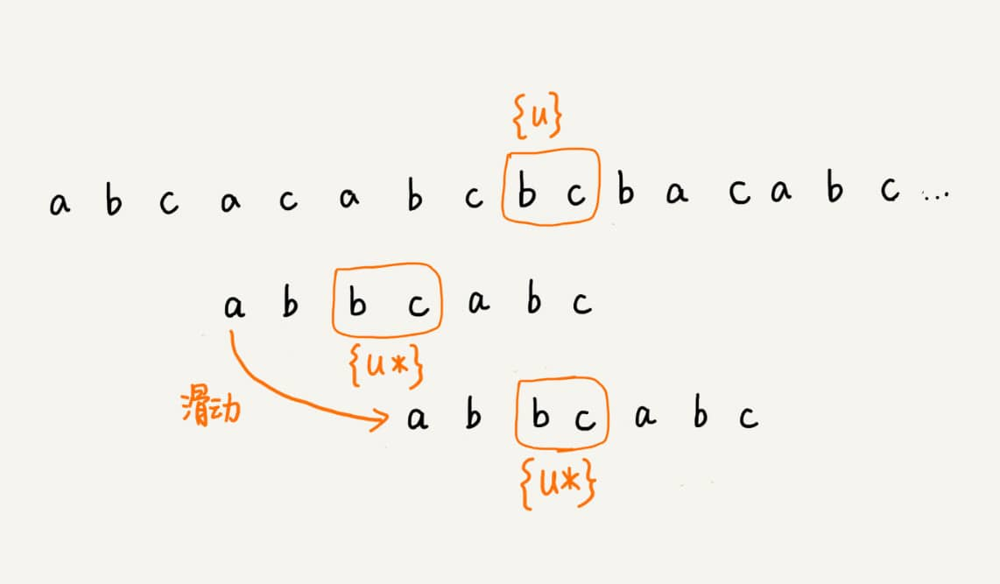

如果在模式串中找不到另一个等于{u}的子串，我们就直接将模式串，滑动到主串中{u}的后面，因为之前的任何一次往后滑动，都没有匹配主串中{u}的情况。


不过，当模式串中不存在等于{u}的子串时，我们直接将模式串滑动到主串{u}的后面。这样做是否有点太过头呢？我们来看下面这个例子。这里面 bc 是好后缀，尽管在模式串中没有另外一个相匹配的子串{u*}，但是如果我们将模式串移动到好后缀的后面，如图所示，那就会错过模式串和主串可以匹配的情况。


如果好后缀在模式串中不存在可匹配的子串，那在我们一步一步往后滑动模式串的过程中，只要主串中的{u}与模式串有重合，那肯定就无法完全匹配。但是当模式串滑动到前缀与主串中{u}的后缀有部分重合的时候，并且重合的部分相等的时候，就有可能会存在完全匹配的情况。


所以，针对这种情况，我们不仅要看好后缀在模式串中，是否有另一个匹配的子串，我们还要考察好后缀的后缀子串，是否存在跟模式串的前缀子串匹配的。

所谓某个字符串 s 的后缀子串，就是最后一个字符跟 s 对齐的子串，比如 abc 的后缀子串就包括 c, bc。所谓前缀子串，就是起始字符跟 s 对齐的子串，比如 abc 的前缀子串有 a，ab。我们从好后缀的后缀子串中，找一个最长的并且能跟模式串的前缀子串匹配的，假设是{v}，然后将模式串滑动到如图所示的位置。


当模式串和主串中的某个字符不匹配的时候，如何选择用好后缀规则还是坏字符规则，来计算模式串往后滑动的位数？

可以分别计算好后缀和坏字符往后滑动的位数，然后取两个数中最大的，作为模式串往后滑动的位数。这种处理方法还可以避免我们前面提到的，根据坏字符规则，计算得到的往后滑动的位数，有可能是负数的情况。

### BM算法代码实现🔖


### BM算法的性能分析及优化🔖


### 思考题

> 你熟悉的编程语言中的查找函数，或者工具、软件中的查找功能，都是用了哪种字符串匹配算法呢？

grep  BM算法

### 小结


BM 算法核心思想是，利用模式串本身的特点，在模式串中某个字符与主串不能匹配的时候，将模式串往后多滑动几位，以此来减少不必要的字符比较，提高匹配的效率。BM 算法构建的规则有两类，坏字符规则和好后缀规则。好后缀规则可以独立于坏字符规则使用。因为坏字符规则的实现比较耗内存，为了节省内存，我们可以只用好后缀规则来实现 BM 算法。


平常不大可能会自己去实现一个bm算法 顶多就用个bf算法。不过bm算法号称最高效的 比如grep命令就是用它实现的 。

值得学习借鉴的思想有：

- 要有优化意识，前面的 BF，RK 算法已经能够满足我们需求了，为什么发明 BM 算法？是为了减少时间复杂度，但是带来的弊端是，优化代码变得复杂，维护成本变高。 

- 需要查找，需要减少时间复杂度，应该想到什么？散列表。 

- 如果某个表达式计算开销比较大，又需要频繁的使用怎么办？预处理，并缓存。

- 逆向思维：一般都是从前往后做比较，而BM用到的是从后往前的比较


## 34 字符串匹配基础（下）：如何借助BM算法轻松理解KMP算法？

尽管BM算法很复杂，也不好理解，但却是工程中非常常用的一种高效字符串匹配算法。有统计说，它是**最高效、最常用**的字符串匹配算法。

不过，在所有的字符串匹配算法里，**最知名**的就是KMP算法。

实际上，KMP算法跟BM算法的本质是一样的。

### KMP 算法基本原理

KMP 算法是根据三位作者（D.E.Knuth，J.H.Morris 和 V.R.Pratt）的名字来命名的。

### 失效函数计算方法

### KMP 算法复杂度分析


### 小结

KMP算法和BM算法的本质非常类似，都是==根据规律在遇到坏字符的时候，把模式串往后多滑动几位==。

BM 算法有两个规则，坏字符和好后缀。KMP 算法借鉴 BM 算法的思想，可以总结成**好前缀规则**。

## 35 Trie树（字典树）：如何实现搜索引擎的搜索关键词提示功能？

搜索引擎的搜索关键词提示功能，我们经常使用。Google、百度等搜索引擎，这个功能肯定做了很多优化，但基本原理还是：**Trie树**（发音类似 "try"）。

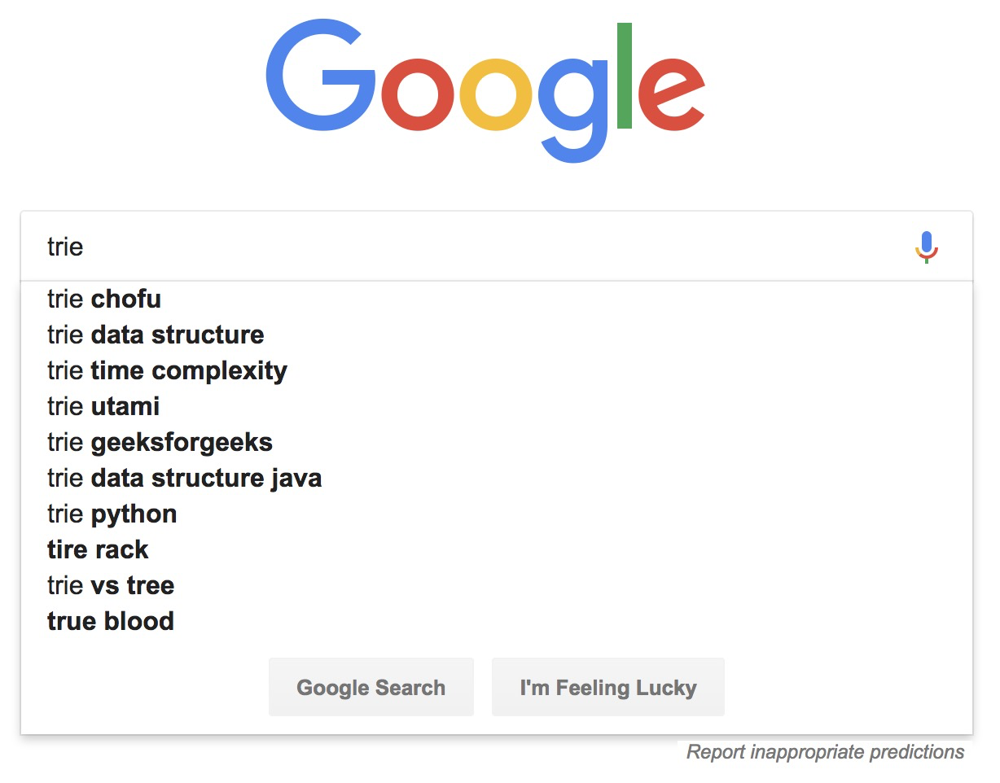

### 什么是“Trie 树”？

==Trie树==，也叫“==字典树==”，是一个树形结构，是一种专门处理**字符串匹配**的数据结构，用来解决==在一组字符串集合中快速查找某个字符串==的问题。

有6个字符串，分别是：how，hi，her，hello，so，see。如何多次查找某个字符串是否在前面的几个字符串中？

一般情况下就是，拿要查找到的字符串依次和6个字符串匹配，这是可行的，但效率比较低下。

先对6个字符串预处理一下，组织成字典树的结构，然后在字典树中匹配查找。

Trie树的本质，就是**==利用字符串之间的公共前缀，将重复的前缀合并在一起==**。


其中，字典树有几个特点：

- 根节点不包含任何信息

- 每个节点表示一个字符串中的一个字符

- 根节点到红色节点的一条路径表示一个字符串（注：红色节点不都是叶子节点）

字典树的具体构造过程：


在字典树种查找字符串的过程，就很好理解了，比如查找“her”，先把它分割成三个字符h、e、r，然后从根节点依次匹配，下图绿色路径就是字典树匹配的路径：


### 如何实现一棵 Trie树？

Trie树主要有两个操作：

1. **将字符串集合构造成Trie树**。也就是将字符串插入到Trie树中。
2. **在Trie树中查询一个字符串**。

Trie 树是一个多叉树，如何存储一个Trie树？

经典的存储方式，就是借助散列表的思想，通过一个下标与字符一一映射的数组，来存储子节点的指针：

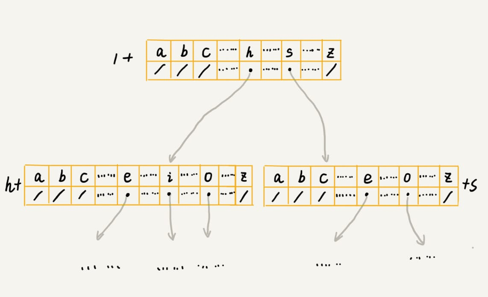

假设字符串中只有从a到z这26个小写字母，在数组中下标为0的位置，存储指向子节点 a 的指针，下标为 1 的位置存储指向子节点 b 的指针，以此类推，下标为 25 的位置，存储的是指向的子节点 z 的指针。如果某个字符的子节点不存在，就在对应的下标的位置存储null。

```java
class TrieNode {
  char data;
  TrieNode children[26];
}
```

当在Trie树中查找字符串的时候，就可以通过字符的ASCII码减去“a”的ASCII 码，迅速找到匹配的子节点的指针。比如，d 的 ASCII 码减去 a 的 ASCII 码就是 3，那子节点 d 的指针就存储在数组中下标为 3 的位置中。

```java
public class Trie {
    private TrieNode root = new TrieNode('/');

    /**
     * 像Trie树中插入一个字符串
     * @param text
     */
    public void insert(char[] text) {
        TrieNode p = root;
        for (int i = 0; i < text.length; ++i) {
            int index = text[i] - 'a';
            if (p.children[index] == null) {
                TrieNode newNode = new TrieNode(text[i]);
                p.children[index] = newNode;
            }
            p = p.children[index];
        }
        p.isEndingChar = true;
    }

    /**
     * 在Trie树中查找一个字符串
     * @param pattern
     * @return
     */
    public boolean find(char[] pattern) {
        TrieNode p = root;
        for (int i = 0; i < pattern.length; i++) {
            int index = pattern[i] - 'a';
            if (p.children[index] == null) {
                return false;  // 不存在pattern
            }
            p = p.children[index];
        }
        if (p.isEndingChar == false) {
            return false;  // 不能完全匹配，只是前缀
        } else {
            return true;
        }
    }

    public class TrieNode {
        public char data;
        public TrieNode[] children = new TrieNode[26];
        /**
         * 表示是否是最后一个标识位
         */
        public boolean isEndingChar = false;
        public TrieNode(char data) {
            this.data = data;
        }
    }
}
```

> 在 Trie 树中，查找某个字符串的时间复杂度是多少？

如果要在一组字符串中，频繁地查询某些字符串，用 Trie 树会非常高效。构建 Trie 树的过程，需要扫描所有的字符串，时间复杂度是 O(n)（n 表示所有字符串的长度和）。但是一旦构建成功之后，后续的查询操作会非常高效。

每次查询时，如果要查询的字符串长度是 k，那我们只需要比对大约 k 个节点，就能完成查询操作。跟原本那组字符串的长度和个数没有任何关系。所以说，构建好 Trie 树后，在其中查找字符串的时间复杂度是 O(k)，k 表示要查找的字符串的长度。

### Trie树真的很耗内存吗？🔖


### Trie树与散列表、红黑树的比较


### 思考题

> 如何利用 Trie 树，实现搜索关键词的提示功能？


> Trie 树应用场合对数据要求比较苛刻，比如字符串的字符集不能太大，前缀重合比较多等。如果现在给你一个很大的字符串集合，比如包含 1 万条记录，如何通过编程量化分析这组字符串集合是否比较适合用 Trie 树解决呢？也就是如何统计字符串的字符集大小，以及前缀重合的程度呢？

### 小结

Trie 树是一种**解决字符串快速匹配问题**的数据结构。如果用来构建 Trie 树的这一组字符串中，前缀重复的情况不是很多，那 Trie 树这种数据结构总体上来讲是比较费内存的，是一种空间换时间的解决问题思路。

尽管比较耗费内存，但是**对内存不敏感或者内存消耗在接受范围内的情况下**，在 Trie 树中做字符串匹配还是非常高效的，时间复杂度是 O(k)，k 表示要匹配的字符串的长度。

但是，Trie 树的优势并不在于，用它来做动态集合数据的查找，因为，这个工作完全可以用更加合适的散列表或者红黑树来替代。Trie 树最有优势的是**==查找前缀匹配的字符串==**，比如搜索引擎中的关键词提示功能这个场景，就比较适合用它来解决，也是 Trie 树比较经典的应用场景。


## 36 AC自动机：如何用多模式串匹配实现敏感词过滤功能？

> 敏感词过滤功能最基本的原理就是字符串匹配算法，也就是通过维护一个敏感词的字典，当用户输入一段文字内容之后，通过字符串匹配算法，来查找用户输入的这段文字，是否包含敏感词。如果有，就用“***”把它替代掉。

> 那如何才能实现一个高性能的敏感词过滤系统呢？

### 基于单模式串和Trie树实现的敏感词过滤

BF 算法、RK 算法、BM 算法、KMP 算法都是==单模式串匹配算法==；

Trie 树是==多模式串匹配算法==。

### 经典的多模式串匹配算法：AC自动机

Aho-Corasick算法

AC自动机实际上就是在Trie树之上，加了类似 KMP的 next数组，只不过此处的 next数组是构建在树上罢了。

## 37 贪心算法：如何用贪心算法实现Huffman压缩编码？

一些**==算法思想==**：==贪心算法、分治算法、回溯算法、动态规划==。

贪心算法（greedy algorithm）有很多经典的应用，比如==霍夫曼编码==（Huffman Coding）、==Prim和Kruskal最小生成树算法==、还有 ==Dijkstra单源最短路径算法==。

> 霍夫曼编码是如何利用贪心算法来实现对数据压缩编码，有效节省数据存储空间的？

### 如何理解“贪心算法”？

假设有一个可以容纳100kg物品的背包，可以装各种物品。有以 5种豆子，每种豆子的总量和总价值都各不相同。为了让背包中所装物品的总价值最大，如何选择在背包中装哪些豆子？每种豆子又该装多少呢？


只要先算一算每个物品的单价，按照单价由高到低依次来装就好了。单价从高到低排列，依次是：黑豆、绿豆、红豆、青豆、黄豆，所以，可以往背包里装 20kg 黑豆、30kg 绿豆、50kg 红豆。

上面的解决思路本质上借助的就是贪心算法：

- 第一步，当看到这类问题的时候，首先要联想到贪心算法：针对一组数据，我们定义了==限制值==和==期望值==，希望从中选出几个数据，在满足限制值的情况下，期望值最大。

  也就是，限制值就是重量不能超过 100kg，期望值就是物品的总价值。这组数据就是 5 种豆子。我们从中选出一部分，满足重量不超过 100kg，并且总价值最大。

- 第二步，尝试看下这个问题是否可以用贪心算法解决：每次选择当前情况下，在对限制值同等贡献量的情况下，对期望值贡献最大的数据。

  也就是，每次都从剩下的豆子里面，选择单价最高的，也就是重量相同的情况下，对价值贡献最大的豆子。

- 第三步，举几个例子看下贪心算法产生的结果是否是最优的。大部分情况下，举几个例子验证一下就可以了。**严格地证明贪心算法的正确性，是非常复杂的，需要涉及比较多的数学推理**。而且，从实践的角度来说，大部分能用贪心算法解决的问题，贪心算法的正确性都是显而易见的，也不需要严格的数学推导证明。

实际上，用贪心算法解决问题的思路，并不总能给出最优解。

例子，在一个有权图中，我们从顶点 S 开始，找一条到顶点 T 的最短路径（路径中边的权值和最小）。贪心算法的解决思路是，每次都选择一条跟当前顶点相连的权最小的边，直到找到顶点T。按照这种思路，求出的最短路径是 `S->A->E->T`，路径长度是 1+4+4=9。


但是，这种贪心的选择方式，最终求的路径并不是最短路径，因为路径 `S->B->D->T` 才是最短路径，因为这条路径的长度是 2+2+2=6。

在这个问题上，贪心算法不工作的主要原因是，**前面的选择，会影响后面的选择**。

### 贪心算法实战分析

#### 1 分糖果

> 有 m 个糖果和 n 个孩子。我们现在要把糖果分给这些孩子吃，但是糖果少，孩子多（m<n），所以糖果只能分配给一部分孩子。
>
> 每个糖果的大小不等，这 m 个糖果的大小分别是 s1，s2，s3，……，sm。除此之外，每个孩子对糖果大小的需求也是不一样的，只有糖果的大小大于等于孩子的对糖果大小的需求的时候，孩子才得到满足。假设这 n 个孩子对糖果大小的需求分别是 g1，g2，g3，……，gn。
>
> 问题是，**如何分配糖果，能尽可能满足最多数量的孩子？**

可以把这个问题抽象成，从 n 个孩子中，抽取一部分孩子分配糖果，让满足的孩子的个数（期望值）是最大的。这个问题的限制值就是糖果个数 m。

看看如何用贪心算法来解决。对于一个孩子来说，如果小的糖果可以满足，我们就没必要用更大的糖果，这样更大的就可以留给其他对糖果大小需求更大的孩子。另一方面，对糖果大小需求小的孩子更容易被满足，所以，可以从需求小的孩子开始分配糖果。因为满<u>足一个需求大的孩子跟满足一个需求小的孩子，对我们期望值的贡献是一样的</u>。

每次从剩下的孩子中，找出对糖果大小需求最小的，然后发给他剩下的糖果中能满足他的最小的糖果，这样得到的分配方案，也就是满足的孩子个数最多的方案。

#### 2 钱币找零

> 假设我们有 1 元、2 元、5 元、10 元、20 元、50 元、100 元这些面额的纸币，它们的张数分别是 c1、c2、c5、c10、c20、c50、c100。
>
> **现在要用这些钱来支付 K 元，最少要用多少张纸币呢？**

在生活中，我们肯定是先用面值最大的来支付，如果不够，就继续用更小一点面值的，以此类推，最后剩下的用 1 元来补齐。

在贡献相同期望值（纸币数目）的情况下，我们希望多贡献点金额，这样就可以让纸币数更少，这就是一种贪心算法的解决思路。直觉告诉我们，这种处理方法就是最好的。

#### 3 区间覆盖

> 假设我们有 n 个区间，区间的起始端点和结束端点分别是[l1, r1]，[l2, r2]，[l3, r3]，……，[ln, rn]。我们从这 n 个区间中选出一部分区间，这部分区间满足两两不相交（端点相交的情况不算相交），最多能选出多少个区间呢？
>
> 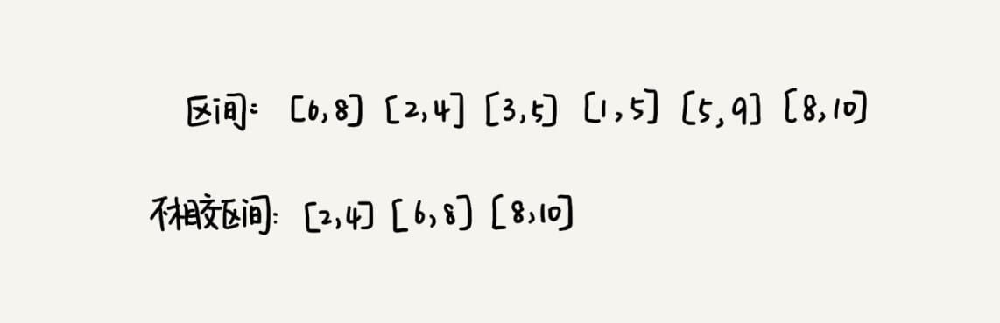

这个问题的处理思路稍微不是那么好懂，不过，我建议你最好能弄懂，因为这个处理思想在很多贪心算法问题中都有用到，比如**任务调度、教师排课**等等问题。

假设这 n 个区间中最左端点是 lmin，最右端点是 rmax。这个问题就相当于，我们选择几个不相交的区间，从左到右将[lmin, rmax]覆盖上。我们按照起始端点从小到大的顺序对这 n 个区间排序。

每次选择的时候，左端点跟前面的已经覆盖的区间不重合的，右端点又尽量小的，这样可以让剩下的未覆盖区间尽可能的大，就可以放置更多的区间。这实际上就是一种贪心的选择方法。


### 小结

实际上，贪心算法适用的场景比较有限。这种算法思想更多的是指导设计基础算法。比如最小生成树算法、单源最短路径算法，这些算法都用到了贪心算法。从我个人的学习经验来讲，**不要刻意去记忆贪心算法的原理，多练习才是最有效的学习方法**。

贪心算法的最难的一块是==如何将要解决的问题抽象成贪心算法模型==。

### 思考题

> 如何用贪心算法实现霍夫曼编码？🔖

霍夫曼编码是一种十分有效的编码方法，广泛用于数据压缩中，其压缩率通常在 20%～90% 之间。

霍夫曼编码不仅会考察文本中有多少个不同字符，还会考察每个字符出现的==频率==，<u>根据频率的不同，选择不同长度的编码</u>。

霍夫曼编码试图用这种不等长的编码方法，来进一步增加压缩的效率。如何给不同频率的字符选择不同长度的编码呢？根据贪心的思想，我们可以把出现频率比较多的字符，用稍微短一些的编码；出现频率比较少的字符，用稍微长一些的编码。

### 思考题

> 在一个非负整数 a 中，我们希望从中移除 k 个数字，让剩下的数字值最小，如何选择移除哪 k 个数字呢？

> 假设有 n 个人等待被服务，但是服务窗口只有一个，每个人需要被服务的时间长度是不同的，如何安排被服务的先后顺序，才能让这 n 个人总的等待时间最短？

## 38 分治算法：谈一谈大规模计算框架MapReduce中的分治思想

**==MapReduce==** 是Google大数据处理的三驾马车之一，另外两个是 ==GFS 和 Bigtable==。它在**倒排索引、PageRank 计算、网页分析**等搜索引擎相关的技术中都有大量的应用。

MapRedue 的本质就是分治算法。

### 如何理解分治算法？

分治算法（divide and conquer）的核心思想其实就是四个字，**==分而治之==** ，也就是<u>将原问题划分成 n 个规模较小，并且结构与原问题相似的子问题，递归地解决这些子问题，然后再合并其结果，就得到原问题的解。</u>

**分治算法是一种处理问题的==思想==，递归是一种==编程技巧==。**

实际上，分治算法一般都比较适合用递归来实现。分治算法的递归实现中，每一层递归都会涉及这样三个操作：

- 分解：将原问题分解成一系列子问题；
- 解决：递归地求解各个子问题，若子问题足够小，则直接求解；
- 合并：将子问题的结果合并成原问题。

分治算法能解决的问题，一般需要满足下面这几个条件：

- 原问题与分解成的小问题具有**相同的模式**；
- 原问题分解成的子问题可以**独立求解**，子问题之间**没有相关性**，这一点是分治算法跟动态规划的明显区别，等我们讲到动态规划的时候，会详细对比这两种算法；
- 具有分解**终止条件**，也就是说，当问题足够小时，可以**直接求解**；
- 可以将子问题合并成原问题，而这个合并操作的复杂度不能太高，否则就起不到减小算法总体复杂度的效果了。

### 分治算法应用举例分析

### 分治思想在海量数据处理中的应用

分治算法思想的应用是非常广泛的，并不仅限于指导编程和算法设计。它还经常用在海量数据处理的场景中。

我们前面讲的数据结构和算法，大部分都是**基于内存存储和单机处理**。但是，如果要处理的数据量非常大，没法一次性放到内存中，这个时候，这些数据结构和算法就无法工作了。

可以将海量的数据集合根据某种方法，划分为几个小的数据集合，每个小的数据集合单独加载到内存来解决，然后再将小数据集合合并成大数据集合。

==创新并非离我们很远，创新的源泉来自对事物本质的认识。无数优秀架构设计的思想来源都是基础的数据结构和算法，这本身就是算法的一个魅力所在。==

### 思考题

> 为什么说 MapReduce 的本质就是分治思想？

实际上，MapReduce 框架只是一个任务调度器，底层依赖 GFS 来存储数据，依赖 Borg 管理机器。它从 GFS 中拿数据，交给 Borg 中的机器执行，并且时刻监控机器执行的进度，一旦出现机器宕机、进度卡壳等，就重新从 Borg 中调度一台机器执行。

## 39 回溯算法：从电影《蝴蝶效应》中学习回溯算法的核心思想

回溯算法思想的应用：

- 深度优先搜索算

- 实际的软件开发场景中，比如正则表达式匹配、编译原理中的语法分析等

- 很多经典的数学问题，比如数独、八皇后、0-1背包、图的着色、旅行商问题、全排列等等。

### 如何理解“回溯算法”？

笼统地讲，回溯算法很多时候都应用在<u>“搜索”这类问题</u>上。不过这里说的搜索，并不是狭义的指我们前面讲过的图的搜索算法，而是**在一组可能的解中，搜索满足期望的解**。

回溯的处理思想，有点类似**枚举搜索**。我们枚举所有的解，找到满足期望的解。为了有规律地枚举所有可能的解，避免遗漏和重复，我们把问题求解的过程分为多个阶段。每个阶段，我们都会面对一个岔路口，我们先随意选一条路走，当发现这条路走不通的时候（不符合期望的解），就回退到上一个岔路口，另选一种走法继续走。

### 两个回溯算法的经典应用

#### 0-1背包

0-1 背包是非常经典的算法问题，很多场景都可以抽象成这个问题模型。这个问题的经典解法是动态规划，不过还有一种简单但没有那么高效的解法，那就是今天讲的回溯算法。

#### 正则表达式

如何用回溯算法，判断一个给定的文本，能否跟给定的正则表达式匹配？

依次考察正则表达式中的每个字符，当是非通配符时，我们就直接跟文本的字符进行匹配，如果相同，则继续往下处理；如果不同，则回溯。

回溯算法非常适合用递归来实现，在实现的过程中，==剪枝==操作是提高回溯效率的一种技巧。

## 40 初识动态规划：如何巧妙解决“双十一”购物时的凑单问题？

> 淘宝的“双十一”购物节有各种促销活动，比如“满 200 元减 50 元”。假设你女朋友的购物车中有 n 个（n>100）想买的商品，她希望从里面选几个，在凑够满减条件的前提下，让选出来的商品价格总和最大程度地接近满减条件（200 元）。

## 41 动态规划理论：一篇文章带你彻底搞懂最优子结构、无后效性和重复子问题

### “一个模型三个特征”理论讲解

什么样的问题适合用动态规划来解决呢？/动态规划能解决的问题有什么规律可循呢？

**多阶段决策最优解模型**

一般是用动态规划来解决==最优问题==。而解决问题的过程，需要经历多个==决策阶段==。每个决策阶段都对应着==一组状态==。然后我们寻找一组==决策序列==，经过这组决策序列，能够产生最终期望求解的最优值。

"三个特征"：

#### 1.最优子结构

最优子结构指的是，**问题的最优解包含子问题的最优解**。反过来说就是，我们可以**通过子问题的最优解，推导出问题的最优解**。如果我们把最优子结构，对应到我们前面定义的动态规划问题模型上，那我们也可以理解为，后面阶段的状态可以通过前面阶段的状态推导出来。

#### 2.无后效性

无后效性有两层含义：

- 第一层含义是，在推导后面阶段的状态的时候，我们只关心前面阶段的状态值，不关心这个状态是怎么一步一步推导出来的。
- 第二层含义是，某阶段状态一旦确定，就不受之后阶段的决策影响。

无后效性是一个非常“宽松”的要求。只要满足前面提到的动态规划问题模型，其实基本上都会满足无后效性。

#### 3.重复子问题

不同的决策序列，到达某个相同的阶段时，可能会产生重复的状态。

### “一个模型三个特征”实例剖析

假设我们有一个 n 乘以 n 的矩阵 `w[n][n]`。矩阵存储的都是正整数。棋子起始位置在左上角，终止位置在右下角。我们将棋子从左上角移动到右下角。每次只能向右或者向下移动一位。从左上角到右下角，会有很多不同的路径可以走。我们把每条路径经过的数字加起来看作路径的长度。那从左上角移动到右下角的最短路径长度是多少呢？


### 两种动态规划解题思路总结

#### 1.状态转移表法

#### 2.状态转移方程法

### 四种算法思想比较分析

贪心、回溯、动态规划可以归为一类，而分治单独可以作为一类。前三个算法解决问题的模型，都可以抽象成我们今天讲的那个多阶段决策最优解模型，而分治算法解决的问题尽管大部分也是最优解问题，但是，大部分都不能抽象成多阶段决策模型。

回溯算法是个“万金油”。基本上能用的动态规划、贪心解决的问题，我们都可以用回溯算法解决。回溯算法相当于穷举搜索。穷举所有的情况，然后对比得到最优解。不过，回溯算法的时间复杂度非常高，是指数级别的，只能用来解决小规模数据的问题。

尽管动态规划比回溯算法高效，但是，并不是所有问题，都可以用动态规划来解决。能用动态规划解决的问题，需要满足三个特征，最优子结构、无后效性和重复子问题。在重复子问题这一点上，动态规划和分治算法的区分非常明显。分治算法要求分割成的子问题，不能有重复子问题，而动态规划正好相反，动态规划之所以高效，就是因为回溯算法实现中存在大量的重复子问题。

贪心算法实际上是动态规划算法的一种特殊情况。它解决问题起来更加高效，代码实现也更加简洁。不过，它可以解决的问题也更加有限。它能解决的问题需要满足三个条件，最优子结构、无后效性和贪心选择性（这里我们不怎么强调重复子问题）。

其中，最优子结构、无后效性跟动态规划中的无异。“贪心选择性”的意思是，通过局部最优的选择，能产生全局的最优选择。每一个阶段，我们都选择当前看起来最优的决策，所有阶段的决策完成之后，最终由这些局部最优解构成全局最优解。

## 42 动态规划实战：如何实现搜索引擎中的拼写纠错功能？

### 如何量化两个字符串的相似度？

莱文斯坦距离（Levenshtein distance）和最长公共子串长度（Longest common substring length）


### 如何编程计算莱文斯坦距离？


### 如何编程计算最长公共子串长度？

# 高级篇

## 43 拓扑排序：如何确定代码源文件的编译依赖关系？

编译器通过分析源文件或者程序员事先写好的编译配置文件（比如 Makefile 文件），来获取这种局部的依赖关系。<u>那编译器又该如何通过源文件两两之间的局部依赖关系，确定一个全局的编译顺序呢？</u>

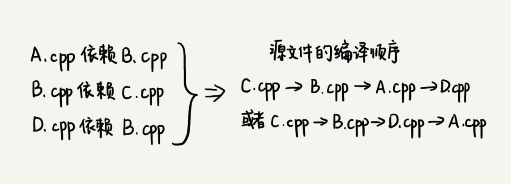

### 算法解析

> 穿衣服时有一定的顺序，衣服与衣服之间有一定的依赖关系。
>
> 你必须先穿袜子才能穿鞋，先穿内裤才能穿秋裤。假设我们现在有八件衣服要穿，它们之间的两两依赖关系我们已经很清楚了，那如何安排一个穿衣序列，能够满足所有的两两之间的依赖关系？

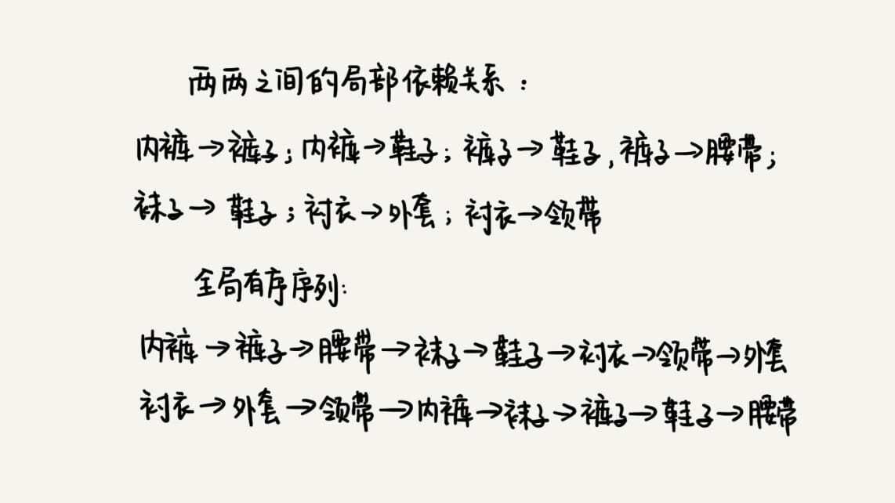

算法是构建在具体的数据结构之上的。针对这个问题，我们先来看下，**如何将问题背景抽象成具体的数据结构**？

拓扑排序本身就是基于有向无环图的一个算法。

如何在这个有向无环图上，实现拓扑排序？

#### 1 Kahn 算法

#### 2 DFS 算法

## 44 最短路径：地图软件是如何计算出最优出行路径的？

深度优先搜索和广度优先搜索这两种算法主要是针对无权图的搜索算法。

最短路径算法（Shortest Path Algorithm）

### 算法解析

最优问题包含三个：最短路线、最少用时和最少红绿灯。

解决软件开发中的实际问题，最重要的一点就是==建模==，也就是==将复杂的场景抽象成具体的数据结构==。

> 把地图抽象成有向有权图。
>
> 每个岔路口看作一个顶点，岔路口与岔路口之间的路看作一条边，路的长度就是边的权重。如果路是单行道，我们就在两个顶点之间画一条有向边；如果路是双行道，我们就在两个顶点之间画两条方向不同的边。

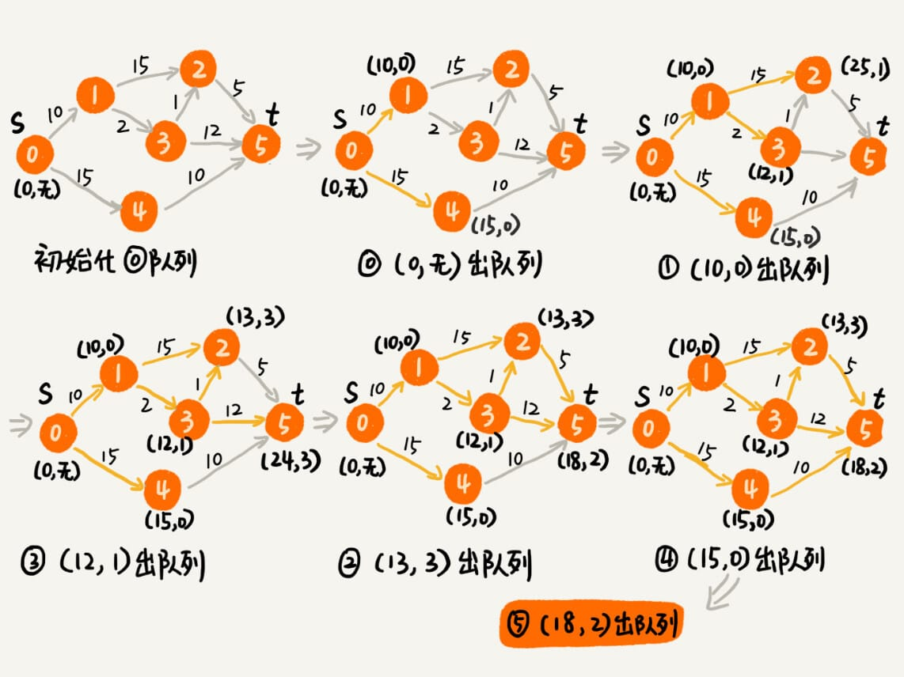

Dijkstra 最短路径算法

### 总结引申

## 45 位图：如何实现网页爬虫中的URL去重功能？

爬虫的工作原理是，通过解析已经爬取页面中的网页链接，然后再爬取这些链接对应的网页。而同一个网页链接有可能被包含在多个页面中，这就会导致爬虫在爬取的过程中，重复爬取相同的网页。<u>如何避免这些重复的爬取呢？</u>

### 算法解析

添加一个 URL 和查询一个 URL

内存消耗方面的优化，==布隆过滤器（Bloom Filter）==

存储结构，==位图（BitMap）==

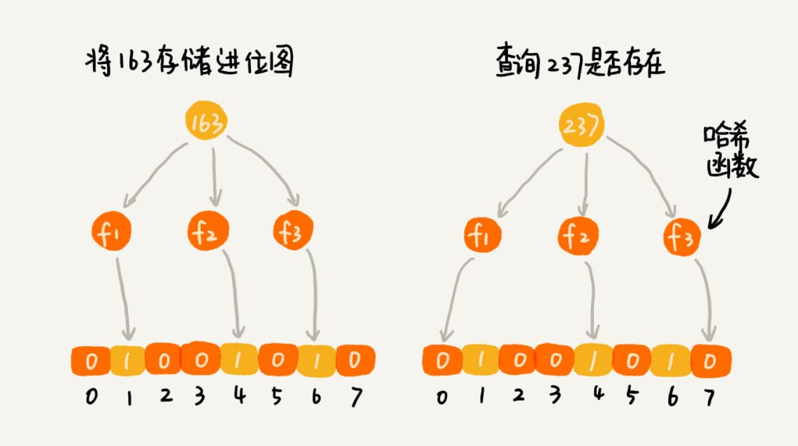


布隆过滤器用多个哈希函数对同一个网页链接进行处理，CPU 只需要将网页链接从内存中读取一次，进行多次哈希计算，理论上讲这组操作是 CPU 密集型的。而在散列表的处理方式中，需要读取散列值相同（散列冲突）的多个网页链接，分别跟待判重的网页链接，进行字符串匹配。这个操作涉及很多内存数据的读取，所以是内存密集型的。我们知道 CPU 计算可能是要比内存访问更快速的，所以，理论上讲，布隆过滤器的判重方式，更加快速。

布隆过滤器非常适合这种不需要 100% 准确的、允许存在小概率误判的大规模判重场景。除了爬虫网页去重这个例子，还有比如统计一个大型网站的每天的 UV 数，也就是每天有多少用户访问了网站，我们就可以使用布隆过滤器，对重复访问的用户进行去重。

布隆过滤器最大的特点就是比较==省存储空间==。

## 46 概率统计：如何利用朴素贝叶斯算法过滤垃圾短信？

用位图、布隆过滤器，来过滤重复的数据。

### 算法解析

#### 1 基于黑名单的过滤器

维护一个骚扰电话号码和垃圾短信发送号码的黑名单。

#### 2 基于规则的过滤器

通过短信的内容，来判断某条短信是否是垃圾短信。

去掉“的、和、是”等没有意义的==停用词（Stop words）==，得到 n 个不同的单词。针对每个单词，我们统计有多少个垃圾短信出现了这个单词，有多少个非垃圾短信会出现这个单词，进而求出==每个单词出现在垃圾短信中的概率==，以及出现在非垃圾短信中的概率。**如果某个单词出现在垃圾短信中的概率，远大于出现在非垃圾短信中的概率，那我们就把这个单词作为特殊单词，用来过滤垃圾短信。**

#### 3 基于概率统计的过滤器


使用概率，来表征一个短信是垃圾短信的可信程度。

在实际的工程中，我们还需要结合具体的场景，以及大量的实验，不断去调整策略，权衡垃圾短信判定的==准确率==（是否会把不是垃圾的短信错判为垃圾短信）和==召回率==（是否能把所有的垃圾短信都找到），来实现我们的需求。

## 47 向量空间：如何实现一个简单的音乐推荐系统？

### 算法解析

核心思想：

- 找到跟你口味偏好相似的用户，把他们爱听的歌曲推荐给你；
- 找出跟你喜爱的歌曲特征相似的歌曲，把这些歌曲推荐给你。

#### 1 基于相似用户做推荐

如何定义口味偏好相似呢？

把跟你听类似歌曲的人，看作口味相似的用户。用“1”表示“喜爱”，用“0”笼统地表示“不发表意见”：


如何定义用户对某首歌曲的喜爱程度呢？

通过用户的行为，来定义这个喜爱程度。给每个行为定义一个得分，得分越高表示喜爱程度越高。


==欧几里得距离（Euclidean distance）==是用来计算两个==向量==之间的==距离==的。

向量（vector）


把每个用户对所有歌曲的喜爱程度，都用一个向量表示。计算出两个向量之间的欧几里得距离，作为两个用户的口味相似程度的度量。


#### 2 基于相似歌曲做推荐

计算机通过什么数据来量化两个歌曲之间的相似程度呢？

特征项

对于两首歌，如果喜欢听的人群都是差不多的，那侧面就可以反映出，这两首歌比较相似。

## 48 B+树：MySQL数据库索引是如何实现的？

> 数据库索引是如何实现的呢？底层使用的是什么数据结构和算法呢？

### 算法解析

#### 1 解决问题的前提是==定义清楚问题==

**如何定义清楚问题呢？**

- 对问题进行详细的调研
- 通过对一些模糊的需求进行假设，来限定要解决的问题的范围。

功能性需求，关注==执行效率和存储空间==。如：

- 根据某个值查找数据，比如 `select * from user where id=1234`；
- 根据区间值来查找某些数据，比如 `select * from user where id > 1234 and id < 2345`。

非功能性需求(比如安全、性能、用户体验等等)，关注性能。 

在执行效率方面，希望通过索引，查询数据的效率尽可能地高；在存储空间方面，希望索引不要消耗太多的内存空间。

#### 2 尝试用学过的数据结构解决这个问题

==散列表==的查询性能很好，时间复杂度是 O(1)。但是，散列表不能支持按照区间快速查找数据。

尽管==平衡二叉查找树==查询的性能也很高，时间复杂度是 O(logn)。而且，对树进行中序遍历，还可以得到一个从小到大有序的数据序列，但这仍然不足以支持按照区间快速查找数据。

==跳表==是在链表之上加上多层索引构成的。它支持快速地插入、查找、删除数据，对应的时间复杂度是 O(logn)。并且，跳表也支持按照区间快速地查找数据。我们只需要定位到区间起点值对应在链表中的结点，然后从这个结点开始，顺序遍历链表，直到区间终点对应的结点为止，这期间遍历得到的数据就是满足区间值的数据。

实际上，数据库索引所用到的数据结构跟跳表非常相似，叫作 ==B+树==。它是通过二叉查找树演化过来的。

#### 3 改造二叉查找树来解决这个问题🔖🔖

为了让二叉查找树支持按照区间来查找数据，对它进行这改造：**树中的节点并不存储数据本身，而是只是作为索引。另外把每个叶子节点串在一条链表上，链表中的数据是从小到大有序的**。

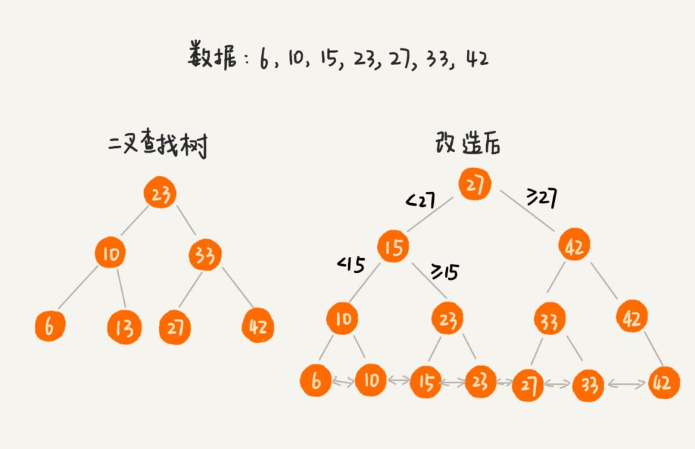

改造之后，如果要求某个区间的数据，只需要拿区间的起始值，在树中进行查找，当查找到某个叶子节点之后，再顺着链表往后遍历，直到链表中的结点数据值大于区间的终止值为止。所有遍历到的数据，就是符合区间值的所有数据。


> 通常内存的访问速度是==纳秒==级别的，而磁盘访问的速度是==毫秒==级别的。读取同样大小的数据，从磁盘中读取花费的时间，是从内存中读取所花费时间的上万倍，甚至几十万倍。

树的高度就等于每次查询数据时磁盘 IO 操作的次数。

优化：减少树的高度。

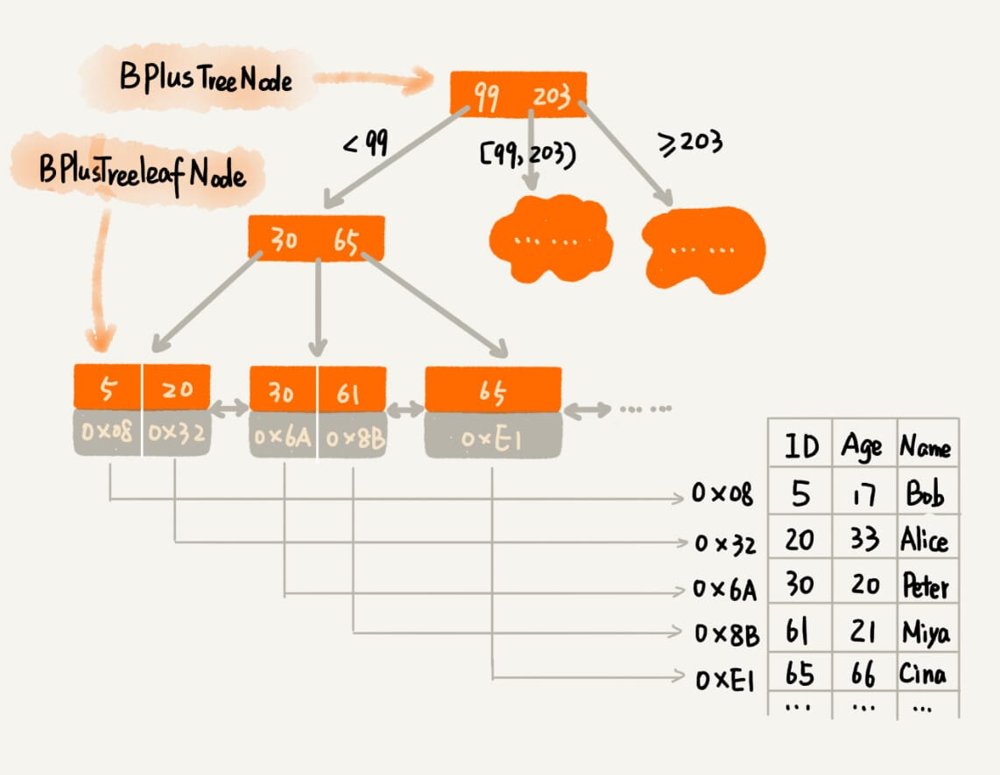

**索引可以提高数据库的查询效率，也会让写入数据的效率下降。**因为数据的写入过程，会涉及索引的更新。

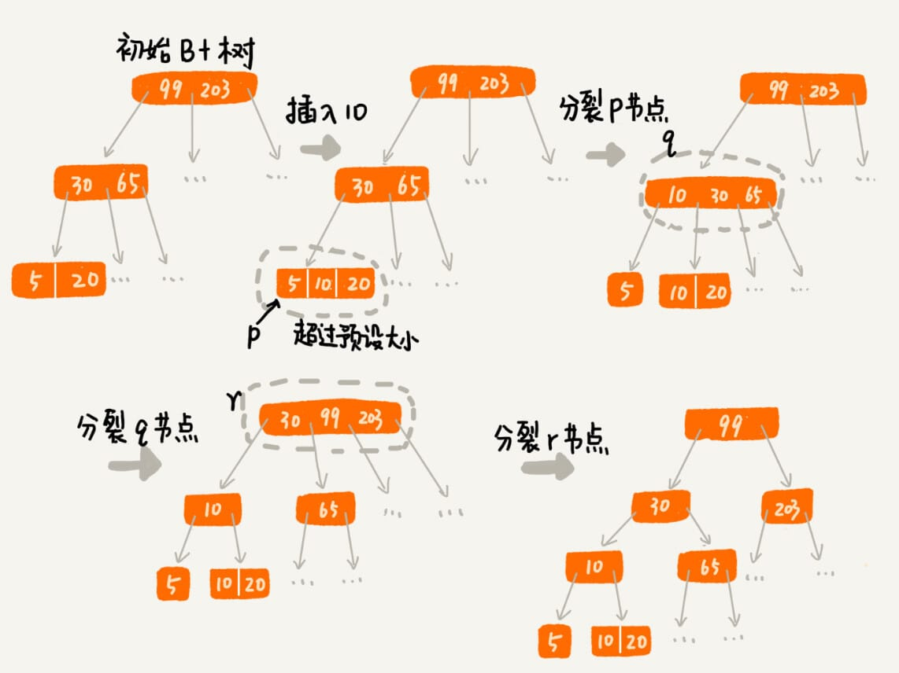


### 总结

B+树通过存储在磁盘的多叉树结构，做到了时间、空间的平衡，既保证了执行效率，又节省了内存。

B+ 树的特点：

- 每个节点中子节点的个数不能超过 m，也不能小于 m/2；
- 根节点的子节点个数可以不超过 m/2，这是一个例外；
- m 叉树只存储索引，并不真正存储数据，这个有点儿类似跳表；
- 通过链表将叶子节点串联在一起，这样可以方便按区间查找；
- 一般情况，根节点会被存储在内存中，其他节点存储在磁盘中。

#### B+树和B树

B树（B-Tree）有时也写成B-树，这里-只是一个连接符不是减号。

B 树实际上是低级版的 B+ 树，或者说**B+树是 B 树的改进版**。不同点：

- B+树中的节点不存储数据，只是索引，而B树中的节点存储数据；
- B中的叶子节点并不需要链表来串联。

也就是说，B树只是一个每个节点的子节点个数不能小于 m/2 的 m 叉树。

### 思考题

> B+ 树中，将叶子节点串起来的链表，是单链表还是双向链表？为什么？

单链表可以保证asc，但是无法desc，而双链表既可以asc又可以desc。

> 对平衡二叉查找树进行改造，将叶子节点串在链表中，就支持了按照区间来查找数据。我们在 散列表（下）讲到，散列表也经常跟链表一块使用，如果我们把散列表中的结点，也用链表串起来，能否支持按照区间查找数据呢？

LinkedHashMap 其实保证不了按区间排序（LinkedHashMap 只是保存放入的先后次序，并不能保证大小的顺序关系）。想要按区间排序，需要额外对散列表中的节点再加一层双向链表的关系，用来维护节点的大小关系。但是此时的插入操作的时间复杂度会比较高。每次插入一个元素，需要遍历并比较现有的节点，找到合适的位置来建立链表关系，时间复杂度为O(n)。

## 49 搜索：如何用A*搜索算法实现游戏中的寻路功能？

> 魔兽世界、仙剑奇侠传这类==MMRPG==（大型多人在线角色扮演游戏）游戏，有一个非常重要的功能，那就是人物角色**自动寻路**。<u>当人物处于游戏地图中的某个位置的时候，我们用鼠标点击另外一个相对较远的位置，人物就会自动地绕过障碍物走过去。</u>
> 这个功能是怎么实现的呢？

出行路线规划、游戏寻路

搜索问题

次优解

**==A*算法==**是对Dijkstra算法的优化和改造。

启发函数（heuristic function）

曼哈顿距离（Manhattan distance）是两点之间横纵坐标的距离之和。

估价函数（evaluation function）

启发式搜索算法（Heuristically Search Algorithm）

## 50 索引：如何在海量数据中快速查找某个数据？

### 为什么需要索引？

在实际的软件开发中，业务纷繁复杂，功能千变万化，但是，万变不离其宗。如果抛开这些业务和功能的外壳，其实它们的本质都可以抽象为**==“对数据的存储和计算”==**。对应到数据结构和算法中，那==“存储”需要的就是数据结构，“计算”需要的就是算法==。

对于存储的需求，功能上无外乎**增删改查**。这其实并不复杂。但是，一旦存储的数据很多，那==性能==就成了这些系统要关注的重点，特别是在一些跟存储相关的基础系统（比如 MySQL 数据库、分布式文件系统等）、中间件（比如消息中间件 RocketMQ 等）中。

“如何节省存储空间、如何提高数据增删改查的执行效率”，这样的问题就成了设计的重点。而这些系统的实现，都离不开一个东西，那就是**索引**。不夸张地说，索引设计得好坏，直接决定了这些系统是否优秀。

### 索引的需求定义

#### 1 功能性需求

- 数据是格式化数据还是非格式化数据？

- 数据是静态数据还是动态数据？

- 索引存储在内存还是硬盘？

- 单值查找还是区间查找？

- 单关键词查找还是多关键词组合查找？

#### 2 非功能性需求

- 不管是存储在内存中还是磁盘中，索引对存储空间的消耗不能过大。

- 在考虑索引查询效率的同时，我们还要考虑索引的维护成本。

### 构建索引常用的数据结构有哪些？

常用来构建索引的数据结构，就是几种支持**==动态数据集合==**的数据结构。比如，**散列表、红黑树、跳表、B+ 树**。除此之外，**位图、布隆过滤器**可以作为辅助索引，**有序数组**可以用来对静态数据构建索引。

## 51 并行算法：如何利用并行处理提高算法的执行效率？

算法的目的就是为了提高代码执行的效率。那当算法无法再继续优化的情况下，可以借助并行计算的处理思想对算法进行改造，从而进一步提高执行效率。

### 并行排序

### 并行查找

### 并行字符串匹配

### 并行搜索


# 实战篇

## 52 剖析Redis常用数据类型对应的数据结构


## 53 剖析搜索引擎背后的经典数据结构和算法


## 54 剖析高性能队列Disruptor背后的数据结构和算法


## 55 剖析微服务接口鉴权限流背后的数据结构和算法


## 56 如何用学过的数据结构和算法实现一个短网址系统？

# 更多

## 数据结构与算法学习书单


### 面试必刷的宝典

《剑指 offer》

《编程珠玑》特色就是讲了很多**针对海量数据的处理技巧**。

《编程之美》这本书有多位作者，其中绝大部分是微软的工程师，所以书的质量很有保证。不过，这里面的算法题目稍微有点难，也不是很系统，这也是我把它归到面试这一部分的原因。如果你有一定基础，也喜欢钻研些算法问题，或者要面试 Google、Facebook 这样的公司，可以拿这本书里的题，先来自测一下。

### 经典大部头

《算法导论》这本书的章节安排不是循序渐进的，里面充斥着各种算法的正确性、复杂度的证明、推导，数学公式比较多，一般人看起来会比较吃力。所以，作为入门书籍，并不是很推荐。

《算法》这本书也是一本经典大部头，不过它比起《算法导论》来要友好很多，更容易看懂，更适合初学者入门。但是这本书的缺点也很明显，就是内容不够全面，比如动态规划这么重要的知识点，这本书就没有讲。对于数据结构的东西，它讲的也不多，基本就是**偏重讲算法**。

### 殿堂级经典

《计算机程序设计艺术》


> 每个人的基础、学习能力都不一样，掌握程度取决于你的努力程度。


## 王争：羁绊前行的，不是肆虐的狂风，而是内心的迷茫


如果我们不那么确信能不能看懂、能不能学会的时候，当面对困难的时候，很容易就会否定自己，也就很容易半途而废。


没有捷径，没有杀手锏，更没有一招致胜的“葵花宝典”


这些方法论的难点并不在于能不能听懂，而是在于能不能执行到位。


不要浮躁，不要丧失思考能力，不要丧失学习能力


只有做好打硬仗的心理准备，遇到困难才能心态平和


“放弃”的念头像是一个心魔，它会一直围绕着你


第一，我对学习这件事情认识得比较清楚，我一直觉得，没有学不会的东西，没有攻克不了的技术难题，如果有，那就说明时间花得还不够多。

第二，我之前遇到卡壳的时候，几乎从来没有放弃过，即便短暂地停歇，我也会继续拎起来再死磕，而且每次都能搞定，正是这种正向的激励，给了我信心，让我再遇到困难的时候，都能坚信自己能搞定它。


对于任何新知识的学习，入门是一个非常漫长和煎熬的过程，谁都逃不过


其实我一直觉得**情商比智商更重要**。对于很多学科的学习，智商并不是瓶颈，最终能够决定你能达到的高度的，还是情商，而情商中最重要的，我觉得就是==逆商（逆境商数，Adversity Quotient）==，也就是，==当你遇到困难时，你会如何去面对，这将会决定你的人生最终能够走多远==。


## 在实际开发中，如何权衡选择使用哪种数据结构和算法？


## 《数据结构与算法之美》学习指导手册


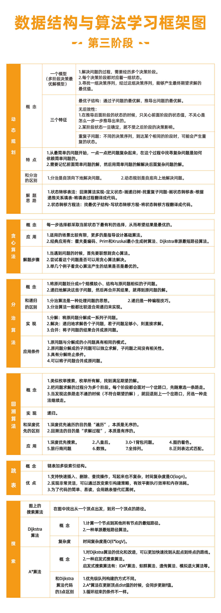


## 练习


## 用户学习故事

