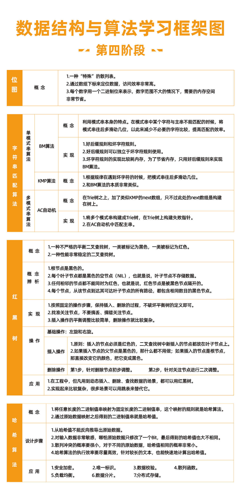

# 实战篇

## 52 剖析Redis常用数据类型对应的数据结构

## 53 剖析搜索引擎背后的经典数据结构和算法

## 54 剖析高性能队列Disruptor背后的数据结构和算法

## 55 剖析微服务接口鉴权限流背后的数据结构和算法

## 56 如何用学过的数据结构和算法实现一个短网址系统？

# 更多

## 数据结构与算法学习书单

### 面试必刷的宝典

《剑指 offer》

《编程珠玑》特色就是讲了很多**针对海量数据的处理技巧**。

《编程之美》这本书有多位作者，其中绝大部分是微软的工程师，所以书的质量很有保证。不过，这里面的算法题目稍微有点难，也不是很系统，这也是我把它归到面试这一部分的原因。如果你有一定基础，也喜欢钻研些算法问题，或者要面试 Google、Facebook 这样的公司，可以拿这本书里的题，先来自测一下。

### 经典大部头

《算法导论》这本书的章节安排不是循序渐进的，里面充斥着各种算法的正确性、复杂度的证明、推导，数学公式比较多，一般人看起来会比较吃力。所以，作为入门书籍，并不是很推荐。

《算法》这本书也是一本经典大部头，不过它比起《算法导论》来要友好很多，更容易看懂，更适合初学者入门。但是这本书的缺点也很明显，就是内容不够全面，比如动态规划这么重要的知识点，这本书就没有讲。对于数据结构的东西，它讲的也不多，基本就是**偏重讲算法**。

### 殿堂级经典

《计算机程序设计艺术》

> 每个人的基础、学习能力都不一样，掌握程度取决于你的努力程度。

## 王争：羁绊前行的，不是肆虐的狂风，而是内心的迷茫

如果我们不那么确信能不能看懂、能不能学会的时候，当面对困难的时候，很容易就会否定自己，也就很容易半途而废。

没有捷径，没有杀手锏，更没有一招致胜的“葵花宝典”

这些方法论的难点并不在于能不能听懂，而是在于能不能执行到位。

不要浮躁，不要丧失思考能力，不要丧失学习能力

只有做好打硬仗的心理准备，遇到困难才能心态平和

“放弃”的念头像是一个心魔，它会一直围绕着你

第一，我对学习这件事情认识得比较清楚，我一直觉得，没有学不会的东西，没有攻克不了的技术难题，如果有，那就说明时间花得还不够多。

第二，我之前遇到卡壳的时候，几乎从来没有放弃过，即便短暂地停歇，我也会继续拎起来再死磕，而且每次都能搞定，正是这种正向的激励，给了我信心，让我再遇到困难的时候，都能坚信自己能搞定它。

对于任何新知识的学习，入门是一个非常漫长和煎熬的过程，谁都逃不过

其实我一直觉得**情商比智商更重要**。对于很多学科的学习，智商并不是瓶颈，最终能够决定你能达到的高度的，还是情商，而情商中最重要的，我觉得就是==逆商（逆境商数，Adversity Quotient）==，也就是，==当你遇到困难时，你会如何去面对，这将会决定你的人生最终能够走多远==。

## 在实际开发中，如何权衡选择使用哪种数据结构和算法？

## 《数据结构与算法之美》学习指导手册

## 练习

## 用户学习故事

