# 基础篇

## 32 字符串匹配基础（上）：如何借助哈希算法实现高效字符串匹配？

编程语言提供的**字符串查找函数**，比如Java中的indexOf()，Python中的find()函数等，它们底层就是依赖**字符串匹配算法**。

字符串匹配算法有很多。

- ==单模式==串匹配的算法：一个串跟一个串进行匹配
  - BF算法和RK算法  （简单、好理解）
  - BM算法和KMP算法  （难理解、高效）
- ==多模式==串匹配算法：一个串中同时查找多个串
  - Trie树
  - AC自动机

RK算法是BF算法的改进，它借助了哈希算法，让匹配的效率有了很大的提升。

### BF算法

BF算法，Brute Force，中文叫作**暴力匹配算法** 或者朴素匹配算法。

在字符串A中查找字符串B，那字符串A就是==主串==，字符串B就是==模式串==。把主串的长度记作n，模式串的长度记作m，n>m。

BF算法就是**在主串中，检查起始位置分别是 0、1、2....n-m 且长度为 m 的 n-m+1 个子串，看有没有跟模式串匹配的**。

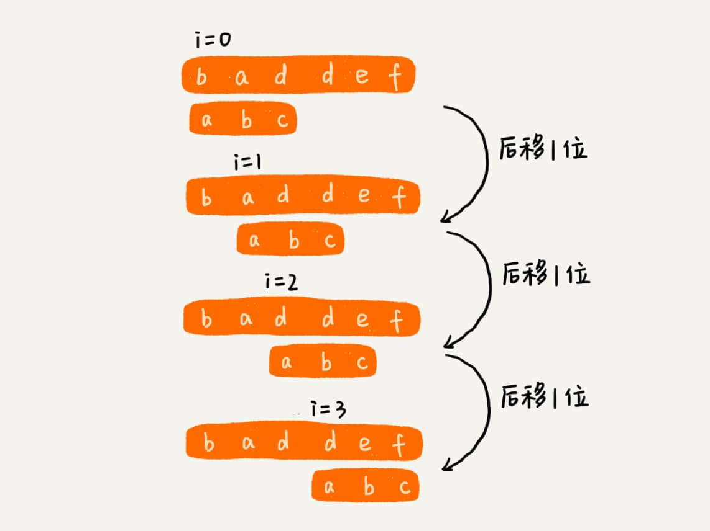

最坏情况时间复杂度是 O(n*m)，虽然时间复杂度很高，但实际开发中BF算法比较常用，因为：

1. 实际的软件开发中，大部分情况下，模式串和主串的长度都不会太长。
2. 朴素字符串匹配算法思想简单，代码实现也非常简单。在工程中，在满足性能要求的前提下，简单是首选。这也是我们常说的==KISS==（Keep it Simple and Stupid）设计原则。

### RK算法

Rabin-Karp算法

RK算法是**借助哈希算法对BF算法进行改造**，即对每个子串分别求哈希值，然后拿子串的哈希值与模式串的哈希值比较，减少了比较的时间。理想情况下，RK 算法的时间复杂度是 O(n)。


### 小结

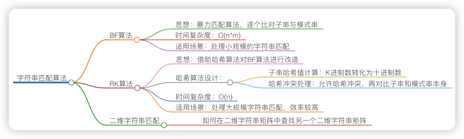


## 33 字符串匹配基础（中）：如何实现文本编辑器中的查找功能？

如何实现文本编辑器中的查找替换功能？

在某些极端情况下，BF算法性能会**退化**的比较严重，而 RK算法需要用到哈希算法，**设计一个可以应对各种类型字符的哈希算法并不简单**。

对于工业级的软件开发来说，希望算法尽可能的高效，并且在极端情况下，性能也不要退化的太严重。

BM（Boyer-Moore）算法，非常高效的字符串匹配算法，原理复杂难懂。

### BM算法的核心思想

把模式串和主串的匹配过程，看作模式串在主串中不停地往后滑动。当遇到不匹配的字符时，BF 算法和 RK 算法的做法是，模式串往后滑动**一位**，然后从模式串的第一个字符开始重新匹配。

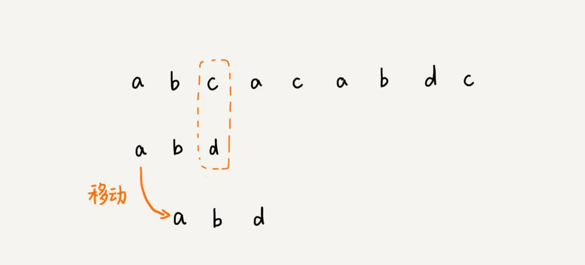

在这个例子里，主串中的c，在模式串中是不存在的，所以，模式串向后滑动的时候，只要有c就会与模式串没有重合，肯定无法匹配。所以，可以一次性把模式串往后多滑动几位，把模式串移动到c的后面。

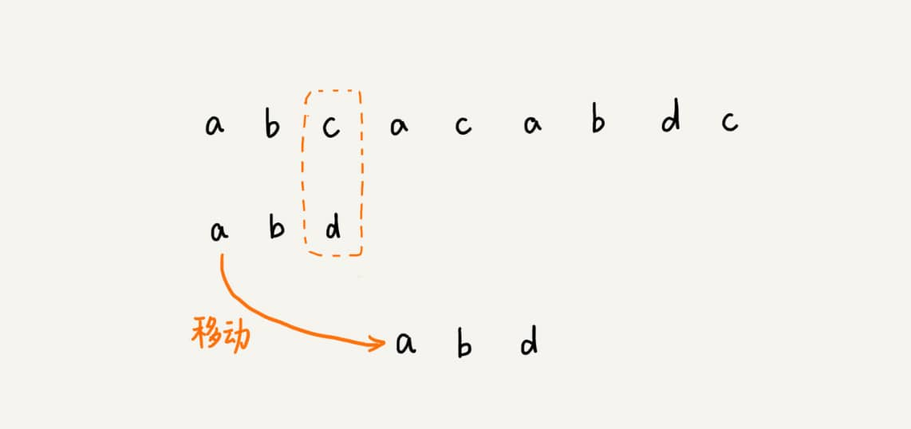

由现象找规律，当遇到不匹配的字符时，有什么固定的规律，可以将模式串往后多滑动几位呢？这样一次性往后滑动好几位，那匹配的效率岂不是就提高了？

BM算法，本质上其实就是在寻找这种规律。借助这种规律，在模式串与主串匹配的过程中，当模式串和主串某个字符不匹配的时候，能够跳过一些肯定不会匹配的情况，将模式串往后多滑动**几位**。

### BM算法原理分析

BM算法包含两部分：==坏字符规则==（bad character rule）和==好后缀规则==（good suffix shift）

#### 1.坏字符规则

之前两个算法都是按模式串的下标从小到大的顺序，依次与主串中的字符进行匹配的：


而 BM 算法的匹配顺序比较特别，它是按照模式串下标从大到小的顺序，倒着匹配的：

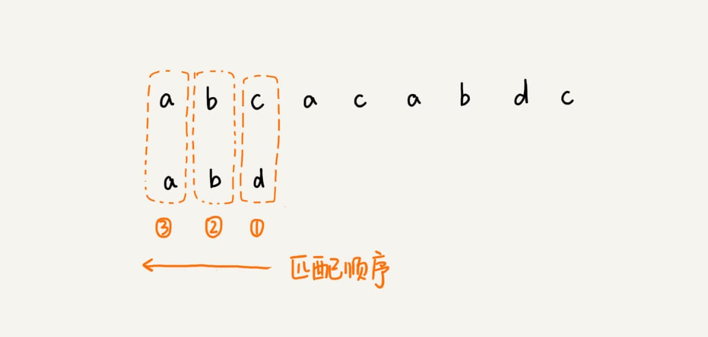

从模式串的末尾往前倒着匹配，当发现某个字符没法匹配的时候，把这个没有匹配的字符叫作**坏字符**（主串中的字符）：

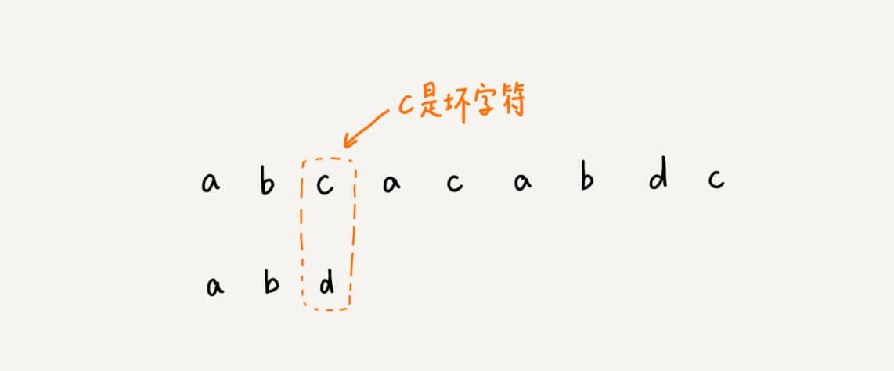

拿坏字符 c 在模式串中查找，发现模式串中并不存在这个字符，也就是说，字符 c 与模式串中的任何字符都不可能匹配。这个时候，我们可以将模式串直接往后滑动三位，将模式串滑动到 c 后面的位置，再从模式串的末尾字符开始比较。


这个时候，我们发现，模式串中最后一个字符 d，还是无法跟主串中的 a 匹配，这个时候，还能将模式串往后滑动三位吗？答案是不行的。因为这个时候，坏字符 a 在模式串中是存在的，模式串中下标是 0 的位置也是字符 a。这种情况下，我们可以将模式串往后滑动两位，让两个 a 上下对齐，然后再从模式串的末尾字符开始，重新匹配。

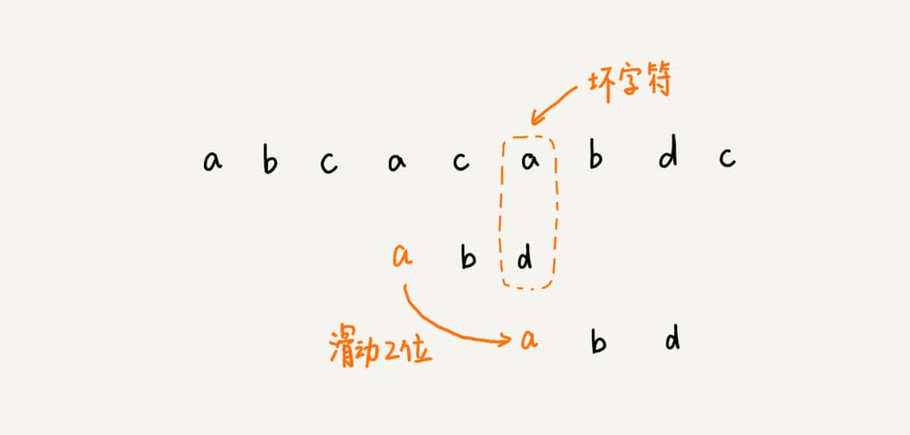


那么不匹配滑动几位的规律是什么？

当发生不匹配的时候，把坏字符对应的模式串中的字符下标记作 `si`。如果坏字符在模式串中存在，我们把这个坏字符在模式串中的下标记作`xi`。如果不存在，我们把xi记作 -1。那模式串往后移动的位数就等于==si-xi==。（注意，我这里说的下标，都是字符在模式串的下标）。


> 如果坏字符在模式串里多处出现，那我们在计算xi的时候，选择最靠后的那个，因为这样不会让模式串滑动过多，导致本来可能匹配的情况被滑动略过。

利用坏字符规则，BM算法在最好情况下的时间复杂度非常低，是 O(n/m)。比如，主串是 aaabaaabaaabaaab，模式串是 aaaa。每次比对，模式串都可以直接后移四位，所以，匹配具有类似特点的模式串和主串的时候，BM算法非常高效。

不过，单纯使用坏字符规则还是不够的。因为根据 si-xi 计算出来的移动位数，有可能是负数，比如主串是 aaaaaaaaaaaaaaaa，模式串是 baaa。不但不会向后滑动模式串，还有可能倒退。

#### 2.好后缀规则

好后缀规则实际上跟坏字符规则的思路很类似。。当模式串滑动到图中的位置的时候，模式串和主串有 2 个字符是匹配的，倒数第 3 个字符发生了不匹配的情况。


把已经匹配的 bc叫作好后缀，记作`{u}`。我们拿它在模式串中查找，如果找到了另一个跟{u}相匹配的子串`{u*}`，那我们就将模式串滑动到子串`{u*}`与主串中`{u}`对齐的位置。


如果在模式串中找不到另一个等于{u}的子串，我们就直接将模式串，滑动到主串中{u}的后面，因为之前的任何一次往后滑动，都没有匹配主串中{u}的情况。

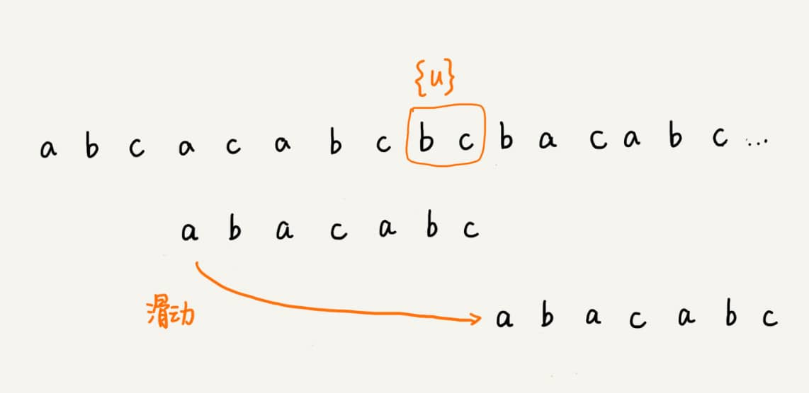

不过，当模式串中不存在等于{u}的子串时，我们直接将模式串滑动到主串{u}的后面。这样做是否有点太过头呢？我们来看下面这个例子。这里面 bc 是好后缀，尽管在模式串中没有另外一个相匹配的子串{u*}，但是如果我们将模式串移动到好后缀的后面，如图所示，那就会错过模式串和主串可以匹配的情况。

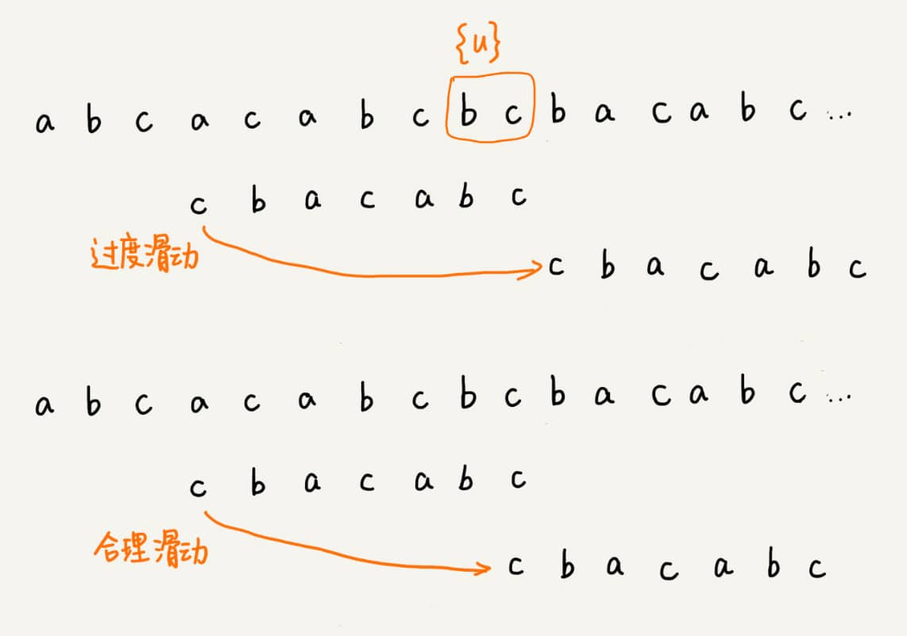

如果好后缀在模式串中不存在可匹配的子串，那在我们一步一步往后滑动模式串的过程中，只要主串中的{u}与模式串有重合，那肯定就无法完全匹配。但是当模式串滑动到前缀与主串中{u}的后缀有部分重合的时候，并且重合的部分相等的时候，就有可能会存在完全匹配的情况。

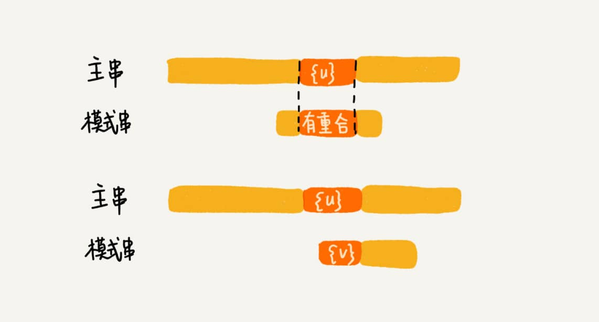

所以，针对这种情况，我们不仅要看好后缀在模式串中，是否有另一个匹配的子串，我们还要考察好后缀的后缀子串，是否存在跟模式串的前缀子串匹配的。

所谓某个字符串 s 的后缀子串，就是最后一个字符跟 s 对齐的子串，比如 abc 的后缀子串就包括 c, bc。所谓前缀子串，就是起始字符跟 s 对齐的子串，比如 abc 的前缀子串有 a，ab。我们从好后缀的后缀子串中，找一个最长的并且能跟模式串的前缀子串匹配的，假设是{v}，然后将模式串滑动到如图所示的位置。

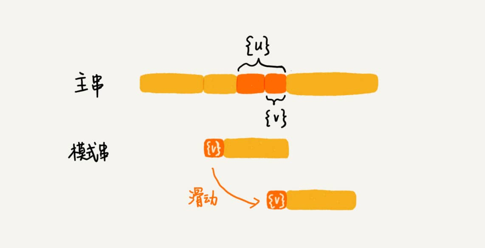


当模式串和主串中的某个字符不匹配的时候，如何选择用好后缀规则还是坏字符规则，来计算模式串往后滑动的位数？

可以分别计算好后缀和坏字符往后滑动的位数，然后取两个数中最大的，作为模式串往后滑动的位数。这种处理方法还可以避免我们前面提到的，根据坏字符规则，计算得到的往后滑动的位数，有可能是负数的情况。

### BM算法代码实现🔖


### BM算法的性能分析及优化🔖


### 思考题

> 你熟悉的编程语言中的查找函数，或者工具、软件中的查找功能，都是用了哪种字符串匹配算法呢？

grep  BM算法

### 小结

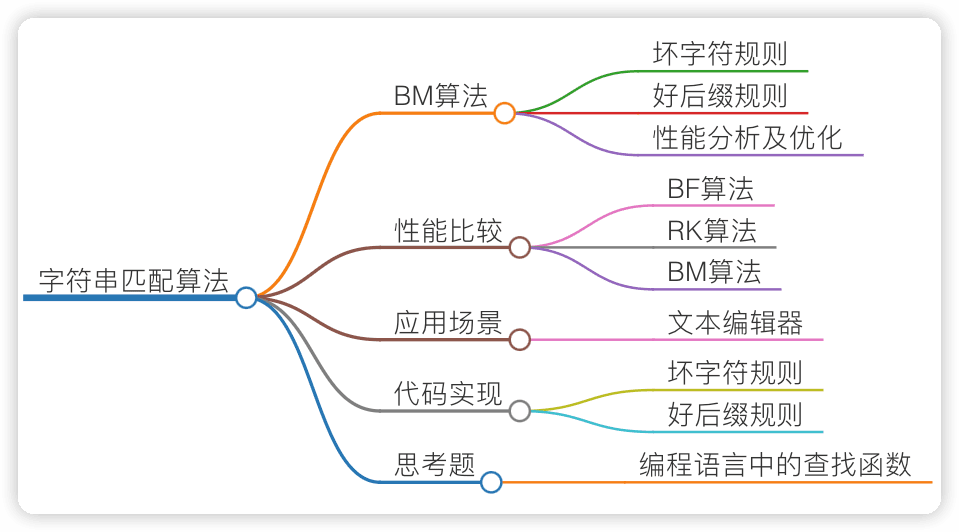

BM 算法核心思想是，利用模式串本身的特点，在模式串中某个字符与主串不能匹配的时候，将模式串往后多滑动几位，以此来减少不必要的字符比较，提高匹配的效率。BM 算法构建的规则有两类，坏字符规则和好后缀规则。好后缀规则可以独立于坏字符规则使用。因为坏字符规则的实现比较耗内存，为了节省内存，我们可以只用好后缀规则来实现 BM 算法。


平常不大可能会自己去实现一个bm算法 顶多就用个bf算法。不过bm算法号称最高效的 比如grep命令就是用它实现的 。

值得学习借鉴的思想有：

- 要有优化意识，前面的 BF，RK 算法已经能够满足我们需求了，为什么发明 BM 算法？是为了减少时间复杂度，但是带来的弊端是，优化代码变得复杂，维护成本变高。 

- 需要查找，需要减少时间复杂度，应该想到什么？散列表。 

- 如果某个表达式计算开销比较大，又需要频繁的使用怎么办？预处理，并缓存。

- 逆向思维：一般都是从前往后做比较，而BM用到的是从后往前的比较


## 34 字符串匹配基础（下）：如何借助BM算法轻松理解KMP算法？

尽管BM算法很复杂，也不好理解，但却是工程中非常常用的一种高效字符串匹配算法。有统计说，它是**最高效、最常用**的字符串匹配算法。

不过，在所有的字符串匹配算法里，**最知名**的就是KMP算法。

实际上，KMP算法跟BM算法的本质是一样的。

### KMP 算法基本原理

KMP 算法是根据三位作者（D.E.Knuth，J.H.Morris 和 V.R.Pratt）的名字来命名的。

### 失效函数计算方法


### KMP 算法复杂度分析


### 小结

KMP算法和BM算法的本质非常类似，都是==根据规律在遇到坏字符的时候，把模式串往后多滑动几位==。

BM 算法有两个规则，坏字符和好后缀。KMP 算法借鉴 BM 算法的思想，可以总结成**好前缀规则**。


## 35 Trie树（字典树）：如何实现搜索引擎的搜索关键词提示功能？

搜索引擎的搜索关键词提示功能，我们经常使用。Google、百度等搜索引擎，这个功能肯定做了很多优化，但基本原理还是：**Trie树**（发音类似 "try"）。


### 什么是“Trie 树”？

==Trie树==，也叫“==字典树==”，是一个树形结构，是一种专门处理**字符串匹配**的数据结构，用来解决==在一组字符串集合中快速查找某个字符串==的问题。

有6个字符串，分别是：how，hi，her，hello，so，see。如何多次查找某个字符串是否在前面的几个字符串中？

一般情况下就是，拿要查找到的字符串依次和6个字符串匹配，这是可行的，但效率比较低下。

先对6个字符串预处理一下，组织成字典树的结构，然后在字典树中匹配查找。

Trie树的本质，就是**==利用字符串之间的公共前缀，将重复的前缀合并在一起==**。


其中，字典树有几个特点：

- 根节点不包含任何信息

- 每个节点表示一个字符串中的一个字符

- 根节点到红色节点的一条路径表示一个字符串（注：红色节点不都是叶子节点）

字典树的具体构造过程：

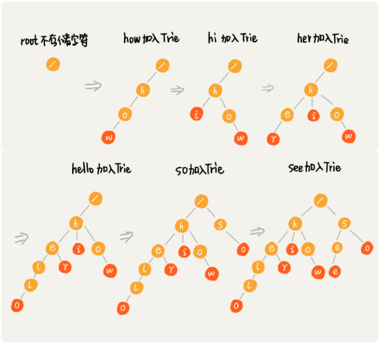

在字典树种查找字符串的过程，就很好理解了，比如查找“her”，先把它分割成三个字符h、e、r，然后从根节点依次匹配，下图绿色路径就是字典树匹配的路径：


### 如何实现一棵 Trie树？

Trie树主要有两个操作：

1. **将字符串集合构造成Trie树**。也就是将字符串插入到Trie树中。
2. **在Trie树中查询一个字符串**。

Trie 树是一个多叉树，如何存储一个Trie树？

经典的存储方式，就是借助散列表的思想，通过一个下标与字符一一映射的数组，来存储子节点的指针：


假设字符串中只有从a到z这26个小写字母，在数组中下标为0的位置，存储指向子节点 a 的指针，下标为 1 的位置存储指向子节点 b 的指针，以此类推，下标为 25 的位置，存储的是指向的子节点 z 的指针。如果某个字符的子节点不存在，就在对应的下标的位置存储null。

```java
class TrieNode {
  char data;
  TrieNode children[26];
}
```

当在Trie树中查找字符串的时候，就可以通过字符的ASCII码减去“a”的ASCII 码，迅速找到匹配的子节点的指针。比如，d 的 ASCII 码减去 a 的 ASCII 码就是 3，那子节点 d 的指针就存储在数组中下标为 3 的位置中。

```java
public class Trie {
    private TrieNode root = new TrieNode('/');

    /**
     * 像Trie树中插入一个字符串
     * @param text
     */
    public void insert(char[] text) {
        TrieNode p = root;
        for (int i = 0; i < text.length; ++i) {
            int index = text[i] - 'a';
            if (p.children[index] == null) {
                TrieNode newNode = new TrieNode(text[i]);
                p.children[index] = newNode;
            }
            p = p.children[index];
        }
        p.isEndingChar = true;
    }

    /**
     * 在Trie树中查找一个字符串
     * @param pattern
     * @return
     */
    public boolean find(char[] pattern) {
        TrieNode p = root;
        for (int i = 0; i < pattern.length; i++) {
            int index = pattern[i] - 'a';
            if (p.children[index] == null) {
                return false;  // 不存在pattern
            }
            p = p.children[index];
        }
        if (p.isEndingChar == false) {
            return false;  // 不能完全匹配，只是前缀
        } else {
            return true;
        }
    }

    public class TrieNode {
        public char data;
        public TrieNode[] children = new TrieNode[26];
        /**
         * 表示是否是最后一个标识位
         */
        public boolean isEndingChar = false;
        public TrieNode(char data) {
            this.data = data;
        }
    }
}
```

> 在 Trie 树中，查找某个字符串的时间复杂度是多少？

如果要在一组字符串中，频繁地查询某些字符串，用 Trie 树会非常高效。构建 Trie 树的过程，需要扫描所有的字符串，时间复杂度是 O(n)（n 表示所有字符串的长度和）。但是一旦构建成功之后，后续的查询操作会非常高效。

每次查询时，如果要查询的字符串长度是 k，那我们只需要比对大约 k 个节点，就能完成查询操作。跟原本那组字符串的长度和个数没有任何关系。所以说，构建好 Trie 树后，在其中查找字符串的时间复杂度是 O(k)，k 表示要查找的字符串的长度。

### Trie树真的很耗内存吗？🔖


### Trie树与散列表、红黑树的比较


### 思考题

> 如何利用 Trie 树，实现搜索关键词的提示功能？


> Trie 树应用场合对数据要求比较苛刻，比如字符串的字符集不能太大，前缀重合比较多等。如果现在给你一个很大的字符串集合，比如包含 1 万条记录，如何通过编程量化分析这组字符串集合是否比较适合用 Trie 树解决呢？也就是如何统计字符串的字符集大小，以及前缀重合的程度呢？

### 小结

Trie 树是一种**解决字符串快速匹配问题**的数据结构。如果用来构建 Trie 树的这一组字符串中，前缀重复的情况不是很多，那 Trie 树这种数据结构总体上来讲是比较费内存的，是一种空间换时间的解决问题思路。

尽管比较耗费内存，但是**对内存不敏感或者内存消耗在接受范围内的情况下**，在 Trie 树中做字符串匹配还是非常高效的，时间复杂度是 O(k)，k 表示要匹配的字符串的长度。

但是，Trie 树的优势并不在于，用它来做动态集合数据的查找，因为，这个工作完全可以用更加合适的散列表或者红黑树来替代。Trie 树最有优势的是**==查找前缀匹配的字符串==**，比如搜索引擎中的关键词提示功能这个场景，就比较适合用它来解决，也是 Trie 树比较经典的应用场景。


## 36 AC自动机：如何用多模式串匹配实现敏感词过滤功能？

> 敏感词过滤功能最基本的原理就是字符串匹配算法，也就是通过维护一个敏感词的字典，当用户输入一段文字内容之后，通过字符串匹配算法，来查找用户输入的这段文字，是否包含敏感词。如果有，就用“***”把它替代掉。

> 那如何才能实现一个高性能的敏感词过滤系统呢？

### 基于单模式串和Trie树实现的敏感词过滤

BF 算法、RK 算法、BM 算法、KMP 算法都是==单模式串匹配算法==；

Trie 树是==多模式串匹配算法==。

### 经典的多模式串匹配算法：AC自动机

Aho-Corasick算法

AC自动机实际上就是在Trie树之上，加了类似 KMP的 next数组，只不过此处的 next数组是构建在树上罢了。


### 小结


单模式串匹配算法是为了快速在主串中查找一个模式串，而多模式串匹配算法是为了快速在主串中查找多个模式串。

AC 自动机是基于 Trie 树的一种改进算法，它跟 Trie 树的关系，就像单模式串中，KMP 算法与 BF 算法的关系一样。KMP 算法中有一个非常关键的 next 数组，类比到 AC 自动机中就是失败指针。而且，AC 自动机失败指针的构建过程，跟 KMP 算法中计算 next 数组极其相似。所以，要理解 AC 自动机，最好先掌握 KMP 算法，因为 AC 自动机其实就是 KMP 算法在多模式串上的改造。

整个 AC 自动机算法包含两个部分，第一部分是将多个模式串构建成 AC 自动机，第二部分是在 AC 自动机中匹配主串。第一部分又分为两个小的步骤，一个是将模式串构建成 Trie 树，另一个是在 Trie 树上构建失败指针。


### 思考

> 分析总结一下，各个字符串匹配算法的特点和比较适合的应用场景吗？


## 37 贪心算法：如何用贪心算法实现Huffman压缩编码？

一些**==算法思想==**：==贪心算法、分治算法、回溯算法、动态规划==。

贪心算法（greedy algorithm）有很多经典的应用，比如==霍夫曼编码==（Huffman Coding）、==Prim和Kruskal最小生成树算法==、还有 ==Dijkstra单源最短路径算法==。

> 霍夫曼编码是如何利用贪心算法来实现对数据压缩编码，有效节省数据存储空间的？

### 如何理解“贪心算法”？

假设有一个可以容纳100kg物品的背包，可以装各种物品。有以 5种豆子，每种豆子的总量和总价值都各不相同。为了让背包中所装物品的总价值最大，如何选择在背包中装哪些豆子？每种豆子又该装多少呢？

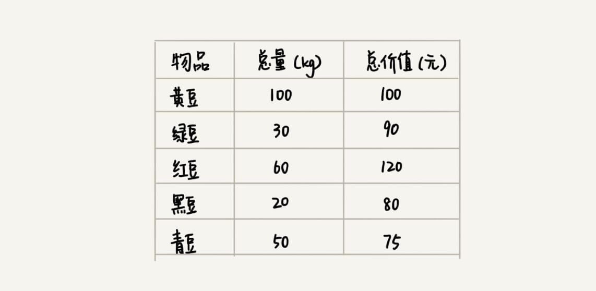

只要先算一算每个物品的单价，按照单价由高到低依次来装就好了。单价从高到低排列，依次是：黑豆、绿豆、红豆、青豆、黄豆，所以，可以往背包里装 20kg 黑豆、30kg 绿豆、50kg 红豆。

上面的解决思路本质上借助的就是贪心算法：

- 第一步，当看到这类问题的时候，首先要联想到贪心算法：针对一组数据，我们定义了==限制值==和==期望值==，希望从中选出几个数据，在满足限制值的情况下，期望值最大。

  也就是，限制值就是重量不能超过 100kg，期望值就是物品的总价值。这组数据就是 5 种豆子。我们从中选出一部分，满足重量不超过 100kg，并且总价值最大。

- 第二步，尝试看下这个问题是否可以用贪心算法解决：每次选择当前情况下，在对限制值同等贡献量的情况下，对期望值贡献最大的数据。

  也就是，每次都从剩下的豆子里面，选择单价最高的，也就是重量相同的情况下，对价值贡献最大的豆子。

- 第三步，举几个例子看下贪心算法产生的结果是否是最优的。大部分情况下，举几个例子验证一下就可以了。**严格地证明贪心算法的正确性，是非常复杂的，需要涉及比较多的数学推理**。而且，从实践的角度来说，大部分能用贪心算法解决的问题，贪心算法的正确性都是显而易见的，也不需要严格的数学推导证明。

实际上，用贪心算法解决问题的思路，并不总能给出最优解。

例子，在一个有权图中，我们从顶点 S 开始，找一条到顶点 T 的最短路径（路径中边的权值和最小）。贪心算法的解决思路是，每次都选择一条跟当前顶点相连的权最小的边，直到找到顶点T。按照这种思路，求出的最短路径是 `S->A->E->T`，路径长度是 1+4+4=9。

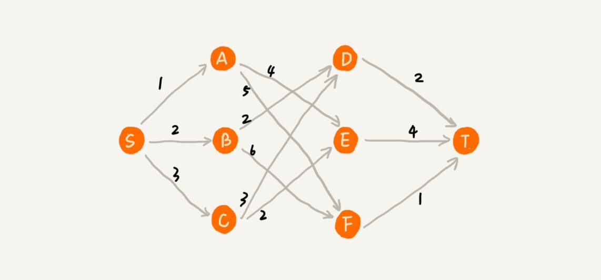

但是，这种贪心的选择方式，最终求的路径并不是最短路径，因为路径 `S->B->D->T` 才是最短路径，因为这条路径的长度是 2+2+2=6。

在这个问题上，贪心算法不工作的主要原因是，**前面的选择，会影响后面的选择**。

### 贪心算法实战分析

#### 1 分糖果

> 有 m 个糖果和 n 个孩子。我们现在要把糖果分给这些孩子吃，但是糖果少，孩子多（m<n），所以糖果只能分配给一部分孩子。
>
> 每个糖果的大小不等，这 m 个糖果的大小分别是 s1，s2，s3，……，sm。除此之外，每个孩子对糖果大小的需求也是不一样的，只有糖果的大小大于等于孩子的对糖果大小的需求的时候，孩子才得到满足。假设这 n 个孩子对糖果大小的需求分别是 g1，g2，g3，……，gn。
>
> 问题是，**如何分配糖果，能尽可能满足最多数量的孩子？**

可以把这个问题抽象成，从 n 个孩子中，抽取一部分孩子分配糖果，让满足的孩子的个数（期望值）是最大的。这个问题的限制值就是糖果个数 m。

看看如何用贪心算法来解决。对于一个孩子来说，如果小的糖果可以满足，我们就没必要用更大的糖果，这样更大的就可以留给其他对糖果大小需求更大的孩子。另一方面，对糖果大小需求小的孩子更容易被满足，所以，可以从需求小的孩子开始分配糖果。因为满<u>足一个需求大的孩子跟满足一个需求小的孩子，对我们期望值的贡献是一样的</u>。

每次从剩下的孩子中，找出对糖果大小需求最小的，然后发给他剩下的糖果中能满足他的最小的糖果，这样得到的分配方案，也就是满足的孩子个数最多的方案。

#### 2 钱币找零

> 假设我们有 1 元、2 元、5 元、10 元、20 元、50 元、100 元这些面额的纸币，它们的张数分别是 c1、c2、c5、c10、c20、c50、c100。
>
> **现在要用这些钱来支付 K 元，最少要用多少张纸币呢？**

在生活中，我们肯定是先用面值最大的来支付，如果不够，就继续用更小一点面值的，以此类推，最后剩下的用 1 元来补齐。

在贡献相同期望值（纸币数目）的情况下，我们希望多贡献点金额，这样就可以让纸币数更少，这就是一种贪心算法的解决思路。直觉告诉我们，这种处理方法就是最好的。

#### 3 区间覆盖

> 假设我们有 n 个区间，区间的起始端点和结束端点分别是[l1, r1]，[l2, r2]，[l3, r3]，……，[ln, rn]。我们从这 n 个区间中选出一部分区间，这部分区间满足两两不相交（端点相交的情况不算相交），最多能选出多少个区间呢？
>
> 

这个问题的处理思路稍微不是那么好懂，不过，我建议你最好能弄懂，因为这个处理思想在很多贪心算法问题中都有用到，比如**任务调度、教师排课**等等问题。

假设这 n 个区间中最左端点是 lmin，最右端点是 rmax。这个问题就相当于，我们选择几个不相交的区间，从左到右将[lmin, rmax]覆盖上。我们按照起始端点从小到大的顺序对这 n 个区间排序。

每次选择的时候，左端点跟前面的已经覆盖的区间不重合的，右端点又尽量小的，这样可以让剩下的未覆盖区间尽可能的大，就可以放置更多的区间。这实际上就是一种贪心的选择方法。
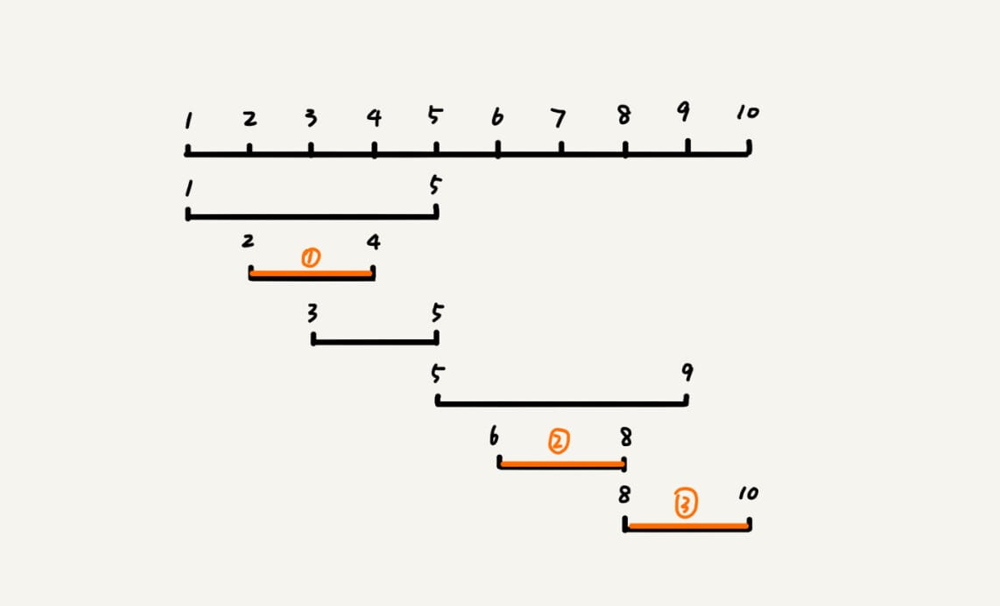


### 小结

实际上，贪心算法适用的场景比较有限。这种算法思想更多的是指导设计基础算法。比如最小生成树算法、单源最短路径算法，这些算法都用到了贪心算法。从我个人的学习经验来讲，**不要刻意去记忆贪心算法的原理，多练习才是最有效的学习方法**。

贪心算法的最难的一块是==如何将要解决的问题抽象成贪心算法模型==。

### 思考题

> 如何用贪心算法实现霍夫曼编码？🔖

霍夫曼编码是一种十分有效的编码方法，广泛用于数据压缩中，其压缩率通常在 20%～90% 之间。

霍夫曼编码不仅会考察文本中有多少个不同字符，还会考察每个字符出现的==频率==，<u>根据频率的不同，选择不同长度的编码</u>。

霍夫曼编码试图用这种不等长的编码方法，来进一步增加压缩的效率。如何给不同频率的字符选择不同长度的编码呢？根据贪心的思想，我们可以把出现频率比较多的字符，用稍微短一些的编码；出现频率比较少的字符，用稍微长一些的编码。


> 在一个非负整数 a 中，我们希望从中移除 k 个数字，让剩下的数字值最小，如何选择移除哪 k 个数字呢？


> 假设有 n 个人等待被服务，但是服务窗口只有一个，每个人需要被服务的时间长度是不同的，如何安排被服务的先后顺序，才能让这 n 个人总的等待时间最短？


## 38 分治算法：谈一谈大规模计算框架MapReduce中的分治思想

**==MapReduce==** 是Google大数据处理的三驾马车之一，另外两个是 ==GFS 和 Bigtable==。它在**倒排索引、PageRank计算、网页分析**等搜索引擎相关的技术中都有大量的应用。

MapRedue的本质就是分治算法。

### 如何理解分治算法？

分治算法（divide and conquer）的核心思想就是**==分而治之==**，也就是**将原问题划分成 n个规模较小，并且==结构与原问题相似的子问题==，==递归==地解决这些子问题，然后再==合并==其结果，就得到原问题的解。**

**分治算法是一种处理问题的==思想==，递归是一种==编程技巧==。**

实际上，分治算法一般都比较适合用递归来实现。分治算法的递归实现中，每一层递归都会涉及这样三个操作：

- 分解：将原问题分解成一系列子问题；
- 解决：递归地求解各个子问题，若子问题足够小，则直接求解；
- 合并：将子问题的结果合并成原问题。

分治算法能解决的问题，一般需要满足下面这几个条件：

- 原问题与分解成的小问题具有**==相同的模式==**；
- 原问题分解成的子问题可以**==独立求解==**，子问题之间**==没有相关性==**，这一点是分治算法跟动态规划的明显区别；
- 具有分解**==终止条件==**，也就是说，当问题足够小时，可以**直接求解**；
- 可以将子问题合并成原问题，而这个合并操作的复杂度不能太高，否则就起不到减小算法总体复杂度的效果了。

### 分治算法应用举例分析

排序算法里讲的数据的有序度、逆序度。

假设我们有 n 个数据，我们期望数据从小到大排列，那完全有序的数据的有序度就是 n(n-1)/2，逆序度等于 0；相反，倒序排列的数据的有序度就是 0，逆序度是 n(n-1)/2。除了这两种极端情况外，我们通过计算有序对或者逆序对的个数，来表示数据的有序度或逆序度。

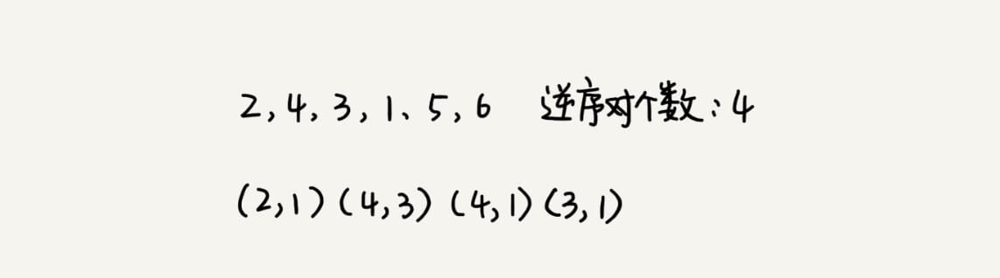

现在的问题是，**如何编程求出一组数据的有序对个数或者逆序对个数呢**？有序对个数和逆序对个数的求解方式是类似的，可以只思考逆序对个数的求解方法。

最笨的方法是，拿每个数字跟它后面的数字比较，看有几个比它小的。把比它小的数字个数记作 k，通过这样的方式，把每个数字都考察一遍之后，然后对每个数字对应的 k 值求和，最后得到的总和就是逆序对个数。不过，这样操作的时间复杂度是 **O(n^2)**。那有没有更加高效的处理方法呢？

用分治算法来试试。套用分治的思想来求数组 A 的逆序对个数。我们可以将数组分成前后两半 A1 和 A2，分别计算 A1 和 A2 的逆序对个数 K1 和 K2，然后再计算 A1 与 A2 之间的逆序对个数 K3。那数组 A 的逆序对个数就等于 K1+K2+K3。

前面讲过，使用分治算法其中一个要求是，子问题合并的代价不能太大，否则就起不了降低时间复杂度的效果了。那回到这个问题，如何快速计算出两个子问题 A1 与 A2 之间的逆序对个数呢？

这里就要借助==归并排序算法==了。

归并排序中有一个非常关键的操作，就是将两个有序的小数组，合并成一个有序的数组。实际上，在这个合并的过程中，我们就可以计算这两个小数组的逆序对个数了。每次合并操作，我们都计算逆序对个数，把这些计算出来的逆序对个数求和，就是这个数组的逆序对个数了。

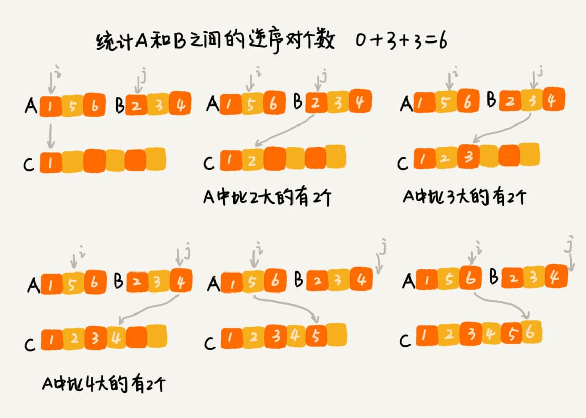

```java
private int num = 0; // 全局变量或者成员变量

public int count(int[] a, int n) {
  num = 0;
  mergeSortCounting(a, 0, n-1);
  return num;
}

private void mergeSortCounting(int[] a, int p, int r) {
  if (p >= r) return;
  int q = (p+r)/2;
  mergeSortCounting(a, p, q);
  mergeSortCounting(a, q+1, r);
  merge(a, p, q, r);
}

private void merge(int[] a, int p, int q, int r) {
  int i = p, j = q+1, k = 0;
  int[] tmp = new int[r-p+1];
  while (i<=q && j<=r) {
    if (a[i] <= a[j]) {
      tmp[k++] = a[i++];
    } else {
      num += (q-i+1); // 统计p-q之间，比a[j]大的元素个数
      tmp[k++] = a[j++];
    }
  }
  while (i <= q) { // 处理剩下的
    tmp[k++] = a[i++];
  }
  while (j <= r) { // 处理剩下的
    tmp[k++] = a[j++];
  }
  for (i = 0; i <= r-p; ++i) { // 从tmp拷贝回a
    a[p+i] = tmp[i];
  }
}
```

分治算法，另外两道经典的问题：

> - 二维平面上有 n 个点，如何快速计算出两个距离最近的点对？
> - 有两个 `n*n` 的矩阵 A，B，如何快速求解两个矩阵的乘积 `C=A*B`？


### 分治思想在海量数据处理中的应用

分治算法思想的应用是非常广泛的，并不仅限于**指导编程和算法设计**。它还经常用在**海量数据处理**的场景中。

我们前面讲的数据结构和算法，大部分都是**基于内存存储和单机处理**。但是，如果要处理的数据量非常大，没法一次性放到内存中，这个时候，这些数据结构和算法就无法工作了。

> 比如，给 10GB 的订单文件按照金额排序这样一个需求，看似是一个简单的排序问题，但是因为数据量大，有 10GB，而我们的机器的内存可能只有 2、3GB 这样子，无法一次性加载到内存，也就无法通过单纯地使用快排、归并等基础算法来解决了。

**可以将海量的数据集合根据某种方法，划分为几个小的数据集合，每个小的数据集合单独加载到内存来解决，然后再将小数据集合合并成大数据集合**。

实际上，利用这种分治的处理思路，不仅仅能克服内存的限制，还能利用**多线程或者多机处理**，加快处理的速度。

比如刚刚举的那个例子，给 10GB 的订单排序，我们就可以先扫描一遍订单，根据订单的金额，将 10GB 的文件划分为几个金额区间。比如订单金额为 1 到 100 元的放到一个小文件，101 到 200 之间的放到另一个文件，以此类推。这样每个小文件都可以单独加载到内存排序，最后将这些有序的小文件合并，就是最终有序的 10GB 订单数据了。

如果订单数据存储在类似 GFS 这样的分布式系统上，当 10GB 的订单被划分成多个小文件的时候，每个文件可以并行加载到多台机器上处理，最后再将结果合并在一起，这样并行处理的速度也加快了很多。不过，这里有一个点要注意，就是数据的存储与计算所在的机器是同一个或者在网络中靠的很近（比如一个局域网内，数据存取速度很快），否则就会因为数据访问的速度，导致整个处理过程不但不会变快，反而有可能变慢。

### 小结

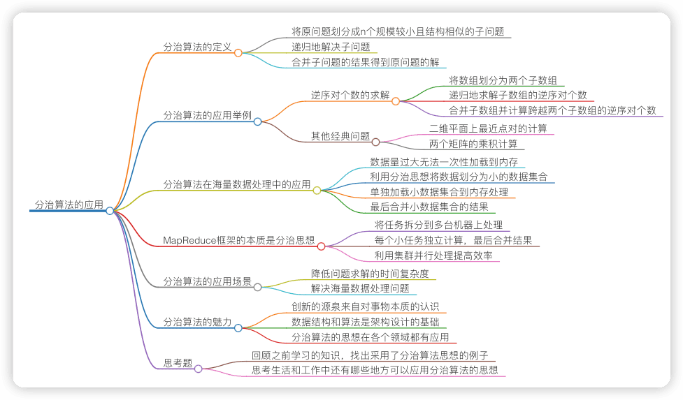

==创新并非离我们很远，创新的源泉来自对事物本质的认识。无数优秀架构设计的思想来源都是基础的数据结构和算法，这本身就是算法的一个魅力所在。==

### 思考题

> 为什么说 MapReduce 的本质就是分治思想？

如果要处理的数据是 1T、10T、100T 这样子的，那一台机器处理的效率肯定是非常低的。而对于谷歌搜索引擎来说，网页爬取、清洗、分析、分词、计算权重、倒排索引等等各个环节中，都会面对如此海量的数据（比如网页）。所以，利用==集群并行处理==显然是大势所趋。

一台机器过于低效，那就把任务拆分到多台机器上来处理。如果拆分之后的小任务之间互不干扰，独立计算，最后再将结果合并。这不就是分治思想吗？

实际上，MapReduce框架只是一个==任务调度器==，底层依赖 GFS 来存储数据，依赖Borg管理机器。它从 GFS 中拿数据，交给 Borg 中的机器执行，并且时刻监控机器执行的进度，一旦出现机器宕机、进度卡壳等，就重新从 Borg 中调度一台机器执行。

尽管 MapReduce 的模型非常简单，但是在 Google 内部应用非常广泛。它除了可以用来处理这种**数据与数据之间存在关系**的任务，比如 MapReduce 的经典例子，**统计文件中单词出现的频率**。除此之外，它还可以用来处理**数据与数据之间没有关系**的任务，比如**对网页分析、分词**等，每个网页可以独立的分析、分词，而这两个网页之间并没有关系。网页几十亿、上百亿，如果单机处理，效率低下，我们就可以利用 MapReduce 提供的高可靠、高性能、高容错的并行计算框架，并行地处理这几十亿、上百亿的网页。

> 之前的数据结构、算法、解决思路，以及举的例子中，有哪些采用了分治算法的思想呢？除此之外，生活、工作中，还有没有其他用到分治算法的地方呢？


## 39 回溯算法：从电影《蝴蝶效应》中学习回溯算法的核心思想

回溯算法思想的应用：

- 深度优先搜索算法

- 实际的软件开发场景中，比如正则表达式匹配、编译原理中的语法分析等

- 很多经典的数学问题，比如数独、八皇后、0-1背包、图的着色、旅行商问题、全排列等等。

### 如何理解“回溯算法”？

笼统地讲，回溯算法很多时候都应用在<u>“搜索”这类问题</u>上。不过这里说的搜索，并不是狭义的指我们前面讲过的图的搜索算法，而是**在一组可能的解中，搜索满足期望的解**。

回溯的处理思想，有点类似**枚举搜索**。我们枚举所有的解，找到满足期望的解。为了有规律地枚举所有可能的解，避免遗漏和重复，我们把问题求解的过程分为多个阶段。每个阶段，我们都会面对一个岔路口，我们先随意选一条路走，当发现这条路走不通的时候（不符合期望的解），就回退到上一个岔路口，另选一种走法继续走。

### 两个回溯算法的经典应用

#### 0-1背包

0-1 背包是非常经典的算法问题，很多场景都可以抽象成这个问题模型。这个问题的经典解法是动态规划，不过还有一种简单但没有那么高效的解法，那就是今天讲的回溯算法。

#### 正则表达式

如何用回溯算法，判断一个给定的文本，能否跟给定的正则表达式匹配？

依次考察正则表达式中的每个字符，当是非通配符时，我们就直接跟文本的字符进行匹配，如果相同，则继续往下处理；如果不同，则回溯。

回溯算法非常适合用递归来实现，在实现的过程中，==剪枝==操作是提高回溯效率的一种技巧。


### 小结

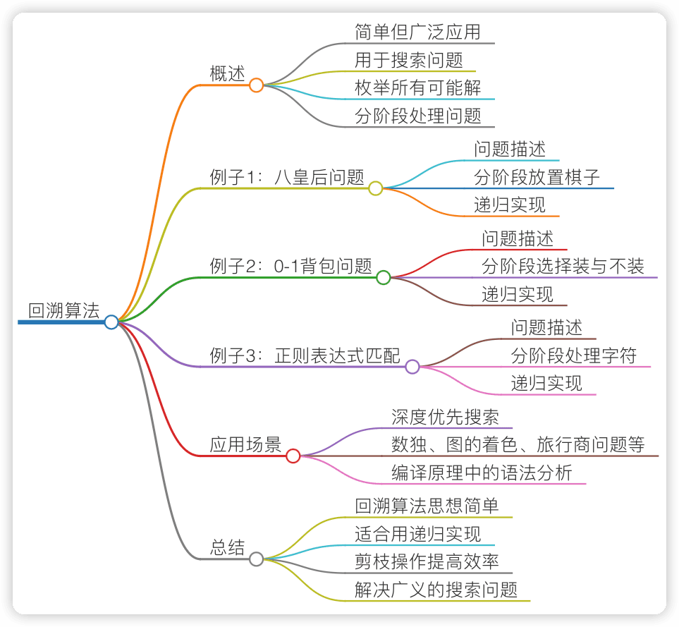

回溯算法的思想非常简单，大部分情况下，都是用来解决**广义的搜索问题**，也就是，从一组可能的解中，选择出一个满足要求的解。回溯算法非常适合用**递归**来实现，在实现的过程中，剪枝操作是提高回溯效率的一种技巧。利用**剪枝**，我们并不需要穷举搜索所有的情况，从而提高搜索效率。


## 40 初识动态规划：如何巧妙解决“双十一”购物时的凑单问题？


### 动态规划学习路线

动态规划比较适合用来求解==最优问题==，比如求**最大值、最小值**等等。它可以非常**显著地降低时间复杂度，提高代码的执行效率**。

学习难点跟递归类似，那就是，求解问题的过程不太符合人类常规的思维方式。

### 0-1 背包问题


### 0-1 背包问题升级版


### 小结

大部分动态规划能解决的问题，都可以通过回溯算法来解决，只不过回溯算法解决起来效率比较低，时间复杂度是指数级的。动态规划算法，在执行效率方面，要高很多。尽管执行效率提高了，但是动态规划的空间复杂度也提高了，所以，很多时候，会说==动态规划是一种空间换时间的算法思想==。


### 思考题

> 淘宝的“双十一”购物节有各种促销活动，比如“满 200 元减 50 元”。假设你女朋友的购物车中有 n 个（n>100）想买的商品，她希望从里面选几个，在凑够满减条件的前提下，让选出来的商品价格总和最大程度地接近满减条件（200 元）。


> 对“杨辉三角”进行一些改造。每个位置的数字可以随意填写，经过某个数字只能到达下面一层相邻的两个数字。
>
> 假设你站在第一层，往下移动，我们把移动到最底层所经过的所有数字之和，定义为路径的长度。请你编程求出从最高层移动到最底层的最短路径长度。
>
> 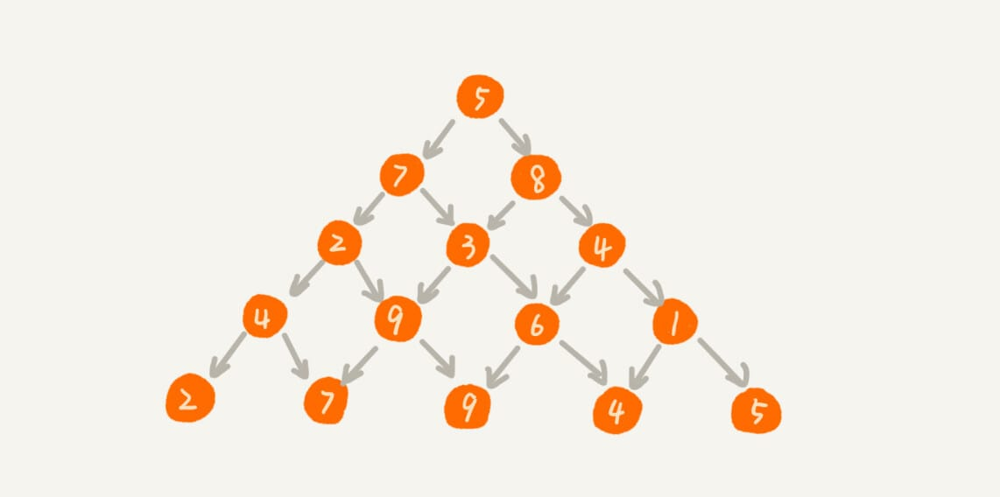


## 41 动态规划理论：一篇文章带你彻底搞懂最优子结构、无后效性和重复子问题

### “一个模型三个特征”理论讲解

什么样的问题适合用动态规划来解决呢？/动态规划能解决的问题有什么规律可循呢？

**多阶段决策最优解模型**

一般是用动态规划来解决==最优问题==。而解决问题的过程，需要经历多个==决策阶段==。每个决策阶段都对应着==一组状态==。然后我们寻找一组==决策序列==，经过这组决策序列，能够产生最终期望求解的最优值。

"三个特征"：

#### 1.最优子结构

最优子结构指的是，**问题的最优解包含子问题的最优解**。反过来说就是，我们可以**通过子问题的最优解，推导出问题的最优解**。如果我们把最优子结构，对应到我们前面定义的动态规划问题模型上，那我们也可以理解为，后面阶段的状态可以通过前面阶段的状态推导出来。

#### 2.无后效性

无后效性有两层含义：

- 第一层含义是，在推导后面阶段的状态的时候，我们只关心前面阶段的状态值，不关心这个状态是怎么一步一步推导出来的。
- 第二层含义是，某阶段状态一旦确定，就不受之后阶段的决策影响。

无后效性是一个非常“宽松”的要求。只要满足前面提到的动态规划问题模型，其实基本上都会满足无后效性。

#### 3.重复子问题

不同的决策序列，到达某个相同的阶段时，可能会产生重复的状态。

### “一个模型三个特征”实例剖析

假设我们有一个 n 乘以 n 的矩阵 `w[n][n]`。矩阵存储的都是正整数。棋子起始位置在左上角，终止位置在右下角。我们将棋子从左上角移动到右下角。每次只能向右或者向下移动一位。从左上角到右下角，会有很多不同的路径可以走。我们把每条路径经过的数字加起来看作路径的长度。那从左上角移动到右下角的最短路径长度是多少呢？


### 两种动态规划解题思路总结

#### 1.状态转移表法

一般能用动态规划解决的问题，都可以使用回溯算法的暴力搜索解决。


#### 2.状态转移方程法


### 四种算法思想比较分析

贪心、回溯、动态规划可以归为一类，而分治单独可以作为一类。前三个算法解决问题的模型，都可以抽象成我们今天讲的那个多阶段决策最优解模型，而分治算法解决的问题尽管大部分也是最优解问题，但是，大部分都不能抽象成多阶段决策模型。

回溯算法是个“万金油”。基本上能用的动态规划、贪心解决的问题，我们都可以用回溯算法解决。回溯算法相当于穷举搜索。穷举所有的情况，然后对比得到最优解。不过，回溯算法的时间复杂度非常高，是指数级别的，只能用来解决小规模数据的问题。

尽管动态规划比回溯算法高效，但是，并不是所有问题，都可以用动态规划来解决。能用动态规划解决的问题，需要满足三个特征，最优子结构、无后效性和重复子问题。在重复子问题这一点上，动态规划和分治算法的区分非常明显。分治算法要求分割成的子问题，不能有重复子问题，而动态规划正好相反，动态规划之所以高效，就是因为回溯算法实现中存在大量的重复子问题。

贪心算法实际上是动态规划算法的一种特殊情况。它解决问题起来更加高效，代码实现也更加简洁。不过，它可以解决的问题也更加有限。它能解决的问题需要满足三个条件，最优子结构、无后效性和贪心选择性（这里我们不怎么强调重复子问题）。

其中，最优子结构、无后效性跟动态规划中的无异。“贪心选择性”的意思是，通过局部最优的选择，能产生全局的最优选择。每一个阶段，我们都选择当前看起来最优的决策，所有阶段的决策完成之后，最终由这些局部最优解构成全局最优解。

### 小结

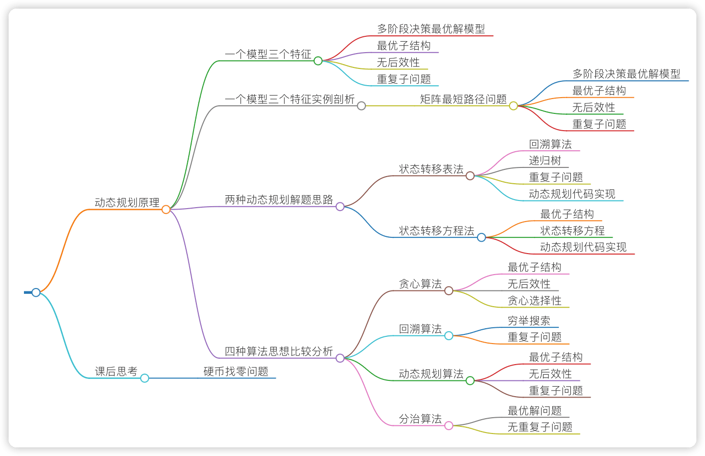


## 42 动态规划实战：如何实现搜索引擎中的拼写纠错功能？

### 如何量化两个字符串的相似度？

**==编辑距离==**（Edit Distance）指的就是，将一个字符串转化成另一个字符串，需要的最少编辑操作次数（比如增加一个字符、删除一个字符、替换一个字符）。编辑距离越大，说明两个字符串的相似程度越小；相反，编辑距离就越小，说明两个字符串的相似程度越大。对于两个完全相同的字符串来说，编辑距离就是 0。

编辑距离有多种不同的计算方式：

- **莱文斯坦距离**（Levenshtein distance），允许增加、删除、替换字符。
- **最长公共子串长度**（Longest common substring length），只允许增加、删除字符。

莱文斯坦距离的大小，表示两个字符串差异的大小；而最长公共子串的大小，表示两个字符串相似程度的大小。举例，两个字符串 mitcmu 和 mtacnu 的莱文斯坦距离是 3，最长公共子串长度是 4。


### 如何编程计算莱文斯坦距离？

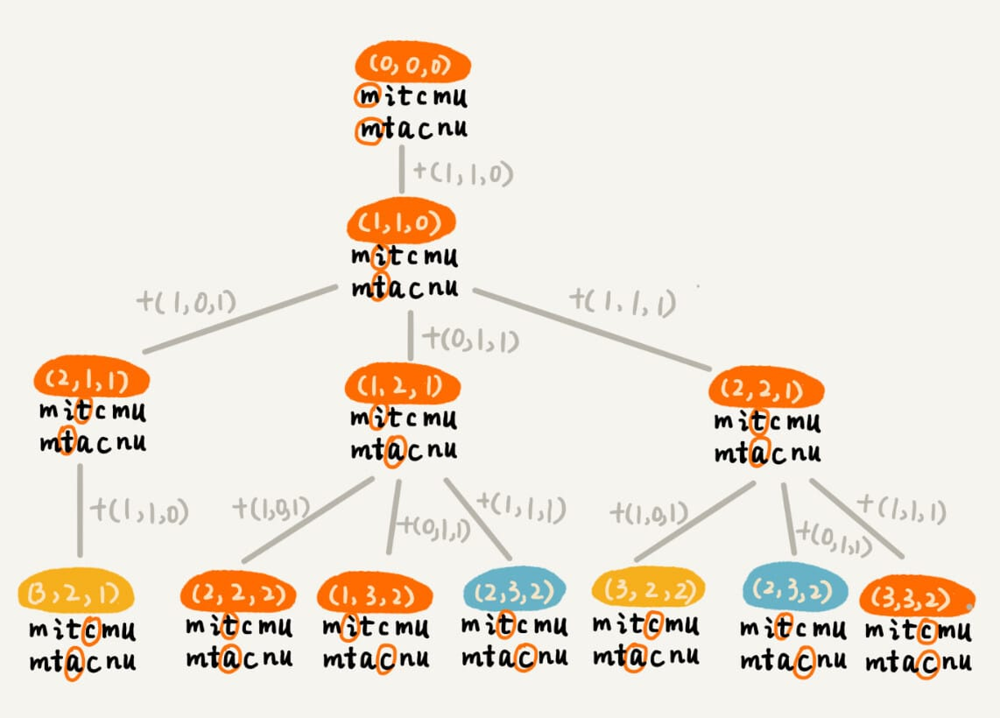

### 如何编程计算最长公共子串长度？


### 小结

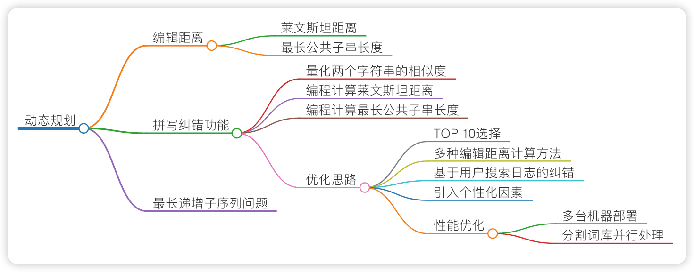


### 小题

> 如何实现搜索引擎中的拼写纠错功能？

当用户在搜索框内，输入一个拼写错误的单词时，我们就拿这个单词跟词库中的单词一一进行比较，计算编辑距离，将编辑距离最小的单词，作为纠正之后的单词，提示给用户。

这就是拼写纠错最基本的原理。不过，真正用于商用的搜索引擎，拼写纠错功能显然不会就这么简单。一方面，单纯利用编辑距离来纠错，效果并不一定好；另一方面，词库中的数据量可能很大，搜索引擎每天要支持海量的搜索，所以对纠错的性能要求很高。

针对纠错效果不好的问题，有很多种优化思路：

- 我们并不仅仅取出编辑距离最小的那个单词，而是取出编辑距离最小的 TOP 10，然后根据其他参数，决策选择哪个单词作为拼写纠错单词。比如使用搜索热门程度来决定哪个单词作为拼写纠错单词。
- 我们还可以用多种编辑距离计算方法，比如今天讲到的两种，然后分别编辑距离最小的 TOP 10，然后求交集，用交集的结果，再继续优化处理。
- 我们还可以通过统计用户的搜索日志，得到最常被拼错的单词列表，以及对应的拼写正确的单词。搜索引擎在拼写纠错的时候，首先在这个最常被拼错单词列表中查找。如果一旦找到，直接返回对应的正确的单词。这样纠错的效果非常好。
- 我们还有更加高级一点的做法，引入个性化因素。针对每个用户，维护这个用户特有的搜索喜好，也就是常用的搜索关键词。当用户输入错误的单词的时候，我们首先在这个用户常用的搜索关键词中，计算编辑距离，查找编辑距离最小的单词。

针对纠错性能方面，也有相应的优化方式。讲两种分治的优化思路。

- 如果纠错功能的 TPS 不高，我们可以部署多台机器，每台机器运行一个独立的纠错功能。当有一个纠错请求的时候，我们通过负载均衡，分配到其中一台机器，来计算编辑距离，得到纠错单词。
- 如果纠错系统的响应时间太长，也就是，每个纠错请求处理时间过长，我们可以将纠错的词库，分割到很多台机器。当有一个纠错请求的时候，我们就将这个拼写错误的单词，同时发送到这多台机器，让多台机器并行处理，分别得到编辑距离最小的单词，然后再比对合并，最终决定出一个最优的纠错单词。


> 有一个数字序列包含 n 个不同的数字，如何求出这个序列中的最长递增子序列长度？比如 2, 9, 3, 6, 5, 1, 7 这样一组数字序列，它的最长递增子序列就是 2, 3, 5, 7，所以最长递增子序列的长度是 4。


---


# 高级篇

相对基础篇，高级篇涉及的知识点，都比较零散，不是太系统。

基础篇结构“开篇问题 - 知识讲解 - 回答开篇 - 总结 - 课后思考”。

高级篇结构：“问题阐述 - 算法解析 - 总结引申 - 课后思考”。


## 43 拓扑排序：如何确定代码源文件的编译依赖关系？

一个完整的项目往往会包含很多代码源文件。编译器在编译整个项目的时候，需要按照依赖关系，依次编译每个源文件。比如，A.cpp 依赖 B.cpp，那在编译的时候，编译器需要先编译 B.cpp，才能编译 A.cpp。

编译器通过分析源文件或者程序员事先写好的编译配置文件（比如 Makefile 文件），来获取这种局部的依赖关系。==那编译器又该如何通过源文件两两之间的局部依赖关系，确定一个全局的编译顺序呢？==


### 算法解析

> 穿衣服时有一定的顺序，衣服与衣服之间有一定的依赖关系。
>
> 你必须先穿袜子才能穿鞋，先穿内裤才能穿秋裤。假设我们现在有八件衣服要穿，它们之间的两两依赖关系我们已经很清楚了，那如何安排一个穿衣序列，能够满足所有的两两之间的依赖关系？

这就是个拓扑排序问题。从这个例子中，应该能想到，在很多时候，拓扑排序的序列并不是唯一的。

可以找到了好几种满足这些局部先后关系的穿衣序列。


拓扑排序的原理非常简单，重点应该放到拓扑排序的实现上面。

==算法是构建在具体的数据结构之上的。==

**如何将问题背景抽象成具体的数据结构**？

可以把源文件与源文件之间的依赖关系，抽象成一个有向图。每个源文件对应图中的一个顶点，源文件之间的依赖关系就是顶点之间的边。

如果 a 先于 b 执行，也就是说 b 依赖于 a，那么就在顶点 a 和顶点 b 之间，构建一条从 a 指向 b 的边。而且，这个图不仅要是有向图，还要是一个有向无环图，也就是不能存在像 a->b->c->a 这样的循环依赖关系。因为图中一旦出现环，拓扑排序就无法工作了。实际上，**拓扑排序本身就是基于有向无环图的一个算法。**

```java
public class Graph {
  private int v; // 顶点的个数
  private LinkedList<Integer> adj[]; // 邻接表

  public Graph(int v) {
    this.v = v;
    adj = new LinkedList[v];
    for (int i=0; i<v; ++i) {
      adj[i] = new LinkedList<>();
    }
  }

  public void addEdge(int s, int t) { // s先于t，边s->t
    adj[s].add(t);
  }
}
```

数据结构定义好了,那么，**如何在这个有向无环图上，实现拓扑排序**？两种实现方法：

#### 1 Kahn 算法

贪心算法思想

定义数据结构的时候，如果 s 需要先于 t 执行，那就添加一条 s 指向 t 的边。所以，如果某个顶点入度为 0， 也就表示，没有任何顶点必须先于这个顶点执行，那么这个顶点就可以执行了。

先从图中，找出一个入度为 0 的顶点，将其输出到拓扑排序的结果序列中（对应代码中就是把它打印出来），并且把这个顶点从图中删除（也就是把这个顶点可达的顶点的入度都减 1）。我们循环执行上面的过程，直到所有的顶点都被输出。最后输出的序列，就是满足局部依赖关系的拓扑排序。

```java
public void topoSortByKahn() {
  int[] inDegree = new int[v]; // 统计每个顶点的入度
  for (int i = 0; i < v; ++i) {
    for (int j = 0; j < adj[i].size(); ++j) {
      int w = adj[i].get(j); // i->w
      inDegree[w]++;
    }
  }
  LinkedList<Integer> queue = new LinkedList<>();
  for (int i = 0; i < v; ++i) {
    if (inDegree[i] == 0) queue.add(i);
  }
  while (!queue.isEmpty()) {
    int i = queue.remove();
    System.out.print("->" + i);
    for (int j = 0; j < adj[i].size(); ++j) {
      int k = adj[i].get(j);
      inDegree[k]--;
      if (inDegree[k] == 0) queue.add(k);
    }
  }
}
```


#### 2 DFS 算法

**深度优先遍历**，遍历图中的所有顶点，而非只是搜索一个顶点到另一个顶点的路径。

```java
public void topoSortByDFS() {
  // 先构建逆邻接表，边s->t表示，s依赖于t，t先于s
  LinkedList<Integer> inverseAdj[] = new LinkedList[v];
  for (int i = 0; i < v; ++i) { // 申请空间
    inverseAdj[i] = new LinkedList<>();
  }
  for (int i = 0; i < v; ++i) { // 通过邻接表生成逆邻接表
    for (int j = 0; j < adj[i].size(); ++j) {
      int w = adj[i].get(j); // i->w
      inverseAdj[w].add(i); // w->i
    }
  }
  boolean[] visited = new boolean[v];
  for (int i = 0; i < v; ++i) { // 深度优先遍历图
    if (visited[i] == false) {
      visited[i] = true;
      dfs(i, inverseAdj, visited);
    }
  }
}

private void dfs(
    int vertex, LinkedList<Integer> inverseAdj[], boolean[] visited) {
  for (int i = 0; i < inverseAdj[vertex].size(); ++i) {
    int w = inverseAdj[vertex].get(i);
    if (visited[w] == true) continue;
    visited[w] = true;
    dfs(w, inverseAdj, visited);
  } // 先把vertex这个顶点可达的所有顶点都打印出来之后，再打印它自己
  System.out.print("->" + vertex);
}
```

- 第一部分是通**过邻接表构造逆邻接表**。邻接表中，边 s->t 表示 s 先于 t 执行，也就是 t 要依赖 s。在逆邻接表中，边 s->t 表示 s 依赖于 t，s 后于 t 执行。为什么这么转化呢？这个跟我们这个算法的实现思想有关。
- 第二部分是这个算法的核心，也就是**递归处理每个顶点**。对于顶点 vertex 来说，我们先输出它可达的所有顶点，也就是说，先把它依赖的所有的顶点输出了，然后再输出自己。


从 Kahn 代码中可以看出来，每个顶点被访问了一次，每个边也都被访问了一次，所以，Kahn 算法的时间复杂度就是 O(V+E)（V 表示顶点个数，E 表示边的个数）。

DFS 算法的时间复杂度我们之前分析过。每个顶点被访问两次，每条边都被访问一次，所以时间复杂度也是 O(V+E)。

注意，这里的图可能不是连通的，有可能是有好几个不连通的子图构成，所以，E 并不一定大于 V，两者的大小关系不确定。所以，在表示时间复杂度的时候，V、E 都要考虑在内。

### 小结

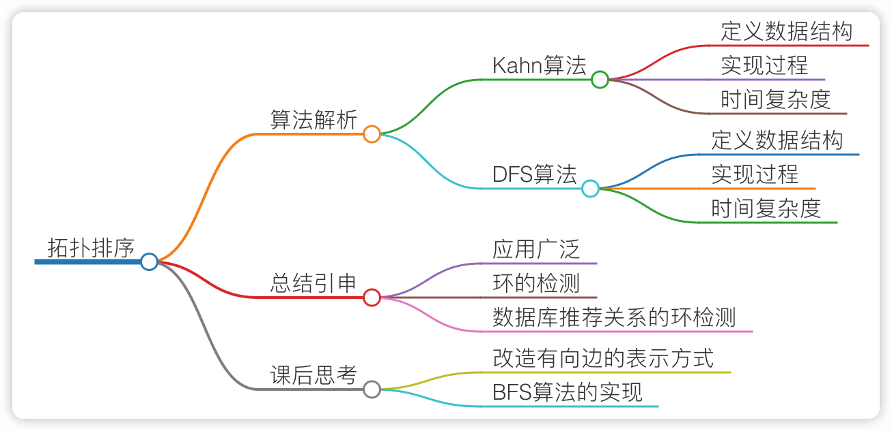


## 44 最短路径：地图软件是如何计算出最优出行路径的？

深度优先搜索和广度优先搜索这两种算法主要是针对无权图的搜索算法。针对有权图，也就是图中的每条边都有一个权重，该如何计算两点之间的最短路径（经过的边的权重和最小）呢？

最短路径算法（Shortest Path Algorithm）

### 算法解析

最优问题包含三个：最短路线、最少用时和最少红绿灯。

解决软件开发中的实际问题，最重要的一点就是==建模==，也就是==将复杂的场景抽象成具体的数据结构==。

> 把地图抽象成有向有权图。
>
> 每个岔路口看作一个顶点，岔路口与岔路口之间的路看作一条边，路的长度就是边的权重。如果路是单行道，我们就在两个顶点之间画一条有向边；如果路是双行道，我们就在两个顶点之间画两条方向不同的边。


Dijkstra 最短路径算法

### 小结


## 45 位图：如何实现网页爬虫中的URL去重功能？

爬虫的工作原理是，通过解析已经爬取页面中的网页链接，然后再爬取这些链接对应的网页。而同一个网页链接有可能被包含在多个页面中，这就会导致爬虫在爬取的过程中，重复爬取相同的网页。<u>如何避免这些重复的爬取呢？</u>

### 算法解析

两个操作：添加一个URL和查询一个URL

内存消耗方面的优化，==布隆过滤器（Bloom Filter）==（对位图的一种改进）

存储结构，==位图（BitMap）==


布隆过滤器用多个哈希函数对同一个网页链接进行处理，CPU 只需要将网页链接从内存中读取一次，进行多次哈希计算，理论上讲这组操作是 CPU 密集型的。而在散列表的处理方式中，需要读取散列值相同（散列冲突）的多个网页链接，分别跟待判重的网页链接，进行字符串匹配。这个操作涉及很多内存数据的读取，所以是内存密集型的。我们知道 CPU 计算可能是要比内存访问更快速的，所以，理论上讲，布隆过滤器的判重方式，更加快速。

布隆过滤器非常适合这种不需要 100% 准确的、允许存在小概率误判的大规模判重场景。除了爬虫网页去重这个例子，还有比如统计一个大型网站的每天的 UV 数，也就是每天有多少用户访问了网站，我们就可以使用布隆过滤器，对重复访问的用户进行去重。

布隆过滤器最大的特点就是比较==省存储空间==。

### 小结

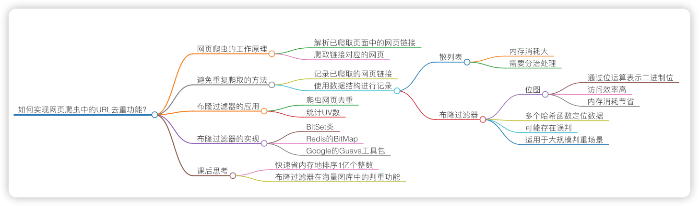

布隆过滤器非常适合这种**不需要 100% 准确的、允许存在小概率误判的大规模判重场景**。除了爬虫网页去重这个例子，还有比如统计一个大型网站的每天的 UV 数，也就是每天有多少用户访问了网站，就可以使用布隆过滤器，对重复访问的用户进行去重。

布隆过滤器的误判率，主要跟哈希函数的个数、位图的大小有关。当我们往布隆过滤器中不停地加入数据之后，位图中不是 true 的位置就越来越少了，误判率就越来越高了。所以，对于无法事先知道要判重的数据个数的情况，我们需要支持自动扩容的功能。

当布隆过滤器中，数据个数与位图大小的比例超过某个阈值的时候，我们就重新申请一个新的位图。后面来的新数据，会被放置到新的位图中。但是，如果我们要判断某个数据是否在布隆过滤器中已经存在，我们就需要查看多个位图，相应的执行效率就降低了一些。

位图、布隆过滤器应用如此广泛，很多编程语言都已经实现了。比如 Java 中的 `BitSet` 类就是一个位图，Redis 也提供了 `BitMap` 位图类，Google 的 Guava 工具包提供了 `BloomFilter` 布隆过滤器的实现。

## 46 概率统计：如何利用朴素贝叶斯算法过滤垃圾短信？

用位图、布隆过滤器，来过滤重复的数据。

### 算法解析

利用简单的数据结构和算法，解决这种看似非常复杂的问题。

#### 1 基于黑名单的过滤器

维护一个骚扰电话号码和垃圾短信发送号码的黑名单。可以从一些公开的网站上下载，也可以通过类似“360 骚扰电话拦截”的功能，通过用户自主标记骚扰电话来收集。

对于被多个用户标记，并且标记个数超过一定阈值的号码，我们就可以定义为骚扰电话，并将它加入到我们的黑名单中。

如果黑名单中的电话号码不多的话，可以使用散列表、二叉树等动态数据结构来存储，对内存的消耗并不会很大。如果我们把每个号码看作一个字符串，并且假设平均长度是 16 个字节，那存储 50 万个电话号码，大约需要 10MB 的内存空间。

如果黑名单中的电话号码很多呢？

布隆过滤器最大的特点就是比较省存储空间。如果我们要存储 500 万个手机号码，我们把位图大小设置为 10 倍数据大小，也就是 5000 万，那也只需要使用 5000 万个二进制位（5000 万 bits），换算成字节，也就是不到 7MB 的存储空间。

另一种一种==时间换空间==的方法，就是把黑名单存储在服务器端上，把过滤和拦截的核心工作，交给服务器端来做。手机端只负责将要检查的号码发送给服务器端，服务器端通过查黑名单，判断这个号码是否应该被拦截，并将结果返回给手机端。

#### 2 基于规则的过滤器

上面基于黑名单的过滤方法，如果不在黑名单，就没办法拦截了。

通过短信的内容，来判断某条短信是否是垃圾短信。

可以**预先设定一些规则**，如果某条短信符合这些规则，就可以判定它是垃圾短信。比如：

- 短信中包含特殊单词（或词语），比如一些非法、淫秽、反动词语等；
- 短信发送号码是群发号码，非我们正常的手机号码，比如 +60389585；
- 短信中包含回拨的联系方式，比如手机号码、微信、QQ、网页链接等，因为群发短信的号码一般都是无法回拨的；
- 短信格式花哨、内容很长，比如包含各种表情、图片、网页链接等；
- 符合已知垃圾短信的模板。垃圾短信一般都是重复群发，对于已经判定为垃圾短信的短信，我们可以抽象成模板，将获取到的短信与模板匹配，一旦匹配，我们就可以判定为垃圾短信。


如果有大量的样本数据（比如 1000 万条短信），还可以**基于概率统计的方法，借助计算机强大的计算能力，找出哪些单词最常出现在垃圾短信中，将这些最常出现的单词，作为特殊单词，用来过滤短信**。【要求每条短信都做好了标记，它是垃圾短信还是非垃圾短信】

对这 1000 万条短信，进行==分词处理==（借助中文或者英文分词算法），去掉“的、和、是”等没有意义的==停用词（Stop words）==，得到 n 个不同的单词。针对每个单词，统计有多少个垃圾短信出现了这个单词，有多少个非垃圾短信会出现这个单词，进而求出==每个单词出现在垃圾短信中的概率==，以及出现在非垃圾短信中的概率。**如果某个单词出现在垃圾短信中的概率，远大于出现在非垃圾短信中的概率，那我们就把这个单词作为特殊单词，用来过滤垃圾短信。**

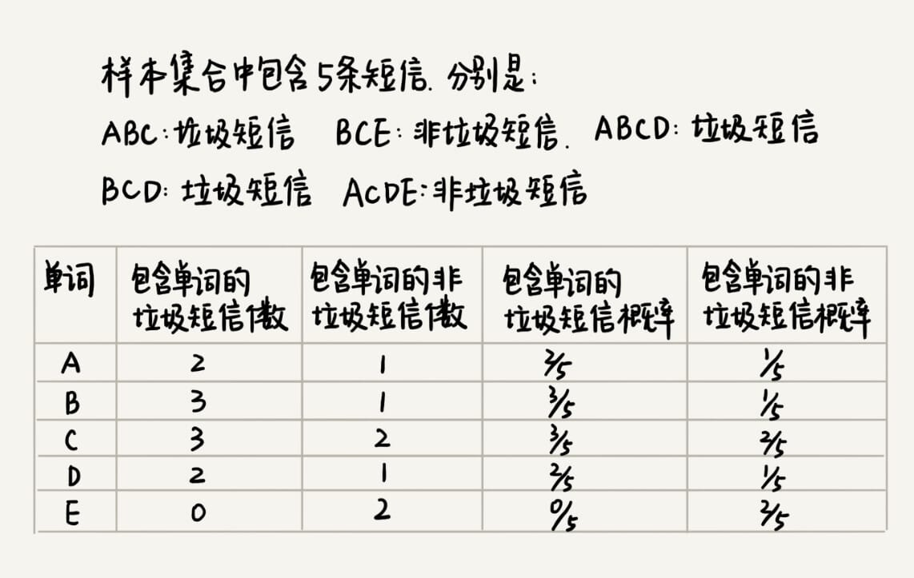


#### 3 基于概率统计的过滤器

基于规则的过滤器，看起来很直观，也很好理解，但是它也有一定的局限性。

- 一方面，这些规则受人的思维方式局限，规则未免太过简单；
- 另一方面，垃圾短信发送者可能会针对规则，精心设计短信，绕过这些规则的拦截。


更加高级的过滤方式：基于概率统计的过滤方式，基础理论是基于朴素贝叶斯算法。

**什么是朴素贝叶斯算法？**

假设事件 A 是“小明不去上学”，事件 B 是“下雨了”。我们现在统计了一下过去 10 天的下雨情况和小明上学的情况，作为样本数据。


分析一下，这组样本有什么规律。在这 10 天中，有 4 天下雨，所以下雨的概率 P(B)=4/10。10 天中有 3 天，小明没有去上学，所以小明不去上学的概率 P(A)=3/10。在 4 个下雨天中，小明有 2 天没去上学，所以下雨天不去上学的概率 P(A|B)=2/4。在小明没有去上学的 3 天中，有 2 天下雨了，所以小明因为下雨而不上学的概率是 P(B|A)=2/3。实际上，这 4 个概率值之间，有一定的关系，这个关系就是朴素贝叶斯算法：

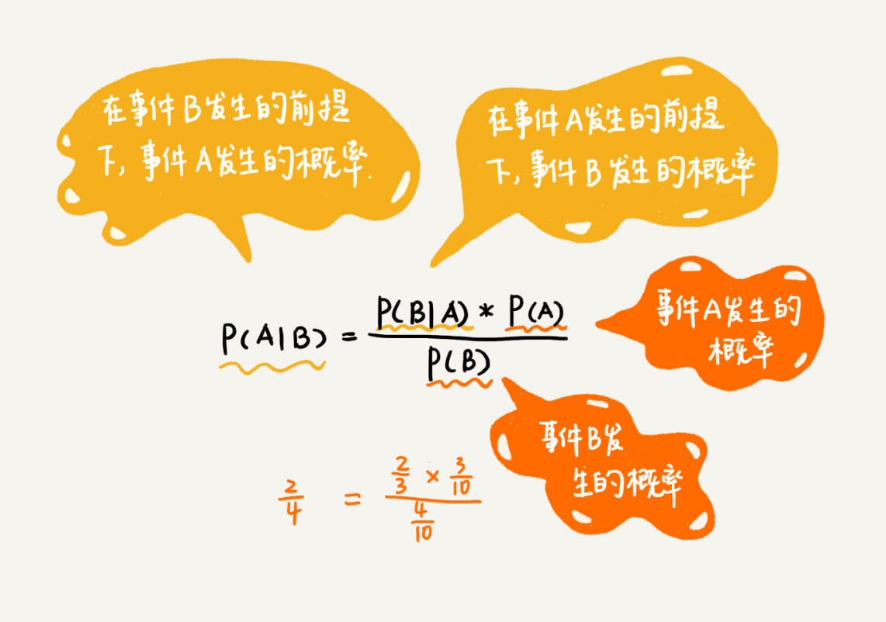

基于概率统计的过滤器，是基于短信内容来判定是否是垃圾短信。而计算机没办法像人一样理解短信的含义。所以，我们需要把短信抽象成一组计算机可以理解并且方便计算的**==特征项==**，用这一组特征项代替短信本身，来做垃圾短信过滤。

可以通过分词算法，把一个短信分割成 n 个单词。这 n 个单词就是一组特征项，全权代表这个短信。因此，判定一个短信是否是垃圾短信这样一个问题，就变成了，判定同时包含这几个单词的短信是否是垃圾短信。

不过，这里我们并不像基于规则的过滤器那样，非黑即白，一个短信要么被判定为垃圾短信、要么被判定为非垃圾短息。我们**使用概率，来表征一个短信是垃圾短信的可信程度**。


尽管我们有大量的短信样本，但是我们没法通过样本数据统计得到这个概率。为什么不可以呢？你可能会说，我只需要统计同时包含 W1，W2，W3，…，Wn 这 n 个单词的短信有多少个（我们假设有 x 个），然后看这里面属于垃圾短信的有几个（我们假设有 y 个），那包含 W1，W2，W3，…，Wn 这 n 个单词的短信是垃圾短信的概率就是 y/x。

理想很丰满，但现实往往很骨感。这里忽视了非常重要的一点，那就是样本的数量再大，毕竟也是有限的，样本中不会有太多同时包含 W1，W2，W3，…，Wn 的短信的，甚至很多时候，样本中根本不存在这样的短信。没有样本，也就无法计算概率。所以这样的推理方式虽然正确，但是实践中并不好用。

可以通过朴素贝叶斯公式，将这个概率的求解，分解为其他三个概率的求解。

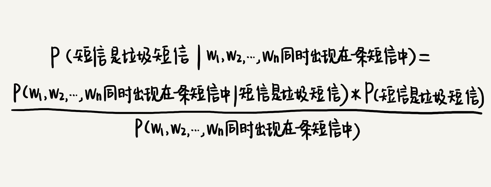

`P（W1，W2，W3，…，Wn 同时出现在一条短信中 | 短信是垃圾短信）`这个概率照样无法通过样本来统计得到。但是我们可以基于下面这条著名的概率规则来计算。

> 独立事件发生的概率计算公式：`P(A*B) = P(A)*P(B)`
>
> 如果事件 A 和事件 B 是独立事件，两者的发生没有相关性，事件 A 发生的概率 P(A) 等于 p1，事件 B 发生的概率 P(B) 等于 p2，那两个同时发生的概率 P(A*B) 就等于 P(A)*P(B)。

基于这条独立事件发生概率的计算公式，我们可以把 P（W1，W2，W3，…，Wn 同时出现在一条短信中 | 短信是垃圾短信）分解为下面这个公式：


其中，P（Wi 出现在短信中 | 短信是垃圾短信）表示垃圾短信中包含 Wi 这个单词的概率有多大。这个概率值通过统计样本很容易就能获得。我们假设垃圾短信有 y 个，其中包含 Wi 的有 x 个，那这个概率值就等于 x/y。

P（W1，W2，W3，…，Wn 同时出现在一条短信中 | 短信是垃圾短信）这个概率值，我们就计算出来了，我们再来看下剩下两个。

P（短信是垃圾短信）表示短信是垃圾短信的概率，这个很容易得到。我们把样本中垃圾短信的个数除以总样本短信个数，就是短信是垃圾短信的概率。

不过，P（W1，W2，W3，…，Wn 同时出现在一条短信中）这个概率还是不好通过样本统计得到，原因我们前面说过了，样本空间有限。不过，我们没必要非得计算这一部分的概率值。为什么这么说呢？

实际上，我们可以分别计算同时包含 W1，W2，W3，…，Wn 这 n 个单词的短信，是垃圾短信和非垃圾短信的概率。假设它们分别是 p1 和 p2。我们并不需要单纯地基于 p1 值的大小来判断是否是垃圾短信，而是通过对比 p1 和 p2 值的大小，来判断一条短信是否是垃圾短信。更细化一点讲，那就是，如果 p1 是 p2 的很多倍（比如 10 倍），我们才确信这条短信是垃圾短信。

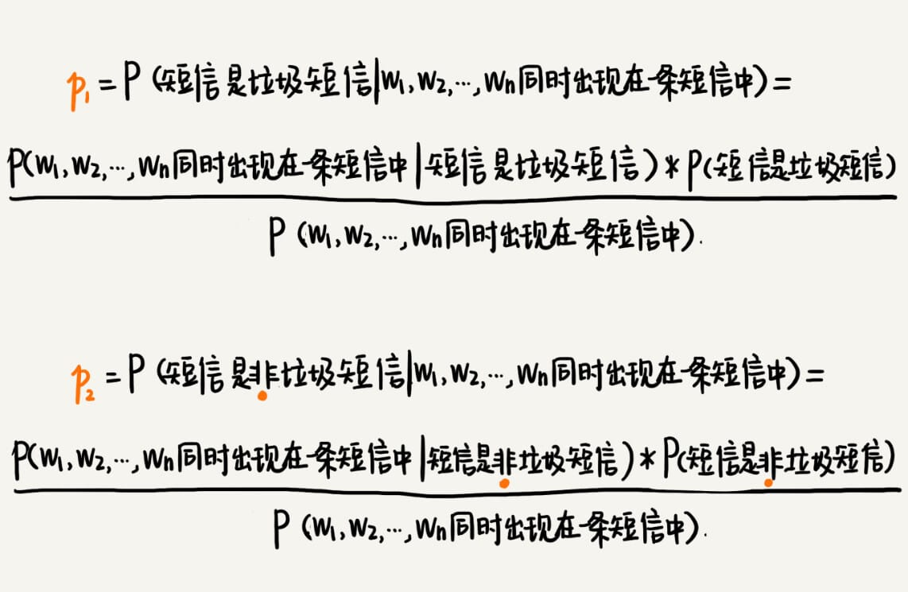

基于这两个概率的倍数来判断是否是垃圾短信的方法，我们就可以不用计算 P（W1，W2，W3，…，Wn 同时出现在一条短信中）这一部分的值了，因为计算 p1 与 p2 的时候，都会包含这个概率值的计算，所以在求解 p1 和 p2 倍数（p1/p2）的时候，我们也就不需要这个值。


### 小结

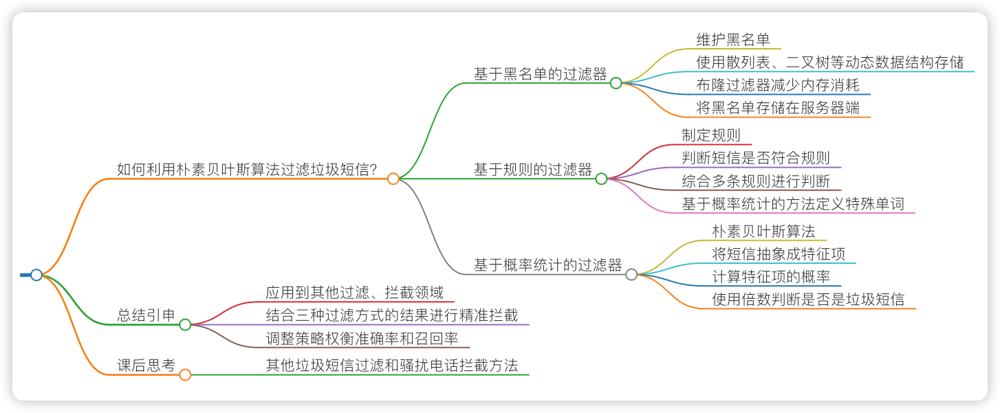

结合三种不同的过滤方式的结果，对同一个短信处理，如果三者都表明这个短信是垃圾短信，我们才把它当作垃圾短信拦截过滤，这样就会更精准。

在实际的工程中，我们还需要结合具体的场景，以及大量的实验，不断去调整策略，权衡垃圾短信判定的==准确率==（是否会把不是垃圾的短信错判为垃圾短信）和==召回率==（是否能把所有的垃圾短信都找到），来实现我们的需求。


## 47 向量空间：如何实现一个简单的音乐推荐系统？

### 算法解析

核心思想：

- 找到跟你口味偏好相似的用户，把他们爱听的歌曲推荐给你；
- 找出跟你喜爱的歌曲特征相似的歌曲，把这些歌曲推荐给你。

#### 1 基于相似用户做推荐

**如何定义口味偏好相似呢？**

把跟你听类似歌曲的人，看作口味相似的用户。用“1”表示“喜爱”，用“0”笼统地表示“不发表意见”：

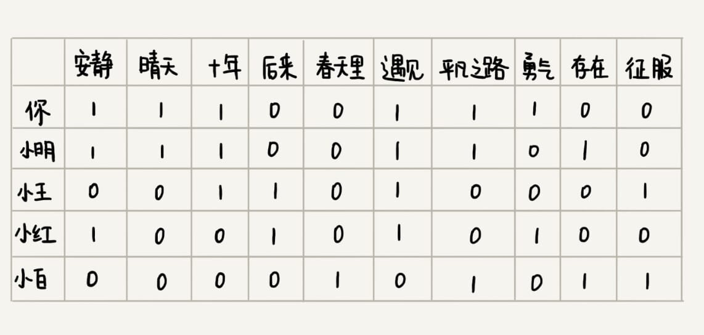

需要遍历所有的用户，对比每个用户跟你共同喜爱的歌曲个数，并且设置一个阈值，如果你和某个用户共同喜爱的歌曲个数超过这个阈值，我们就把这个用户看作跟你口味相似的用户，把这个用户喜爱但你还没听过的歌曲，推荐给你。

**如何定义用户对某首歌曲的喜爱程度呢？**

可以通过用户的行为，来定义这个喜爱程度。给每个行为定义一个得分，得分越高表示喜爱程度越高。


如果把每个人对每首歌曲的喜爱程度表示出来，就是下面这个样子。图中，某个人对某首歌曲是否喜爱，我们不再用“1”或者“0”来表示，而是对应一个具体的分值。


**有了这样一个用户对歌曲的喜爱程度的对应表之后，如何来判断两个用户是否口味相似呢？**

字符串相似度度量有编辑距离，这里的相似度度量，可以使用另外一个距离==欧几里得距离（Euclidean distance）==是用来计算两个==向量==之间的==距离==的。

一维空间是一条线，我们用 1，2，3……这样单个的数，来表示一维空间中的某个位置；二维空间是一个面，我们用（1，3）（4，2）（2，2）……这样的两个数，来表示二维空间中的某个位置；三维空间是一个立体空间，我们用（1，3，5）（3，1，7）（2，4，3）……这样的三个数，来表示三维空间中的某个位置。一维、二维、三维应该都不难理解，那更高维中的某个位置该如何表示呢？

类比一维、二维、三维的表示方法，K 维空间中的某个位置，我们可以写作（X1，X2，X3，…，XK）。这种表示方法就是**==向量（vector）==**。我们知道，二维、三维空间中，两个位置之间有距离的概念，类比到高纬空间，同样也有距离的概念，这就是我们说的两个向量之间的距离。

类比到二维、三维空间中距离的计算方法，可以得到两个向量之间距离的计算公式就是欧几里得距离的计算公式：


把每个用户对所有歌曲的喜爱程度，都用一个向量表示。计算出两个向量之间的欧几里得距离，作为两个用户的口味相似程度的度量。


#### 2 基于相似歌曲做推荐

**计算机通过什么数据来量化两个歌曲之间的相似程度呢？**

最容易想到的是，我们对歌曲定义一些**特征项**，比如是伤感的还是愉快的，是摇滚还是民谣，是柔和的还是高亢的等等。类似基于相似用户的推荐方法，我们给每个歌曲的每个特征项打一个分数，这样每个歌曲就都对应一个特征项向量。我们可以基于这个特征项向量，来计算两个歌曲之间的欧几里得距离。欧几里得距离越小，表示两个歌曲的相似程度越大。

但是，要实现这个方案，需要有一个前提，那就是我们能够找到**足够多，并且能够全面代表歌曲特点的特征项**，除此之外，我们还要人工给每首歌标注每个特征项的得分。对于收录了海量歌曲的音乐 App 来说，这显然是一个非常大的工程。此外，人工标注有很大的**主观性**，也会影响到推荐的准确性。

对于两首歌，如果喜欢听的人群都是差不多的，那侧面就可以反映出，这两首歌比较相似。

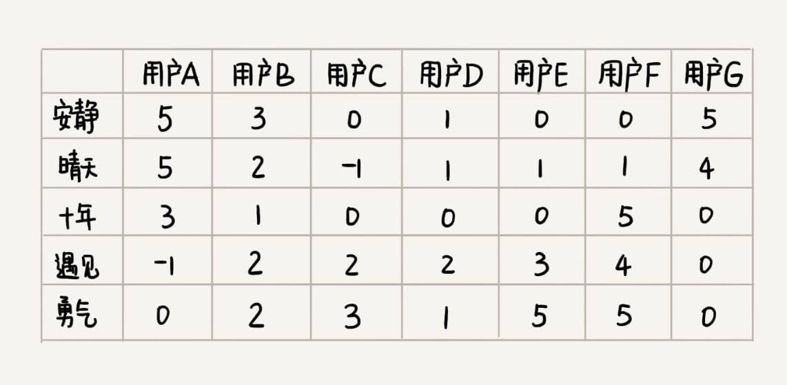

这个图跟基于相似用户推荐中的图几乎一样。只不过这里把歌曲和用户主次颠倒了一下。基于相似用户的推荐方法中，针对每个用户，我们将对各个歌曲的喜爱程度作为向量。基于相似歌曲的推荐思路中，针对每个歌曲，我们将每个用户的打分作为向量。

有了每个歌曲的向量表示，我们通过计算向量之间的欧几里得距离，来表示歌曲之间的相似度。欧几里得距离越小，表示两个歌曲越相似。然后，我们就在用户已经听过的歌曲中，找出他喜爱程度较高的歌曲。然后，我们找出跟这些歌曲相似度很高的其他歌曲，推荐给他。

### 小结

这个问题是==推荐系统（Recommendation System）==里最典型的一类问题。

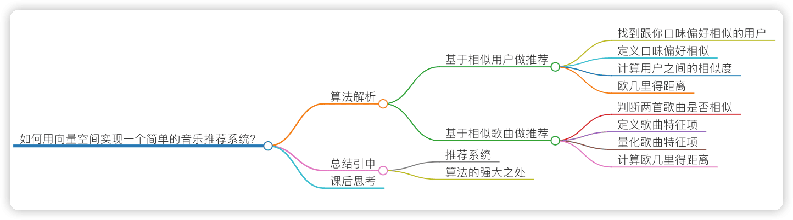


## 48 B+树：MySQL数据库索引是如何实现的？

> 数据库索引是如何实现的呢？底层使用的是什么数据结构和算法呢？

### 算法解析

#### 1 解决问题的前提是==定义清楚问题==

**如何定义清楚问题呢？**

- 对问题进行详细的调研
- 通过对一些模糊的需求进行假设，来==限定==要解决的问题的范围。

功能性需求，关注==执行效率和存储空间==。如：

- 根据某个值查找数据，比如 `select * from user where id=1234`；
- 根据区间值来查找某些数据，比如 `select * from user where id > 1234 and id < 2345`。

非功能性需求(比如安全、性能、用户体验等等)，关注性能。 

在**执行效率**方面，希望通过索引，查询数据的效率尽可能地高；在**存储空间**方面，希望索引不要消耗太多的内存空间。

#### 2 尝试用学过的数据结构解决这个问题

==散列表==的查询性能很好，时间复杂度是 O(1)。但是，散列表不能支持按照区间快速查找数据。

尽管==平衡二叉查找树==查询的性能也很高，时间复杂度是 O(logn)。而且，对树进行中序遍历，还可以得到一个从小到大有序的数据序列，但这仍然不足以支持按照区间快速查找数据。

==跳表==是在链表之上加上多层索引构成的。它支持快速地插入、查找、删除数据，对应的时间复杂度是 O(logn)。并且，跳表也支持按照区间快速地查找数据。我们只需要定位到区间起点值对应在链表中的结点，然后从这个结点开始，顺序遍历链表，直到区间终点对应的结点为止，这期间遍历得到的数据就是满足区间值的数据。

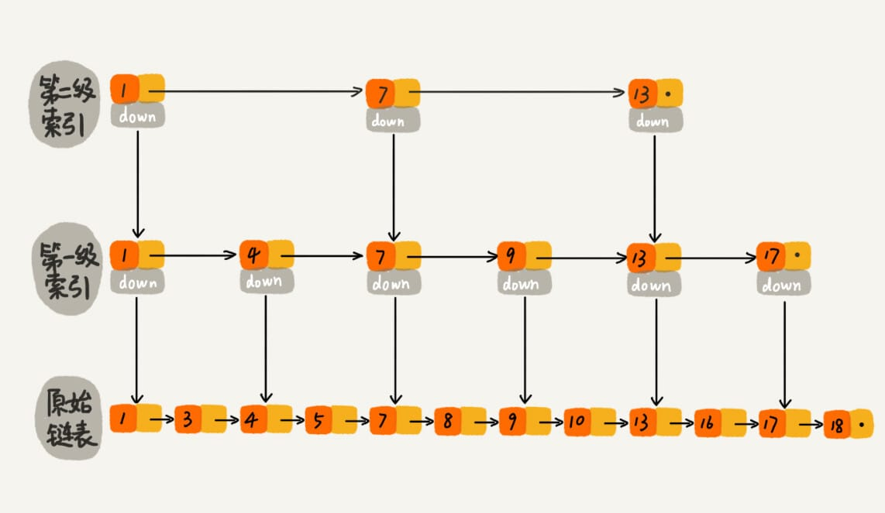

实际上，数据库索引所用到的数据结构跟跳表非常相似，叫作 **==B+树==**。它是通过**二叉查找树演化**过来的。

#### 3 改造二叉查找树来解决这个问题

为了让二叉查找树支持按照区间来查找数据，对它进行这改造：**树中的节点并不存储数据本身，而是只是作为索引。另外把每个叶子节点串在一条链表上，链表中的数据是从小到大有序的**。


改造之后，如果要求某个区间的数据，只需要拿区间的起始值，在树中进行查找，当查找到某个叶子节点之后，再顺着链表往后遍历，直到链表中的结点数据值大于区间的终止值为止。所有遍历到的数据，就是符合区间值的所有数据。


要为几千万、上亿的数据构建索引，如果将索引存储在内存中，尽管内存访问的速度非常快，查询的效率非常高，但是，占用的内存会非常多。

> 通常内存的访问速度是==纳秒==级别的，而磁盘访问的速度是==毫秒==级别的。读取同样大小的数据，从磁盘中读取花费的时间，是从内存中读取所花费时间的上万倍，甚至几十万倍。

**树的高度就等于每次查询数据时磁盘 IO 操作的次数。**

优化：减少树的高度。

如果把索引构建成m叉树，高度就比二叉树要小。

16个数据构建二叉树索引，树高度为4，构建五叉树高度就是2。

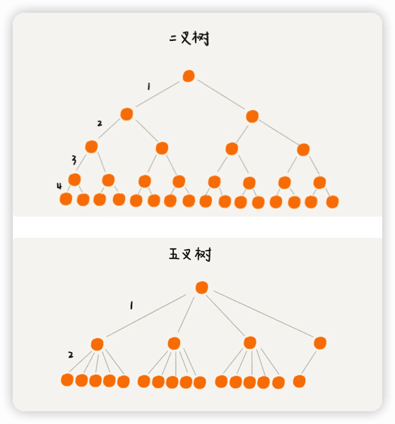

如果 m 叉树中的 m 是 100，那对一亿个数据构建索引，树的高度也只是 3，最多只要 3 次磁盘 IO 就能获取到数据。

> m叉树，则高度(即层数-1)为：`logm(n)`，为一亿(10^8)，则高度为 log100(10^8) = 4。


```java
/**
 * 这是B+树非叶子节点的定义。
 *
 * 假设keywords=[3, 5, 8, 10]
 * 4个键值将数据分为5个区间：(-INF,3), [3,5), [5,8), [8,10), [10,INF)
 * 5个区间分别对应：children[0]...children[4]
 *
 * m值是事先计算得到的，计算的依据是让所有信息的大小正好等于页的大小：
 * PAGE_SIZE = (m-1)*4[keywordss大小]+m*8[children大小]
 */
public class BPlusTreeNode {
  public static int m = 5; // 5叉树
  public int[] keywords = new int[m-1]; // 键值，用来划分数据区间
  public BPlusTreeNode[] children = new BPlusTreeNode[m];//保存子节点指针
}

/**
 * 这是B+树中叶子节点的定义。
 *
 * B+树中的叶子节点跟内部节点是不一样的,
 * 叶子节点存储的是值，而非区间。
 * 这个定义里，每个叶子节点存储3个数据行的键值及地址信息。
 *
 * k值是事先计算得到的，计算的依据是让所有信息的大小正好等于页的大小：
 * PAGE_SIZE = k*4[keyw..大小]+k*8[dataAd..大小]+8[prev大小]+8[next大小]
 */
public class BPlusTreeLeafNode {
  public static int k = 3;
  public int[] keywords = new int[k]; // 数据的键值
  public long[] dataAddress = new long[k]; // 数据地址

  public BPlusTreeLeafNode prev; // 这个结点在链表中的前驱结点
  public BPlusTreeLeafNode next; // 这个结点在链表中的后继结点
}
```


对于相同个数的数据构建 m 叉树索引，m 叉树中的 m 越大，那树的高度就越小，到底多大才最合适呢？

不管是内存中的数据，还是磁盘中的数据，操作系统都是按页（一页大小通常是 4KB，`getconf PAGE_SIZE`）来读取的，一次会读一页的数据。如果要读取的数据量超过一页的大小，就会触发多次 IO 操作。所以，我们在选择 m 大小的时候，要尽量让每个节点的大小等于一个页的大小。读取一个节点，只需要一次磁盘 IO 操作。


**索引可以提高数据库的查询效率，也会让写入数据的效率下降。**因为数据的写入过程，会涉及索引的更新。

对于一个 B+ 树来说，m 值是根据页的大小事先计算好的，也就是说，每个节点最多只能有 m 个子节点。在往数据库中写入数据的过程中，这样就有可能使索引中某些节点的子节点个数超过 m，这个节点的大小超过了一个页的大小，读取这样一个节点，就会导致多次磁盘 IO 操作。我们该如何解决这个问题呢？

实际上，处理思路并不复杂。我们只需要将这个节点分裂成两个节点。但是，节点分裂之后，其上层父节点的子节点个数就有可能超过 m 个。不过这也没关系，我们可以用同样的方法，将父节点也分裂成两个节点。这种级联反应会从下往上，一直影响到根节点。这个分裂过程，你可以结合着下面这个图一块看，会更容易理解（图中的 B+ 树是一个三叉树。我们限定叶子节点中，数据的个数超过 2 个就分裂节点；非叶子节点中，子节点的个数超过 3 个就分裂节点）。


正是因为要时刻保证 B+ 树索引是一个 m 叉树，所以，索引的存在会导致数据库写入的速度降低。

实际上，**不光写入数据会变慢，删除数据也会变慢**。因为**在删除某个数据的时候，也要对应地更新索引节点**。这个处理思路有点类似跳表中删除数据的处理思路。频繁的数据删除，就会导致某些节点中，子节点的个数变得非常少，长此以往，如果每个节点的子节点都比较少，势必会影响索引的效率。

可以设置一个阈值。在 B+ 树中，这个阈值等于 m/2。如果某个节点的子节点个数小于 m/2，就将它跟相邻的兄弟节点合并。不过，合并之后节点的子节点个数有可能会超过 m。针对这种情况，可以借助插入数据时候的处理方法，再分裂节点。

一个删除操作的例子（图中的 B+ 树是一个五叉树。我们限定叶子节点中，数据的个数少于 2 个就合并节点；非叶子节点中，子节点的个数少于 3 个就合并节点。）：


B+ 树的结构和操作，跟跳表非常类似。理论上讲，对跳表稍加改造，也可以替代 B+ 树，作为数据库的索引实现的。

### 总结

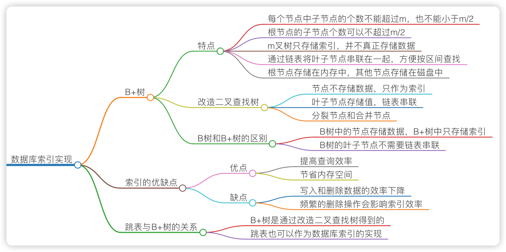

B+树通过**存储在磁盘的==多叉树==结构，做到了==时间、空间的平衡==，既保证了执行效率，又节省了内存**。

B+ 树的特点：

- 每个节点中子节点的个数不能超过 m，也不能小于 m/2；
- 根节点的子节点个数可以不超过 m/2，这是一个例外；
- m 叉树只存储索引，并不真正存储数据，这个有点儿类似跳表；
- 通过链表将叶子节点串联在一起，这样可以方便按区间查找；
- 一般情况，根节点会被存储在内存中，其他节点存储在磁盘中。

#### B+树和B树

B树（B-Tree）有时也写成B-树，这里-只是一个连接符不是减号。

B 树实际上是低级版的 B+ 树，或者说**B+树是 B 树的改进版**。不同点：

- B+树中的节点不存储数据，只是索引，而B树中的节点存储数据；
- B树中的叶子节点并不需要链表来串联。

也就是说，B树只是一个每个节点的子节点个数不能小于 m/2 的 m 叉树。

### 思考题

> B+树中，将叶子节点串起来的链表，是单链表还是双向链表？为什么？

单链表可以保证asc，但是无法desc，而双链表既可以asc又可以desc。

> 对平衡二叉查找树进行改造，将叶子节点串在链表中，就支持了按照区间来查找数据。我们在 散列表（下）讲到，散列表也经常跟链表一块使用，如果我们把散列表中的结点，也用链表串起来，能否支持按照区间查找数据呢？

LinkedHashMap 其实保证不了按区间排序（LinkedHashMap 只是保存放入的先后次序，并不能保证大小的顺序关系）。想要按区间排序，需要额外对散列表中的节点再加一层双向链表的关系，用来维护节点的大小关系。但是此时的插入操作的时间复杂度会比较高。每次插入一个元素，需要遍历并比较现有的节点，找到合适的位置来建立链表关系，时间复杂度为O(n)。


## 49 搜索：如何用A*搜索算法实现游戏中的寻路功能？

> 魔兽世界、仙剑奇侠传这类==MMRPG==（大型多人在线角色扮演游戏）游戏，有一个非常重要的功能，那就是人物角色**自动寻路**。<u>当人物处于游戏地图中的某个位置的时候，我们用鼠标点击另外一个相对较远的位置，人物就会自动地绕过障碍物走过去。</u>
> 这个功能是怎么实现的呢？

### 算法解析

典型的**搜索问题**。人物的**起点**就是他当下所在的位置，**终点**就是鼠标点击的位置。需要在地图中，找一条从起点到终点的**路径**。这条路径要绕过地图中所有障碍物，并且看起来要是一种非常聪明的走法。所谓“聪明”，笼统地解释就是**走的路不能太绕**。理论上讲，**最短路径**显然是最聪明的走法，是这个问题的最优解。

[44最短路径](#44 最短路径：地图软件是如何计算出最优出行路径的？) 最优出行路线规划问题中，提到如果图非常大，那 Dijkstra 最短路径算法的执行耗时会很多。在真实的软件开发中，我们面对的是超级大的地图和海量的寻路请求，算法的执行效率太低，这显然是无法接受的。

实际上，像**出行路线规划、游戏寻路**，这些真实软件开发中的问题，一般情况下，我们都不需要非得求最优解（也就是最短路径）。在==权衡路线规划质量和执行效率==的情况下，我们只需要寻求一个==次优解==就足够了。那如何快速找出一条接近于最短路线的次优路线呢？

**==A*算法==**是对Dijkstra算法的优化和改造。

启发函数（heuristic function）

曼哈顿距离（Manhattan distance）是两点之间横纵坐标的距离之和。

估价函数（evaluation function）

### 总结

`A*`算法属于一种==启发式搜索算法==（Heuristically Search Algorithm），它还有`IDA*`算法、蚁群算法、遗传算法、模拟退火算法等。

### 思考

> 之前讲的“迷宫问题”是否可以借助 A* 算法来更快速地找到一个走出去的路线呢？如果可以，请具体讲讲该怎么来做；如果不可以，请说说原因。


## 50 索引：如何在海量数据中快速查找某个数据？

### 为什么需要索引？

在实际的软件开发中，业务纷繁复杂，功能千变万化，但是，万变不离其宗。如果抛开这些业务和功能的外壳，其实它们的本质都可以抽象为**==“对数据的存储和计算”==**。对应到数据结构和算法中，那==“存储”需要的就是数据结构，“计算”需要的就是算法==。

对于存储的需求，功能上无外乎**增删改查**。这其实并不复杂。但是，一旦存储的数据很多，那==性能==就成了这些系统要关注的重点，特别是在一些跟存储相关的基础系统（比如MySQL数据库、分布式文件系统等）、中间件（比如消息中间件RocketMQ等）中。

“如何节省存储空间、如何提高数据增删改查的执行效率”，这样的问题就成了设计的重点。而这些系统的实现，都离不开一个东西，那就是**==索引==**。不夸张地说，索引设计得好坏，直接决定了这些系统是否优秀。

### 索引的需求定义

#### 1 功能性需求

- 数据是格式化数据还是非格式化数据？

- 数据是静态数据还是动态数据？

- 索引存储在内存还是硬盘？

- 单值查找还是区间查找？

- 单关键词查找还是多关键词组合查找？

#### 2 非功能性需求

- 不管是存储在内存中还是磁盘中，索引对存储空间的消耗不能过大。

- 在考虑索引查询效率的同时，我们还要考虑索引的维护成本。

### 构建索引常用的数据结构有哪些？

常用来构建索引的数据结构，就是几种支持**==动态数据集合==**的数据结构。比如，**散列表、红黑树、跳表、B+ 树**。除此之外，**位图、布隆过滤器**可以作为辅助索引，**有序数组**可以用来对静态数据构建索引。

redis使用跳表不用B+数的原因是：redis是内存数据库，而B+树纯粹是为了mysql这种IO数据库准备的。B+树的每个节点的数量都是一个mysql分区页的大小。

### 思考题

> 你知道基础系统、中间件、开源软件等系统中，有哪些用到了索引吗？这些系统的索引是如何实现的呢？

es中的单排索引其实用了trie树，对每个需要索引的key维护了一个trie树，用于定位到这个key在文件中的位置， 然后直接用有序列表直接去访问对应的documents   ，区块链拿以太坊来说吧，存储用的leveldb，数据存储用的数据结构是帕特利夏树，是一种高级的trie树，很好的做了数据的压缩， 消息中间件像kafka这种，会去做持久化，每个partition都会有很多数据，会有大量数据存储在磁盘中，所以每个partition也会有个索引，方便去做快速访问


## 51 并行算法：如何利用并行处理提高算法的执行效率？

时间复杂度是衡量算法执行效率的一种标准。但是，**时间复杂度并不能跟性能划等号**。在真实的软件开发中，即便在不降低时间复杂度的情况下，也可以通过一些优化手段，提升代码的执行效率。毕竟，对于实际的软件开发来说，即便是像 10%、20% 这样微小的性能提升，也是非常可观的。

算法的目的就是为了**提高代码执行的效率**。那当算法无法再继续优化的情况下，可以借助并行计算的处理思想对算法进行改造，从而进一步提高执行效率。

### 并行排序

假设我们要给大小为 8GB 的数据进行排序，并且，我们机器的内存可以一次性容纳这么多数据。对于排序来说，最常用的就是时间复杂度为 O(nlogn) 的三种排序算法，归并排序、快速排序、堆排序。从理论上讲，这个排序问题，已经很难再从算法层面优化了。而利用并行的处理思想，我们可以很轻松地将这个给 8GB 数据排序问题的执行效率提高很多倍。具体的实现思路有下面两种。

- 第一种是**对归并排序并行化处理**。我们可以将这 8GB 的数据划分成 16 个小的数据集合，每个集合包含 500MB 的数据。我们用 16 个线程，并行地对这 16 个 500MB 的数据集合进行排序。这 16 个小集合分别排序完成之后，我们再将这 16 个有序集合合并。
- 第二种是**对快速排序并行化处理**。我们通过扫描一遍数据，找到数据所处的范围区间。我们把这个区间从小到大划分成 16 个小区间。我们将 8GB 的数据划分到对应的区间中。针对这 16 个小区间的数据，我们启动 16 个线程，并行地进行排序。等到 16 个线程都执行结束之后，得到的数据就是有序数据了。

两种处理思路利用的都是分治的思想，对数据进行分片，然后并行处理。它们的区别在于，第一种处理思路是，先随意地对数据分片，排序之后再合并。第二种处理思路是，先对数据按照大小划分区间，然后再排序，排完序就不需要再处理了。这个跟归并和快排的区别如出一辙。

如果要排序的数据规模不是 8GB，而是 1TB，那问题的重点就不是算法的执行效率了，而是数据的读取效率。因为 1TB 的数据肯定是存在硬盘中，无法一次性读取到内存中，这样在排序的过程中，就会有频繁地磁盘数据的读取和写入。如何减少磁盘的 IO 操作，减少磁盘数据读取和写入的总量，就变成了优化的重点。

### 并行查找

散列表是一种非常适合快速查找的数据结构。

如果我们是给动态数据构建索引，在数据不断加入的时候，散列表的装载因子就会越来越大。为了保证散列表性能不下降，我们就需要对散列表进行动态扩容。对如此大的散列表进行动态扩容，一方面比较耗时，另一方面比较消耗内存。比如，我们给一个 2GB 大小的散列表进行扩容，扩展到原来的 1.5 倍，也就是 3GB 大小。这个时候，实际存储在散列表中的数据只有不到 2GB，所以内存的利用率只有 60%，有 1GB 的内存是空闲的。

实际上，我们可以将数据随机分割成 k 份（比如 16 份），每份中的数据只有原来的 1/k，然后我们针对这 k 个小数据集合分别构建散列表。这样，散列表的维护成本就变低了。当某个小散列表的装载因子过大的时候，我们可以单独对这个散列表进行扩容，而其他散列表不需要进行扩容。

还是刚才那个例子，假设现在有 2GB 的数据，我们放到 16 个散列表中，每个散列表中的数据大约是 150MB。当某个散列表需要扩容的时候，我们只需要额外增加 150*0.5=75MB 的内存（假设还是扩容到原来的 1.5 倍）。无论从扩容的执行效率还是内存的利用率上，这种多个小散列表的处理方法，都要比大散列表高效。

当我们要查找某个数据的时候，我们只需要通过 16 个线程，并行地在这 16 个散列表中查找数据。这样的查找性能，比起一个大散列表的做法，也并不会下降，反倒有可能提高。

当往散列表中添加数据的时候，我们可以选择将这个新数据放入装载因子最小的那个散列表中，这样也有助于减少散列冲突。

### 并行字符串匹配

之前学过的字符串匹配算法有 KMP、BM、RK、BF 等。当在一个不是很长的文本中查找关键词的时候，这些字符串匹配算法中的任何一个，都可以表现得非常高效。但是，如果我们处理的是超级大的文本，那处理的时间可能就会变得很长，那有没有办法加快匹配速度呢？

可以把大的文本，分割成 k 个小文本。假设 k 是 16，我们就启动 16 个线程，并行地在这 16 个小文本中查找关键词，这样整个查找的性能就提高了 16 倍。16 倍效率的提升，从理论的角度来说并不多。但是，对于真实的软件开发来说，这显然是一个非常可观的优化。

不过，这里还有一个细节要处理，那就是原本包含在大文本中的关键词，被一分为二，分割到两个小文本中，这就会导致尽管大文本中包含这个关键词，但在这 16 个小文本中查找不到它。实际上，这个问题也不难解决，我们只需要针对这种特殊情况，做一些特殊处理就可以了。

我们假设关键词的长度是 m。我们在每个小文本的结尾和开始各取 m 个字符串。前一个小文本的末尾 m 个字符和后一个小文本的开头 m 个字符，组成一个长度是 2m 的字符串。我们再拿关键词，在这个长度为 2m 的字符串中再重新查找一遍，就可以补上刚才的漏洞了。

### 并行搜索

之前学过搜索算法：广度优先搜索、深度优先搜索、Dijkstra 最短路径算法、A* 启发式搜索算法。

广度优先搜索是一种逐层搜索的搜索策略。基于当前这一层顶点，我们可以启动多个线程，并行地搜索下一层的顶点。在代码实现方面，原来广度优先搜索的代码实现，是通过一个队列来记录已经遍历到但还没有扩展的顶点。现在，经过改造之后的并行广度优先搜索算法，我们需要利用两个队列来完成扩展顶点的工作。

假设这两个队列分别是队列 A 和队列 B。多线程并行处理队列 A 中的顶点，并将扩展得到的顶点存储在队列 B 中。等队列 A 中的顶点都扩展完成之后，队列 A 被清空，我们再并行地扩展队列 B 中的顶点，并将扩展出来的顶点存储在队列 A。这样两个队列循环使用，就可以实现并行广度优先搜索算法。


思考题

> 假设我们有 n 个任务，为了提高执行的效率，我们希望能并行执行任务，但是各个任务之间又有一定的依赖关系，如何根据依赖关系找出可以并行执行的任务？


----


# 实战篇

## 52 剖析Redis常用数据类型对应的数据结构


## 53 剖析搜索引擎背后的经典数据结构和算法


## 54 剖析高性能队列Disruptor背后的数据结构和算法


## 55 剖析微服务接口鉴权限流背后的数据结构和算法


## 56 如何用学过的数据结构和算法实现一个短网址系统？

# 更多

作图工具 ipad paper

## 数据结构与算法学习书单

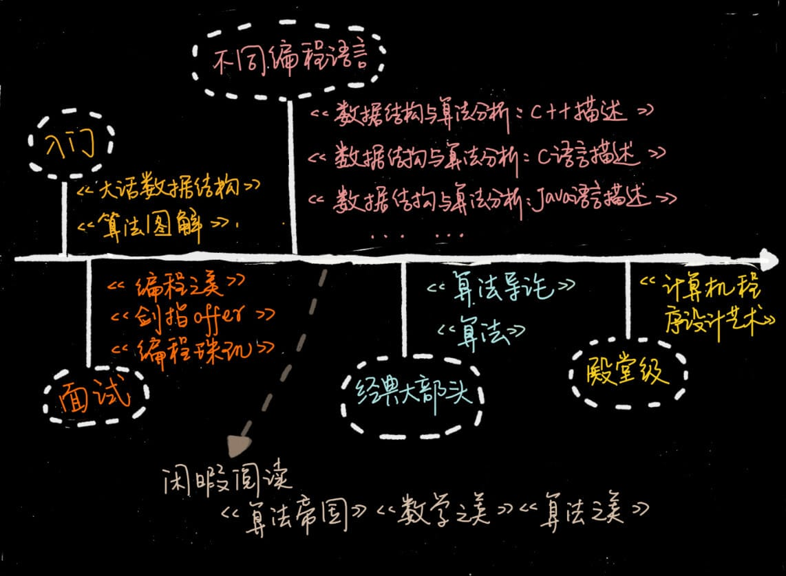

### 面试必刷的宝典

《剑指 offer》

《编程珠玑》特色就是讲了很多**针对海量数据的处理技巧**。

《编程之美》这本书有多位作者，其中绝大部分是微软的工程师，所以书的质量很有保证。不过，这里面的算法题目稍微有点难，也不是很系统，这也是我把它归到面试这一部分的原因。如果你有一定基础，也喜欢钻研些算法问题，或者要面试 Google、Facebook 这样的公司，可以拿这本书里的题，先来自测一下。

### 经典大部头

《算法导论》这本书的章节安排不是循序渐进的，里面充斥着各种算法的正确性、复杂度的证明、推导，数学公式比较多，一般人看起来会比较吃力。所以，作为入门书籍，并不是很推荐。

《算法》这本书也是一本经典大部头，不过它比起《算法导论》来要友好很多，更容易看懂，更适合初学者入门。但是这本书的缺点也很明显，就是内容不够全面，比如动态规划这么重要的知识点，这本书就没有讲。对于数据结构的东西，它讲的也不多，基本就是**偏重讲算法**。

### 殿堂级经典

《计算机程序设计艺术》


> 每个人的基础、学习能力都不一样，掌握程度取决于你的努力程度。


## 王争：羁绊前行的，不是肆虐的狂风，而是内心的迷茫


如果我们不那么确信能不能看懂、能不能学会的时候，当面对困难的时候，很容易就会否定自己，也就很容易半途而废。


没有捷径，没有杀手锏，更没有一招致胜的“葵花宝典”


这些方法论的难点并不在于能不能听懂，而是在于能不能执行到位。


不要浮躁，不要丧失思考能力，不要丧失学习能力


只有做好打硬仗的心理准备，遇到困难才能心态平和


“放弃”的念头像是一个心魔，它会一直围绕着你


第一，我对学习这件事情认识得比较清楚，我一直觉得，没有学不会的东西，没有攻克不了的技术难题，如果有，那就说明时间花得还不够多。

第二，我之前遇到卡壳的时候，几乎从来没有放弃过，即便短暂地停歇，我也会继续拎起来再死磕，而且每次都能搞定，正是这种正向的激励，给了我信心，让我再遇到困难的时候，都能坚信自己能搞定它。


对于任何新知识的学习，入门是一个非常漫长和煎熬的过程，谁都逃不过


其实我一直觉得**情商比智商更重要**。对于很多学科的学习，智商并不是瓶颈，最终能够决定你能达到的高度的，还是情商，而情商中最重要的，我觉得就是==逆商（逆境商数，Adversity Quotient）==，也就是，==当你遇到困难时，你会如何去面对，这将会决定你的人生最终能够走多远==。


## 在实际开发中，如何权衡选择使用哪种数据结构和算法？


## 《数据结构与算法之美》学习指导手册


!(images/52788574ceabff1adbdebfe69d3debce.jpg)


