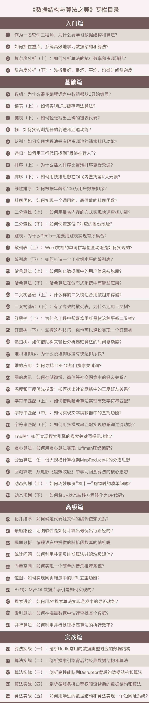

# 《数据结构与算法之美》学习笔记

## 说明

本项目是学习极客时间的付费专栏[《数据结构与算法之美》](https://time.geekbang.org/column/intro/126)的笔记。

作者文中的示例代码多是C/C++。

这个专栏的优点就是把数据结构、算法联系到实际应用中，而不是干巴巴的学算法。

专栏的相关的代码在作者的GitHub[wangzheng0822/algo](https://github.com/wangzheng0822/algo)，除了C/C++代码外，还有很多网友提交的其它语言算法示例，比如Go、Java、PHP、Python、JavaScript等。

## 介绍

**学习数据结构与算法的关键，在于掌握其中的思想和精髓，学会解决实际问题的方法。**

计算机**“内功”**，无外乎就是大学里的那些基础课程，**操作系统、计算机网络、编译原理等等，当然还有数据结构和算法**。

结合**真实的软件开发案例**来讲解每种数据结构和算法，学习数据结构和算法究竟应该如何应用到实际的编码中。

专栏分成四个递进的模块。

**1.入门篇**

时间、空间复杂度分析是数据结构和算法中非常重要的知识点，贯穿整个专栏的学习过程。 

**2.基础篇**

学习的重点，涵盖了最基础、最常用的数据结构和算法。 

**3.高级篇**

不是那么常用的数据结构和算法。为了开拓视野，强化训练算法思维、逻辑思维。 

**4.实战篇**

用一些开源项目、框架或者系统设计问题，剖析它们背后的数据结构和算法。 

## 笔记

[《数据结构与算法之美》](Article/数据结构与算法之美.md)

[《数据结构与算法之美》2](Article/数据结构与算法之美2.md)

## 学习路线

## 目录

